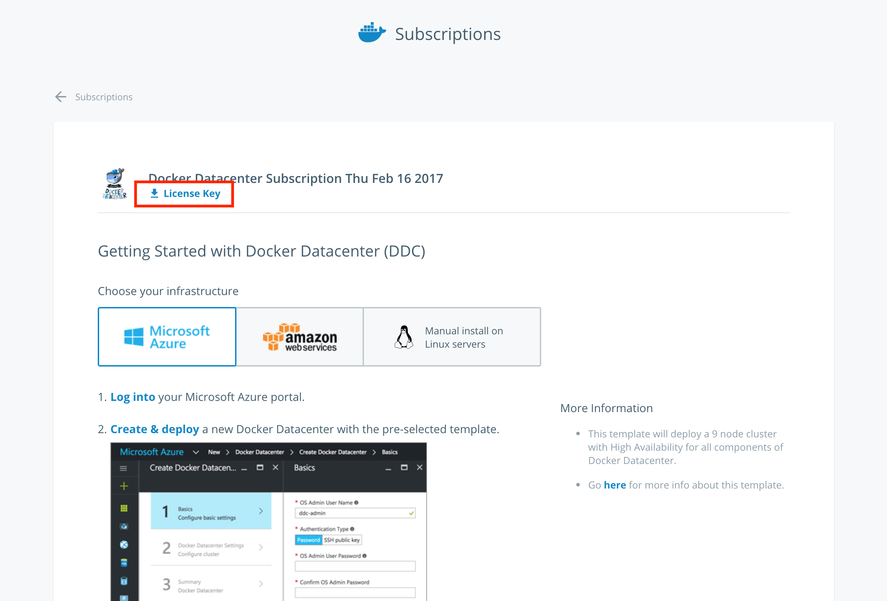
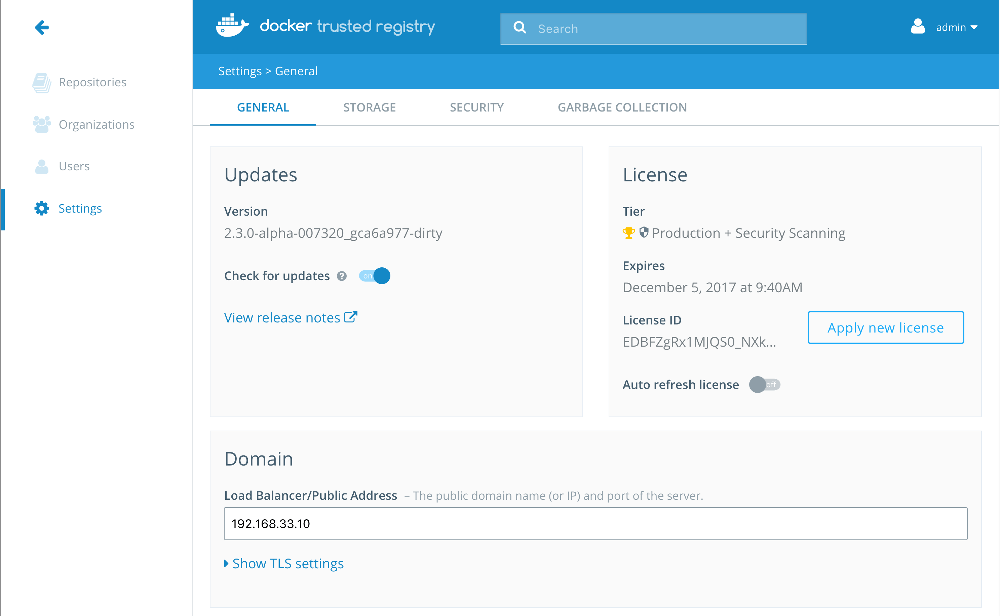
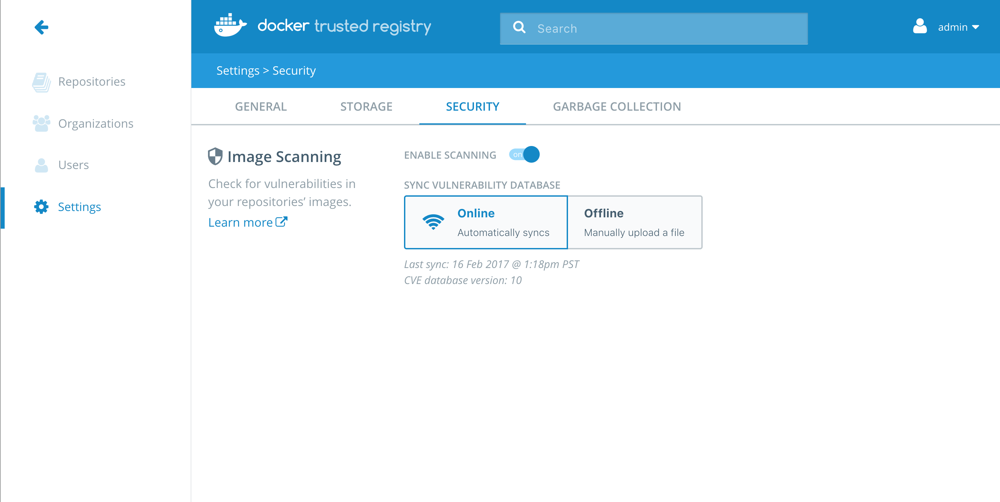
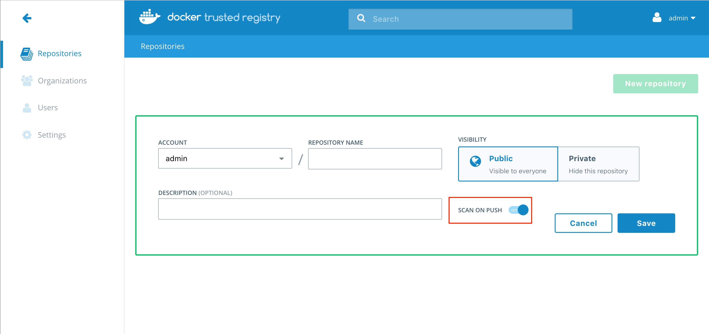
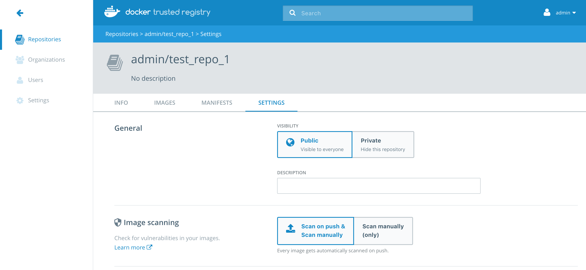

This page explains how to set up and enable Docker Security Scanning on an existing installation of Docker Trusted Registry.

## Prerequisites

These instructions assume that you have already installed Docker Trusted
Registry, and have access to an account on the DTR instance with administrator
access.

Before you begin, make sure that you or your organization has purchased a DTR
license that includes Docker Security Scanning, and that your Docker ID can
access and download this license from the Docker Store.

If you are using a license associated with an individual account, no additional
action is needed. If you are using a license associated with an organization
account, you may need to make sure your Docker ID is a member of the `Owners`
team. Only `Owners` team members can download license files for an Organization.

If you will be allowing the Security Scanning database to update itself
automatically, make sure that the server hosting your DTR instance can access
`https://dss-cve-updates.docker.com/` on the standard https port 443.

## Get the security scanning license.

If your DTR instance already has a license that includes Security Scanning, skip
this step and proceed to [enable DTR Security Scanning](#enable-dtr-security-scanning).

> **Tip**: To check if your existing DTR license includes scanning, navigate to the DTR **Settings** page, and click **Security**. If an "Enable scanning" toggle appears, the license includes scanning.

If your current DTR license doesn't include scanning, you must first download the new license.

1. Log in to the Docker Store using a Docker ID with access to the license you need.
2. In the top right corner, click your user account icon, and select **Subscriptions**.
3. If necessary, select an organization account from the **Accounts** menu at the upper right.
4. Locate Docker Datacenter in the **Subscriptions** list.
5. Click **Subscription Details** and select **Setup instructions**.
6. Click **License key** below the Docker Datacenter logo.
    The license key (a `.lic` file) is downloaded to your local computer.
	{: .with-border}
Next, install the new license on the DTR instance.

7. Log in to your DTR instance using an administrator account.
8. Click **Settings** in the left navigation.
9. On the **General** tab click **Apply new license**.

    A file browser dialog appears.

10. Navigate to where you saved the license key (`.lic`) file, select it, and click **Open**.

{: .with-border}

Proceed to [enable DTR Security Scanning](#enable-dtr-security-scanning).

## Enable DTR security scanning

To enable security scanning in DTR:

1. Log in to your DTR instance with an administrator account.
2. Click **Settings** in the left navigation.
3. Click the **Security** tab.

    > **Note**: If you see a message on this tab telling you to contact your Docker sales representative, then the license installed on this DTR instance does not include Docker Security Scanning. Check that you have purchased Security Scanning, and that the DTR instance is using the latest license file.

4. Click the **Enable scanning** toggle so that it turns blue and says "on".
	{: .with-border}
5.  Next, provide a security database for the scanner. **Security scanning will not function until DTR has a security database to use.**

    By default, security scanning is enabled in **Online** mode. In this mode,
    DTR attempts to download a security database from a Docker server. If your
    installation cannot access `https://dss-cve-updates.docker.com/` you must
    manually upload a `.tar` file containing the security database.

    - If you are using `Online` mode, the DTR instance will contact a Docker server, download the latest vulnerability database, and install it. Scanning can begin once this process completes.<!--(TODO: no completion or confirmation message?) -->
    - If you are using `Offline` mode, use the instructions in [Update scanning database - offline mode](#update-cve-database---offline-mode) to upload an initial security database.

By default when Security Scanning is enabled, new repositories will automatically scan on `docker push`. If you had existing repositories before you enabled security scanning, you might want to [change repository scanning behavior](#set-repository-scanning-mode).

## Set repository scanning mode

Two modes are available when Security Scanning is enabled:

- `Scan on push & Scan manually`: the image is re-scanned on each `docker push` to the repository, and whenever a user with `write` access clicks the **Start Scan** links or **Scan** button.
- `Scan manually`: the image is scanned only when a user with `write` access clicks the **Start Scan** links or **Scan** button.

By default, _new_ repositories are set to `Scan on push & Scan manually`, but
you can change this setting during repository creation.

{: .with-border}

Any repositories that existed before scanning was enabled are set to `Scan manually` mode by default. If these repositories are still in use, you can change this setting from each repository's **Settings** page.

> **Note**: To change an individual repository's scanning mode, you must have
`write` or `admin` access to the repo.

To change an individual repository's scanning mode:

1. Navigate to the repository, and click the **Settings** tab.
2. Scroll down to the **Image scanning** section.
3. Select the desired scanning mode.
{: .with-border}

## Update the CVE scanning database

Docker Security Scanning indexes the components in your DTR images and compares
them against a known CVE database. When new vulnerabilities are reported, Docker
Security Scanning matches the components in new CVE reports to the indexed
components in your images, and quickly generates an updated report.

Users with administrator access to DTR can check when the CVE database was last updated from the **Security** tab in the DTR **Settings** pages.

### Update CVE database - online mode

By default Docker Security Scanning checks automatically for updates to the
vulnerability database, and downloads them when available. If your installation
does not have access to the public internet, use the [Offline mode instructions below](#update-cve-database-offline-mode).

To ensure that DTR can access these updates, make sure that the host can reach
`https://dss-cve-updates.docker.com/` on port 443 using https.

DTR checks for new CVE database updates at 3:00 AM UTC every day. If an update
is found it is downloaded and applied without interrupting any scans in
progress. Once the update is complete, the security scanning system looks for
new vulnerabilities in the indexed components.

To set the update mode to Online:

1. Log in to DTR as a user with administrator rights.
2. Click **Settings** in the left navigation and click **Security**.
3. Click **Online**.

Your choice is saved automatically.

> **Tip**: DTR also checks for CVE database updates when scanning is first enabled, and when you switch update modes. If you need to check for a CVE database update immediately, you can briefly switch modes from online to offline and back again.

### Update CVE database - offline mode

To update the CVE database for your DTR instance when it cannot contact the update server, you download and install a `.tar` file that contains the database updates. Contact us at [nautilus-feedback@docker.com](mailto:nautilus-feedback@docker.com?Subject=Need%20CVE%20database%20file) for an updated database file.

<!-- TODO: update when Store updates available: https://docker.atlassian.net/browse/MER-1444
1. Log in to the Docker Store.

    If you are a member of an Organization managing licenses using Docker Store,
    make sure your account is a member of the `Owners` team. Only Owners can
    view and manage licenses and other entitlements for Organizations from the
    Docker Store.

2. In the top right corner, click your user account icon, and select **Subscriptions**.
3. If necessary, select an organization account from the **Accounts** menu at the upper right.
4. Locate Docker Datacenter in the **Subscriptions** list.
5. Click ...-->

To manually update the DTR CVE database from a `.tar` file:

1. Log in to DTR as a user with administrator rights.
2. Click **Settings** in the left navigation and click **Security**.
4. Click **Upload .tar database file**.
5. Browse to the latest `.tar` file that you received, and click **Open**.

DTR installs the new CVE database, and begins checking already indexed images
for components that match new or updated vulnerabilities.

> **Tip**: The Upload button is unavailable while DTR applies CVE database updates.

## Enable or disable automatic database updates

To change the update mode:

1. Log in to DTR as a user with administrator rights.
2. Click **Settings** in the left navigation and click **Security**.
3. Click **Online/Offline**.

Your choice is saved automatically.

## Where to go next

* [Deploy a cache](deploy-a-cache.md)
