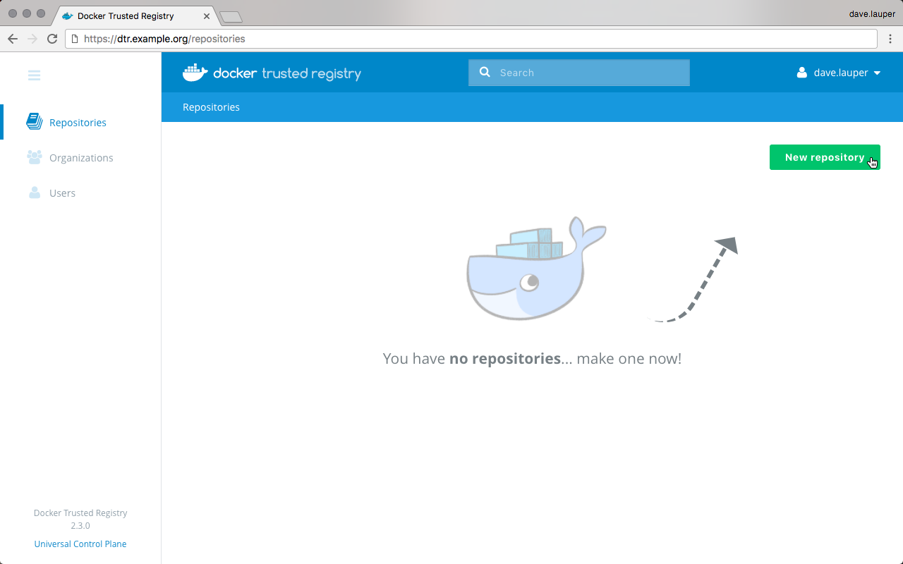
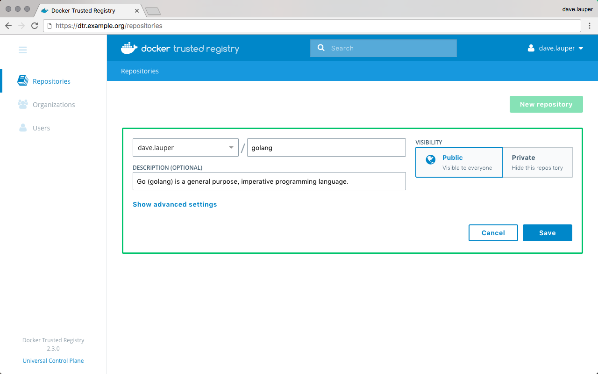

Since DTR is secure by default, you need to create the image repository before
pushing the image to DTR.

In this example, we create the 'golang' repository in DTR.

## Create a repository

To create a new repository, navigate to the **DTR web application**, and click
the **New repository** button.

{: .with-border}

Add a **name and description** for the repository, and choose whether your
repository is public or private:

  * Public repositories are visible to all users, but can only be changed by
  users granted with permission to write them.
  * Private repositories can only be seen by users that have been granted
  permissions to that repository.

{: .with-border}

Click **Save** to create the repository.

When creating a repository in DTR, the full name of the repository becomes
`<dtr-domain-name>/<user-or-org>/<repository-name>`. In this example, the full
name of our repository will be `dtr.example.org/dave.lauper/golang`.

## Where to go next

* [Pull and push images](pull-and-push-images.md)
