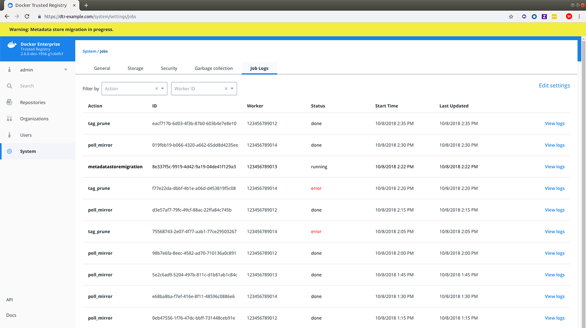



DTR uses [semantic versioning](http://semver.org/) and Docker aims to achieve specific
guarantees while upgrading between versions. While downgrades are not supported, Docker supports upgrades according to the following rules:

* When upgrading from one patch version to another, you can skip patch versions
  because no data migration is done for patch versions.
* When upgrading between minor versions, you ***cannot*** skip versions, but you can
  upgrade from any patch version of the previous minor version to any patch
  version of the current minor version.
* When upgrading between major versions, make sure to upgrade one major
  version at a time &ndash; and also upgrade to the earliest available minor
  version. We strongly recommend upgrading to the latest minor/patch
  version for your major version first.

| Description                          | From  | To        | Supported |
|:-------------------------------------|:------|:----------|:----------|
| patch upgrade                        | x.y.0 | x.y.1     | yes       |
| skip patch version                   | x.y.0 | x.y.2     | yes       |
| patch downgrade                      | x.y.2 | x.y.1     | no        |
| minor upgrade                        | x.y.* | x.y+1.*   | yes       |
| skip minor version                   | x.y.* | x.y+2.*   | no        |
| minor downgrade                      | x.y.* | x.y-1.*   | no        |
| skip major version                   | x.*.* | x+2.*.*   | no        |
| major downgrade                      | x.*.* | x-1.*.*   | no        |
| major upgrade                        | x.y.z | x+1.0.0   | yes       |
| major upgrade skipping minor version | x.y.z | x+1.y+1.z | no        |

There may be at most a few seconds of interruption during the upgrade of a
DTR cluster. Schedule the upgrade to take place outside of peak hours
to avoid any business impacts.

## 2.5 to 2.6 upgrade

> Upgrade Best Practices
>
> There are [important changes to the upgrade process](/ee/upgrade) that, if not correctly followed, can have impact on the availability of applications running on the Swarm during upgrades. These constraints impact any upgrades coming from any version before `18.09` to version `18.09` or greater. See [Cluster Upgrade Best Practices](/ee/upgrade.md#cluster-upgrade-best-practices) for more details. Additionally, to ensure high availability during the DTR upgrade, you can also drain the DTR replicas and move their workloads to updated workers. To do this, you can join new workers as DTR replicas to your existing cluster and then remove the old replicas. See [docker/dtr join](/v18.09/reference/dtr/2.6/cli/join) and [docker/dtr remove](/v18.09/reference/dtr/2.6/cli/remove) for command options and details.

## Minor upgrade

Before starting your upgrade, make sure that:
* The version of UCP you are using is supported by the version of DTR you
are trying to upgrade to. [Check the compatibility matrix](https://success.docker.com/article/compatibility-matrix).
* You have a recent [DTR backup](disaster-recovery/create-a-backup).
* You [disable Docker content trust in UCP](/ee/ucp/admin/configure/run-only-the-images-you-trust/).
* You [meet the system requirements](install/system-requirements).

### Step 1. Upgrade DTR to {{ previous_version }} if necessary

Make sure you are running DTR {{ previous_version }}. If that is not the case,
[upgrade your installation to the {{ previous_version }} version](/datacenter/dtr/{{ previous_version }}/guides/admin/upgrade/).

### Step 2. Upgrade DTR

Then pull the latest version of DTR:

```bash
docker pull {{ page.dtr_org }}/{{ page.dtr_repo }}:{{ page.dtr_version }}
```

Make sure you have at least [16GB of available RAM](install/system-requirements) on the node you are running the upgrade on. If the DTR node does not have access to the internet, you can
follow the [offline installation documentation](install/install-offline)
to get the images.

Once you have the latest image on your machine (and the images on the target
nodes if upgrading offline), run the upgrade command:

```bash
docker run -it --rm \
  {{ page.dtr_org }}/{{ page.dtr_repo }}:{{ page.dtr_version }} upgrade \
  --ucp-insecure-tls
```

By default the upgrade command runs in interactive mode and prompts you for
any necessary information. You can also check the
[reference documentation](/v18.09/reference/dtr/2.6/cli/index.md) for other existing flags.

The upgrade command will start replacing every container in your DTR cluster,
one replica at a time. It will also perform certain data migrations. If anything
fails or the upgrade is interrupted for any reason, you can rerun the upgrade
command and it will resume from where it left off.


#### Metadata Store Migration

When upgrading from `2.5` to `2.6`, the system will run a `metadatastoremigration` job after a successful upgrade. This involves migrating the blob links for your images which is necessary for online garbage collection. With `2.6`, you can log in to the DTR web interface and navigate to **System > Job Logs** to check the status of the `metadatastoremigration` job. See [Audit Jobs via the Web Interface](/manage-jobs/audit-jobs-via-ui/) for more details.

{: .with-border}

Garbage collection is disabled while the migration is running. In the case of a failed `metadatastoremigration`, the system will retry twice.

{: .with-border}

If the three attempts fail, you will have to retrigger the `metadatastoremigration` job manually. To do so, send a `POST` request to the `/api/v0/jobs` endpoint:

```bash
curl https://<dtr-external-url>/api/v0/jobs -X POST \
-u username:accesstoken -H 'Content-Type':'application/json' -d \
'{"action": "metadatastoremigration"}'
```
Alternatively, select **API** from the bottom left navigation pane of the DTR web interface and use the Swagger UI to send your API request.

## Patch upgrade

A patch upgrade changes only the DTR containers and is always safer than a minor version
upgrade. The command is the same as for a minor upgrade.

## DTR cache upgrade

If you have previously [deployed a cache](/admin/configure/deploy-caches/), make sure to [upgrade the node dedicated for your cache](/ee/upgrade) to keep it in sync with your upstream DTR replicas. This prevents authentication errors and other weird behaviors.

## Download the vulnerability database

After upgrading DTR, you need to redownload the vulnerability database.
[Learn how to update your vulnerability database](configure/set-up-vulnerability-scans.md#update-the-cve-scanning-database).

## Where to go next

- [Release notes](../release-notes)
- [Garbage collection in v2.5](/datacenter/dtr/2.5/guides/admin/configure/garbage-collection/)
