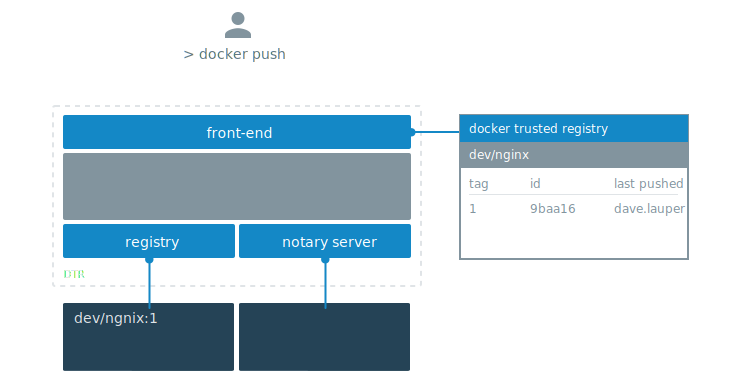
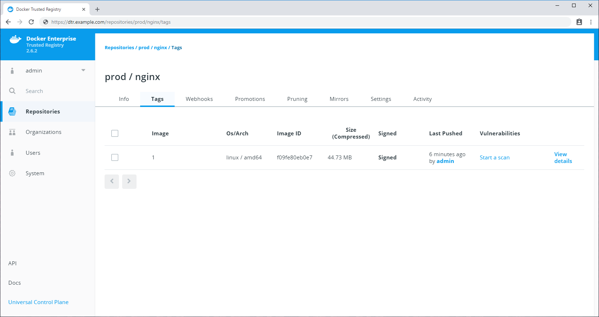

Two key components of the Docker Trusted Registry are the Notary Server and the Notary
Signer. These two containers provide the required components for using Docker Content
Trust (DCT) out of the box. [Docker Content
Trust](/engine/security/trust/content_trust/) allows you to sign image tags,
therefore giving consumers a way to verify the integrity of your image.

As part of DTR, both the Notary and the Registry
servers are accessed through a front-end proxy, with both components sharing the
UCP's RBAC (Role-based Access Control) Engine. Therefore, you do not need additional Docker client
configuration in order to use DCT.

DCT is integrated with the Docker CLI, and allows you to:
- Configure repositories
- Add signers, and 
- Sign images using the `docker trust` command



## Sign images that UCP can trust

UCP has a feature which will prevent [untrusted
images](/ee/ucp/admin/configure/run-only-the-images-you-trust/) from being
deployed on the cluster. To use the feature, you need to sign and push images to your DTR. 
To tie the signed images back to UCP, you need to sign the
images with the private keys of the UCP users. From a UCP client bundle, use
`key.pem` as your private key, and `cert.pem` as your public key
on an `x509` certificate. 

To sign images in a way that UCP can trust, you need to:

1. Download a client bundle for the user account you want to use for signing the images. 
2. Add the user's private key to your machine's trust store.
3. Initialize trust metadata for the repository. 
4. Delegate signing for that repository to the UCP user.
5. Sign the image. 

The following example shows the `nginx` image getting pulled from Docker Hub, tagged
as `dtr.example.com/dev/nginx:1`, pushed to DTR, and signed in a way
that is trusted by UCP.

### Import a UCP user's private key

After downloading and extracting a UCP client bundle into your local
directory, you need to load the private key into the local Docker trust store
`(~/.docker/trust)`. To illustrate the process, we will use `jeff` as an example user.

```bash
$ docker trust key load --name jeff key.pem
Loading key from "key.pem"...
Enter passphrase for new jeff key with ID a453196:
Repeat passphrase for new jeff key with ID a453196:
Successfully imported key from key.pem
```

### Initialize the trust metadata and add the user's public certificate

Next,initiate trust metadata for a DTR repository. If you have not
already done so, navigate to the **DTR web UI**, and create a repository for
your image. This example uses the `nginx` repository in the `prod` namespace.

As part of initiating the repository, the public key of the UCP user needs to be added 
to the Notary server as a signer for the repository. You will be asked for a number of 
passphrases to protect the keys.Make a note of these passphrases, and 
see [Managing Delegations in a Notary Server](/engine/security/trust/trust_delegation/#managing-delegations-in-a-notary-server) to learn more about managing keys.


```bash
$ docker trust signer add --key cert.pem jeff dtr.example.com/prod/nginx
Adding signer "jeff" to dtr.example.com/prod/nginx...
Initializing signed repository for dtr.example.com/prod/nginx...
Enter passphrase for root key with ID 4a72d81:
Enter passphrase for new repository key with ID e0d15a2:
Repeat passphrase for new repository key with ID e0d15a2:
Successfully initialized "dtr.example.com/prod/nginx"
Successfully added signer: jeff to dtr.example.com/prod/nginx
```

Inspect the trust metadata of the repository to make sure the user has
been added correctly.

```bash
$ docker trust inspect --pretty dtr.example.com/prod/nginx

No signatures for dtr.example.com/prod/nginx

List of signers and their keys for dtr.example.com/prod/nginx

SIGNER              KEYS
jeff                927f30366699

Administrative keys for dtr.example.com/prod/nginx

  Repository Key:       e0d15a24b741ab049470298734397afbea539400510cb30d3b996540b4a2506b
  Root Key:     b74854cb27cc25220ede4b08028967d1c6e297a759a6939dfef1ea72fbdd7b9a
```

### Sign the image

Finally, user `jeff` can sign an image tag. The following steps include downloading the image from Hub, tagging the image for Jeff's DTR repository, pushing the image to Jeff's DTR, as
well as signing the tag with Jeff's keys. 

```bash
$ docker pull nginx:latest

$ docker tag nginx:latest dtr.example.com/prod/nginx:1

$ docker trust sign dtr.example.com/prod/nginx:1
Signing and pushing trust data for local image dtr.example.com/prod/nginx:1, may overwrite remote trust data
The push refers to repository [dtr.example.com/prod/nginx]
6b5e2ed60418: Pushed
92c15149e23b: Pushed
0a07e81f5da3: Pushed
1: digest: sha256:5b49c8e2c890fbb0a35f6050ed3c5109c5bb47b9e774264f4f3aa85bb69e2033 size: 948
Signing and pushing trust metadata
Enter passphrase for jeff key with ID 927f303:
Successfully signed dtr.example.com/prod/nginx:1
```

Inspect the trust metadata again to make sure the image tag has been
signed successfully. 

```bash
$ docker trust inspect --pretty dtr.example.com/prod/nginx:1

Signatures for dtr.example.com/prod/nginx:1

SIGNED TAG          DIGEST                                                             SIGNERS
1                   5b49c8e2c890fbb0a35f6050ed3c5109c5bb47b9e774264f4f3aa85bb69e2033   jeff

List of signers and their keys for dtr.example.com/prod/nginx:1

SIGNER              KEYS
jeff                927f30366699

Administrative keys for dtr.example.com/prod/nginx:1

  Repository Key:       e0d15a24b741ab049470298734397afbea539400510cb30d3b996540b4a2506b
  Root Key:     b74854cb27cc25220ede4b08028967d1c6e297a759a6939dfef1ea72fbdd7b9a
```

Alternatively, you can review the signed image from the DTR web UI.

{: .with-border}

### Add delegations

You have the option to sign an image using multiple UCP users' keys. For example, an image
needs to be signed by a member of the `Security` team and a
member of the `Developers` team. Let's assume `jeff` is a member of the Developers team.
In this case, we only need to add a member of the Security team.

To do so, first add the private key of the Security team member to
the local Docker trust store. 

```bash
$ docker trust key load --name ian key.pem
Loading key from "key.pem"...
Enter passphrase for new ian key with ID 5ac7d9a:
Repeat passphrase for new ian key with ID 5ac7d9a:
Successfully imported key from key.pem
```

Upload the user's public key to the Notary Server and sign the image. You will be asked
for `jeff`, the developer's passphrase, as well as the `ian` user's passphrase to
sign the tag. 

```bash
$ docker trust signer add --key cert.pem ian dtr.example.com/prod/nginx
Adding signer "ian" to dtr.example.com/prod/nginx...
Enter passphrase for repository key with ID e0d15a2:
Successfully added signer: ian to dtr.example.com/prod/nginx

$ docker trust sign dtr.example.com/prod/nginx:1
Signing and pushing trust metadata for dtr.example.com/prod/nginx:1
Existing signatures for tag 1 digest 5b49c8e2c890fbb0a35f6050ed3c5109c5bb47b9e774264f4f3aa85bb69e2033 from:
jeff
Enter passphrase for jeff key with ID 927f303:
Enter passphrase for ian key with ID 5ac7d9a:
Successfully signed dtr.example.com/prod/nginx:1
```

Finally, check the tag again to make sure it includes two signers.

```bash
$ docker trust inspect --pretty dtr.example.com/prod/nginx:1

Signatures for dtr.example.com/prod/nginx:1

SIGNED TAG          DIGEST                                                             SIGNERS
1                   5b49c8e2c890fbb0a35f6050ed3c5109c5bb47b9e774264f4f3aa85bb69e2033   jeff, ian

List of signers and their keys for dtr.example.com/prod/nginx:1

SIGNER              KEYS
jeff                927f30366699
ian                 5ac7d9af7222

Administrative keys for dtr.example.com/prod/nginx:1

  Repository Key:       e0d15a24b741ab049470298734397afbea539400510cb30d3b996540b4a2506b
  Root Key:     b74854cb27cc25220ede4b08028967d1c6e297a759a6939dfef1ea72fbdd7b9a
```

For more advanced use cases like this, see [Delegations for content trust](/engine/security/trust/trust_delegation/).

## Delete trust data

If an administrator wants to delete a DTR repository that contains trust
metadata, they will be prompted to delete the trust metadata first before removing the repository.

To delete trust metadata, you need to use the Notary CLI. For information on how
to download and configure the Notary CLI see
[Configuring the Notary client](/engine/security/trust/trust_delegation/#configuring-the-notary-client)


```bash
$ notary delete dtr.example.com/prod/nginx --remote
Deleting trust data for repository dtr.example.com/prod/nginx
Enter username: admin
Enter password:
Successfully deleted local and remote trust data for repository dtr.example.com/prod/nginx
```

If you don't include the `--remote` flag, Notary deletes local cached content
but will not delete data from the Notary server.

## Where to go next

* [Automating Docker Content
  Trust](/engine/security/trust/trust_automation/)
* [Using Docker Content Trust with a Remote UCP](./trust-with-remote-ucp/)
