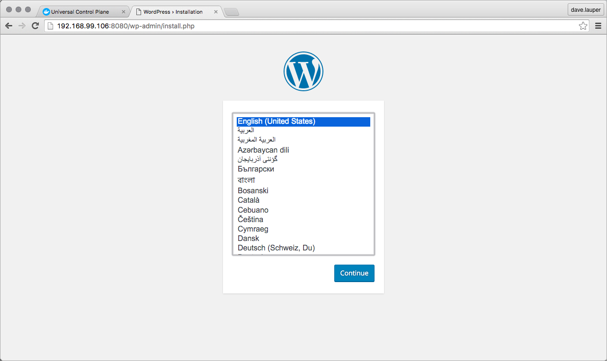

With Docker Universal Control Plane you can deploy your apps from the CLI,
using Docker Compose. In this example we're going to deploy a WordPress
application.

## Get a client certificate bundle

Docker UCP secures your cluster with role-based access control, so that only
authorized users can deploy applications to the cluster. To run
Docker commands on the UCP cluster, you need to authenticate your requests using
client certificates.

[Learn how to set your CLI to use client certificates](../access-ucp/cli-based-access.md).

## Deploy WordPress

The WordPress application we're going to deploy is composed of two services:

* wordpress: The container that runs Apache, PHP, and WordPress.
* db: A MariaDB database used for data persistence.

<!-- would be better if this was a docker-compose v2 file-->

After setting up your terminal to authenticate using client certificates,
create a file named `docker-compose.yml` with the following service definition:

```yml
wordpress:
  image: wordpress
  links:
    - db:mysql
  ports:
    - 8080:80

db:
  image: mariadb
  environment:
    MYSQL_ROOT_PASSWORD: example
```

In your command line, navigate to the place where you've created the
`docker-compose.yml` file and run:

```bash
$ docker-compose --project-name wordpress up -d
```

Test that the WordPress service is up and running, and find where you can
reach it.

```bash
$ docker-compose --project-name wordpress ps

Name                       Command               State             Ports
------------------------------------------------------------------------------------------
wordpress_db_1          docker-entrypoint.sh mysqld      Up      3306/tcp
wordpress_wordpress_1   /entrypoint.sh apache2-for ...   Up      192.168.99.106:8080->80/tcp
```

In this example, WordPress can be accessed at 192.168.99.106:8080. Navigate to
this address in your browser, to start using the WordPress app you just
deployed.



## Where to go next

* [Deploy an app from the UI](deploy-app-ui.md)