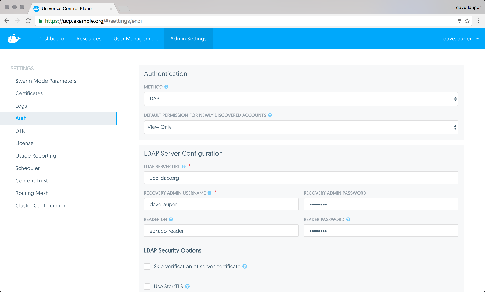

Docker UCP integrates with LDAP services, so that you can manage users from a
single place.

## Configure the LDAP integration

To configure UCP to authenticate users using an LDAP service, go to
the **UCP web UI**, navigate to the **Settings** page, and click the **Auth**
tab.

{: .with-border}

Then configure your LDAP integration.

**Authentication**

| Field                                            | Description                                                                                                                                                    |
|:-------------------------------------------------|:---------------------------------------------------------------------------------------------------------------------------------------------------------------|
| Method                                           | The method used to authenticate users. Managed authentication uses the UCP built-in authentication mechanism. LDAP uses an LDAP service to authenticate users. |
| Default permission for newly discovered accounts | The permission level assigned by default to a new user. Learn more about default permission levels.                                                            |

**LDAP server configuration**

| Field                   | Description                                                                                                                                         |
|:------------------------|:----------------------------------------------------------------------------------------------------------------------------------------------------|
| LDAP server URL         | The URL where the LDAP server can be reached.                                                                                                       |
| Recovery admin username | The username for a recovery user that can access UCP even when the integration with LDAP is misconfigured or the LDAP server is offline.            |
| Recovery admin password | The password for the recovery user.                                                                                                                 |
| Reader DN               | The distinguished name of the LDAP account used for searching entries in the LDAP server. As a best practice this should be an LDAP read-only user. |
| Reader password         | The password of the account used for searching entries in the LDAP server.                                                                          |

**LDAP security options**

| Field                                   | Description                                                                                                                                          |
|:----------------------------------------|:-----------------------------------------------------------------------------------------------------------------------------------------------------|
| Skip verification of server certificate | Whether to verify or not the LDAP server certificate when using TLS. The connection is still encrypted, but vulnerable to man-in-the-middle attacks. |
| Use StartTLS                            | Whether to connect to the LDAP server using TLS or not. If you set the LDAP Server URL field with `ldaps://`, this field is ignored.                 |

**User search configurations**

| Field               | Description                                                                                                                            |
|:--------------------|:---------------------------------------------------------------------------------------------------------------------------------------|
| Base DN             | The distinguished name on the LDAP tree where the search should start looking for users.                                               |
| Username attribute  | The LDAP attribute to use as username on UCP.                                                                                          |
| Full name attribute | The LDAP attribute to use as user name on UCP.                                                                                         |
| Filter              | The LDAP search filter used to find LDAP users. If you leave this field empty, all LDAP entries on the Base DN, are imported as users. |
| Search scope        | Whether to perform the LDAP search on a single level of the LDAP tree, or search through the full LDAP tree starting at the Base DN.   |

**Advanced LDAP configuration**

| Field                      | Description                                         |
|:---------------------------|:----------------------------------------------------|
| No simple pagination       | If your LDAP server doesn't support pagination.     |
| Enable sync of admin users | Whether to import LDAP users as UCP administrators. |

**Sync configuration**

| Field         | Description                                                                                                                                                                                                                                                            |
|:--------------|:-----------------------------------------------------------------------------------------------------------------------------------------------------------------------------------------------------------------------------------------------------------------------|
| Sync interval | The interval in hours to synchronize users between UCP and the LDAP server. When the synchronization job runs, new users found in the LDAP server are created in UCP with the default permission level. UCP users that don't exist in the LDAP server become inactive. |

**Test LDAP connection**

| Field              | Description                                                          |
|:-------------------|:---------------------------------------------------------------------|
| LDAP test username | An LDAP user to test that the configuration is correctly configured. |
| LDAP test password | The password of the LDAP user.                                       |

Before you save the configuration changes, you should test that the integration
is correctly configured. You can do this by providing the credentials of an
LDAP user, and clicking the **Test** button.

## Synchronize users

Once you've configure the LDAP integration, UCP synchronizes users based on the
interval you've defined. When the synchronization runs, UCP stores logs that
can help you troubleshoot when something goes wrong.

You can also manually synchronize users by clicking the **Sync Now** button.

## Revoke user access

When a user is removed from LDAP, that user becomes inactive after the LDAP
synchronization runs.
Also, when you switch from the built-in authentication to using LDAP
authentication, all manually created users become inactive.
