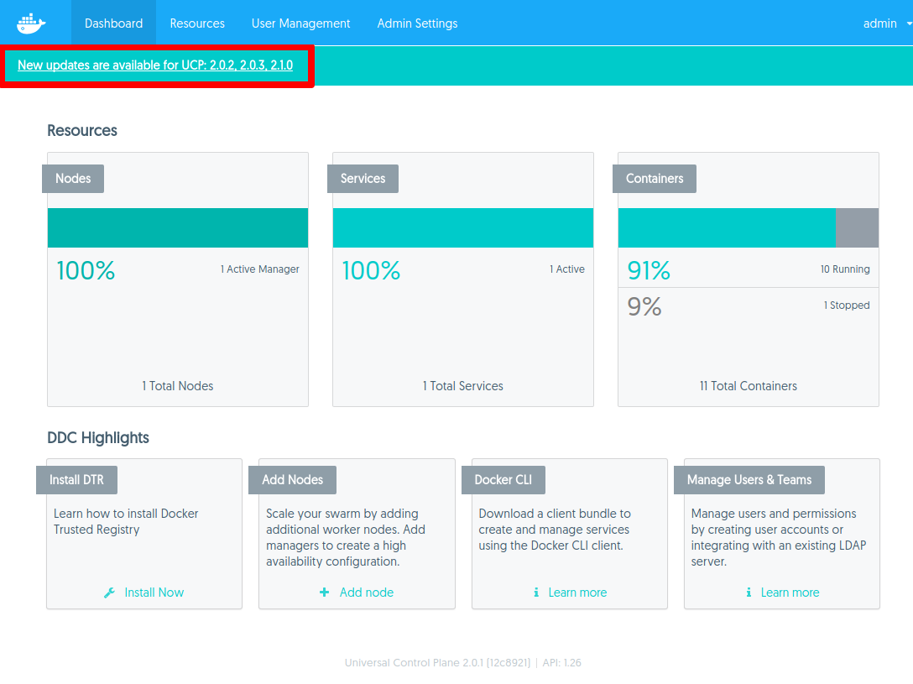
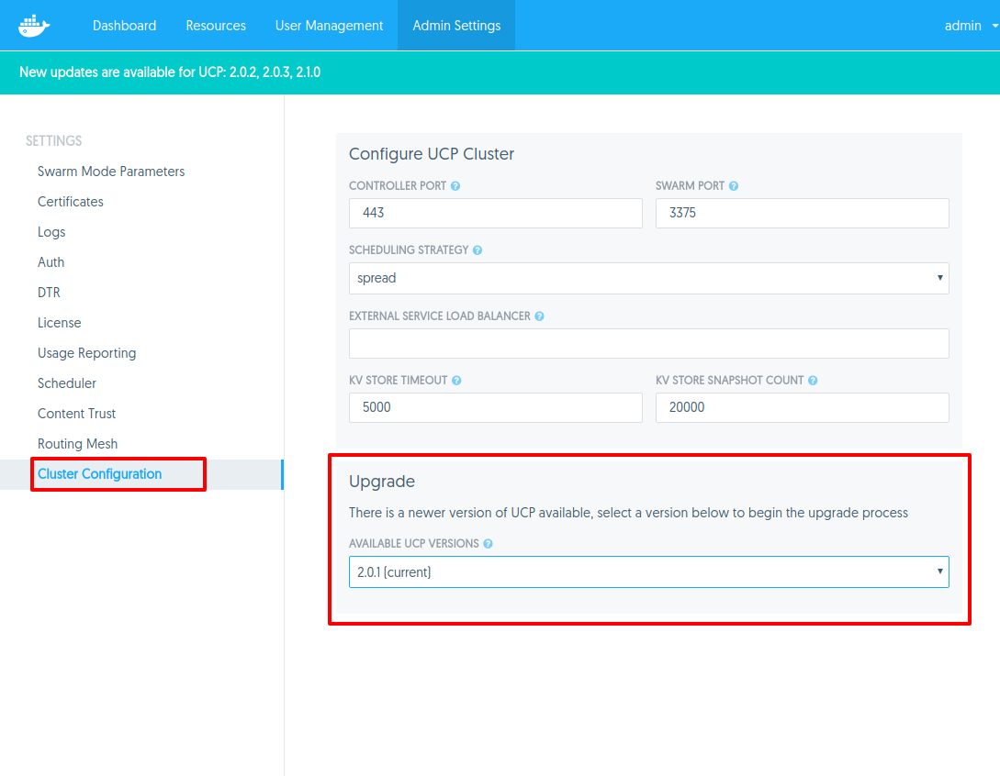
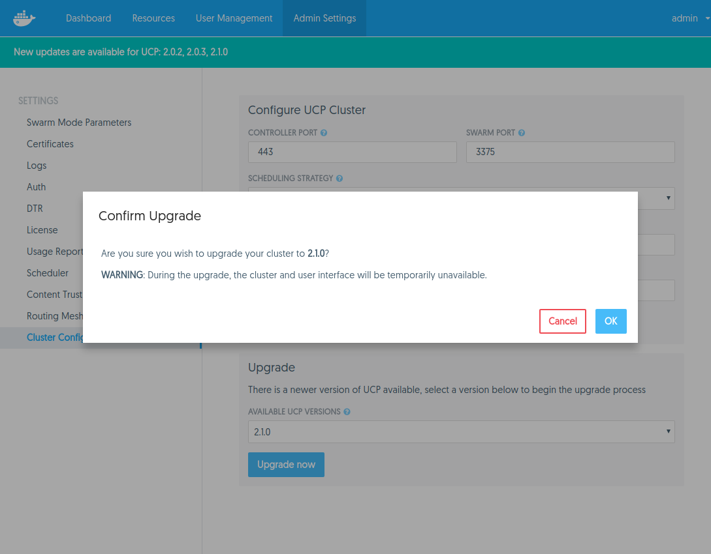

This page guides you in upgrading Docker Universal Control Plane (UCP) to
version 2.1.

Before upgrading to a new version of UCP, check the
[release notes](../release-notes/index.md) for this version.
There you'll find information about the new features, breaking changes, and
other relevant information for upgrading to a particular version.

## Plan the upgrade

As part of the upgrade process, you'll be upgrading the Docker Engine
installed in each node of the cluster to version 1.13.
You should plan for the upgrade to take place outside business hours, to ensure
there's minimal impact to your users.

Also, don't make changes to UCP configurations while you're upgrading it. That
can lead to misconfigurations that are difficult to troubleshoot.

## Backup your cluster

Before starting an upgrade, make sure your cluster is healthy. If a problem
occurs that will make it easier to find and troubleshoot any problems.

Then, [create a backup](backups-and-disaster-recovery.md)
of your cluster. This will allow you to recover from an existing backup if
something goes wrong during the upgrade process.

## Upgrade Docker Engine

For each node that is part of your cluster, upgrade the Docker Engine
installed on that node to Docker Engine version 1.13 or higher.

Starting with the manager nodes, and then worker nodes:

1. Log into the node using ssh.
2. Upgrade the Docker Engine to version 1.13 or higher.
3. Make sure the node is healthy.

    In your browser, navigate to the **UCP web UI**, and validate that the
    node is healthy and is part of the cluster.

## Upgrade UCP

You can upgrade UCP from the web UI or the CLI.

### Using the UI to perform an upgrade

When an upgrade is available for a UCP installation, a banner will be shown.

{: .with-border}

Clicking this message takes an admin user directly to the upgrade process.
It can be found under the **Cluster Configuration** tab of the **Admin
 Settings** section.

{: .with-border}

Select a version to upgrade to using the **Available UCP Versions** dropdown,
then click to upgrade.

Before the upgrade happens, a confirmation dialog along with important
information regarding cluster and UI availability will be displayed.

{: .with-border}

During the upgrade the UI will be unavailable and it is recommended to wait
until completion before continuing to interact with it.  Upon upgrade
completion, the user will see a notification that a newer version of the UI
is available and a browser refresh is required to see the latest UI.

### Using the CLI to perform an upgrade

To upgrade from the CLI, log into a UCP manager node using ssh, and run:

```
# Get the latest version of UCP
$ docker pull {{ page.docker_image }}

$ docker run --rm -it \
  --name ucp \
  -v /var/run/docker.sock:/var/run/docker.sock \
  {{ page.docker_image }} \
  upgrade --interactive
```

This runs the upgrade command in interactive mode, so that you are prompted
for any necessary configuration values.

Once the upgrade finishes, navigate to the **UCP web UI** and make sure that
all the nodes managed by UCP are healthy.


## Where to go next

* [UCP release notes](../release-notes/index.md)
