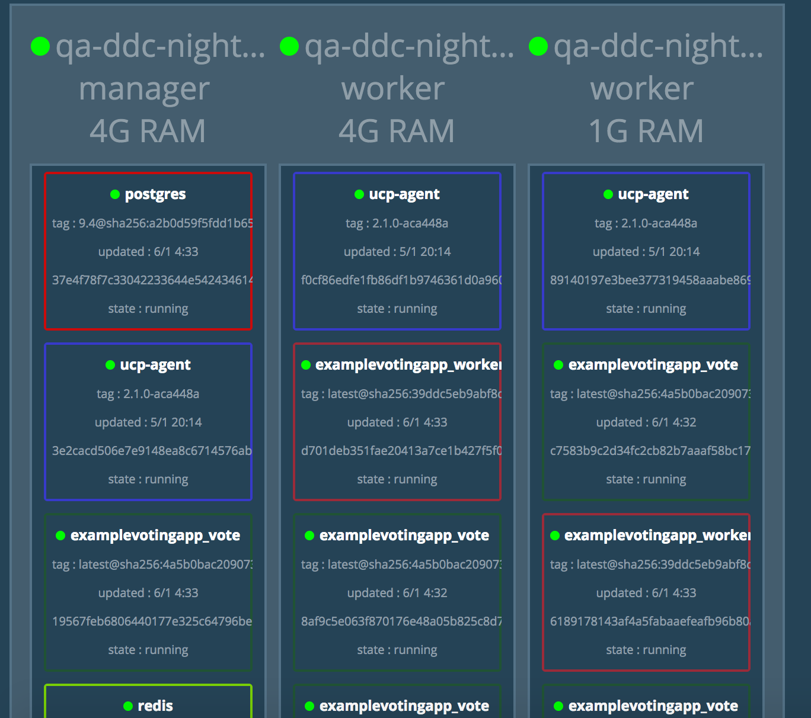

With Docker Universal Control Plane you can deploy your apps from the CLI,
using `docker-compose.yml` files. In this example, we're going to deploy an
application that allows users to vote on whether they prefer cats or dogs.

## Get a client certificate bundle

Docker UCP secures your Docker swarm with
[role-based access control](../../access-control/index.md),
so that only authorized users can deploy applications. To be able to run Docker
commands on a swarm managed by UCP, you need to configure your Docker CLI
client to authenticate to UCP using client certificates. 
[Learn how to set your CLI to use client certificates](../access-ucp/cli-based-access.md).

## Deploy the voting application

The application we're going to deploy is composed of several services:

* `vote`: The web application that presents the voting interface via port 5000
* `result`: A web application that displays the voting results via port 5001
* `visualizer`: A web application that shows a map of the deployment of the
  various services across the available nodes via port 8080
* `redis`: Collects raw voting data and stores it in a key/value queue
* `db`: A PostgreSQL service which provides permanent storage on a host volume
* `worker`: A background service that transfers votes from the queue to permanent storage

After setting up your Docker CLI client to authenticate using client certificates,
create a file named `docker-compose.yml` with the following contents:

```none
version: "3"
services:

  redis:
    image: redis:alpine
    ports:
      - "6379"
    networks:
      - frontend
    deploy:
      replicas: 2
      update_config:
        parallelism: 2
        delay: 10s
      restart_policy:
        condition: on-failure
  db:
    image: postgres:9.4
    volumes:
      - db-data:/var/lib/postgresql/data
    networks:
      - backend
    deploy:
      placement:
        constraints: [node.role == manager]
  vote:
    image: manomarks/examplevotingapp_vote
    ports:
      - 5000:80
    networks:
      - frontend
    depends_on:
      - redis
    deploy:
      replicas: 6
      update_config:
        parallelism: 2
      restart_policy:
        condition: on-failure
  result:
    image: manomarks/examplevotingapp_result
    ports:
      - 5001:80
    networks:
      - backend
    deploy:
      replicas: 2
      update_config:
        parallelism: 2
        delay: 10s
      restart_policy:
        condition: on-failure

  worker:
    image: manomarks/examplevotingapp_worker
    networks:
      - frontend
      - backend
    deploy:
      mode: replicated
      replicas: 2
      labels: [APP=VOTING]
      restart_policy:
        condition: on-failure
        delay: 10s
        max_attempts: 3
        window: 120s
      placement:
        constraints: [node.role == worker]
  visualizer:
    image: manomarks/visualizer
    ports:
      - "8080:8080"
    stop_grace_period: 1m30s
    volumes:
      - "/var/run/docker.sock:/var/run/docker.sock"

networks:
  frontend:
  backend:

volumes:
  db-data:
```

>  You can define services in this YAML file that feature a `deploy:` key, which
>  schedules the containers on certain nodes, defines their restart behavior,
>  configures the number of replicas, and so on. These features are provided
>  by the Compose V3 file format.
>  [Learn about Compose files](/compose/compose-file/).

In your command line, navigate to the place where you've created the
`docker-compose.yml` file and deploy the application to UCP by running `docker
stack deploy` and giving the application a name, like "VotingApp":

```bash
docker stack deploy --compose-file docker-compose.yml VotingApp
```

Test that the voting app is up and running using `docker stack services`:

```bash
$ docker stack services VotingApp

ID            NAME                  MODE        REPLICAS  IMAGE
df7uqiqyqi1n  VotingApp_visualizer  replicated  1/1       manomarks/visualizer:latest
f185w6xnjibe  VotingApp_result      replicated  2/2       manomarks/examplevotingapp_result:latest
hh8qzlrjsgyl  VotingApp_redis       replicated  2/2       redis:alpine
hyvo9xfbzoat  VotingApp_db          replicated  1/1       postgres:9.4
op3z6z5ri4k3  VotingApp_worker      replicated  1/2       manomarks/examplevotingapp_worker:latest
umoqinuwegzj  VotingApp_vote        replicated  6/6       manomarks/examplevotingapp_vote:latest
```

As you saw earlier, a service called `VotingApp_visualizer` was deployed and
published to port 8080. Visiting that port accesses the running instance of
the visualizer service in your browser, which shows a map of how this application
was deployed:

{: .with-border}

Here you can see some of the characteristics of the deployment specification
from the Compose file in play. For example, the manager node is running the
PostgreSQL container, as configured by setting `[node.role == manager]` as a
constraint in the `deploy` key for the `db` service.

## Cleanup

When you're all done, you can take down the entire stack by using `docker stack
rm`:

```bash
$ docker stack rm VotingApp

Removing service VotingApp_visualizer
Removing service VotingApp_result
Removing service VotingApp_redis
Removing service VotingApp_db
Removing service VotingApp_worker
Removing service VotingApp_vote
Removing network VotingApp_backend
Removing network VotingApp_frontend
Removing network VotingApp_default
```

## Where to go next

* [Deploy an app from the UI](index.md)
