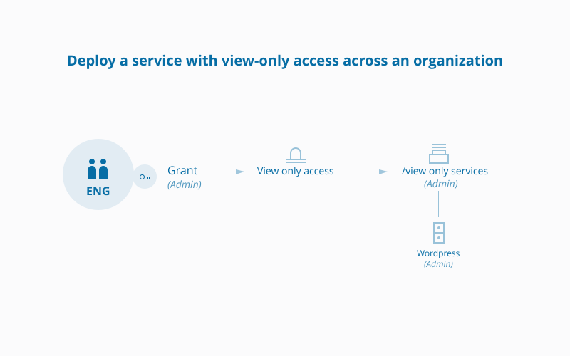
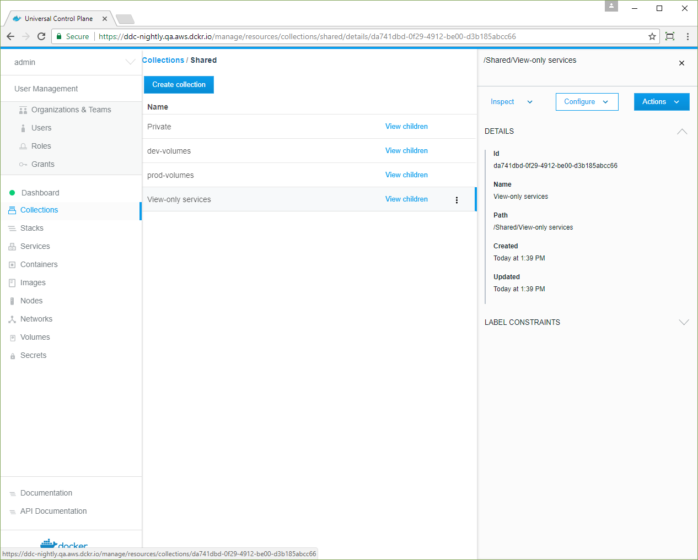
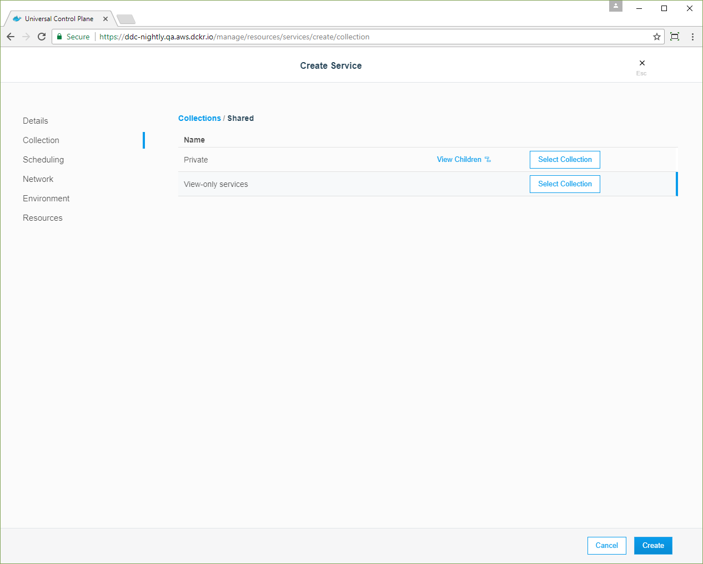
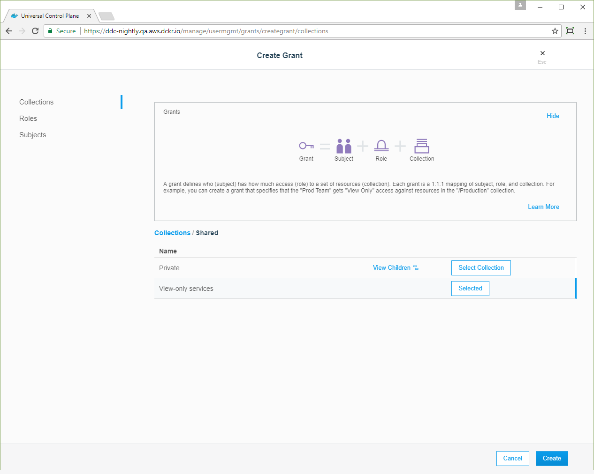
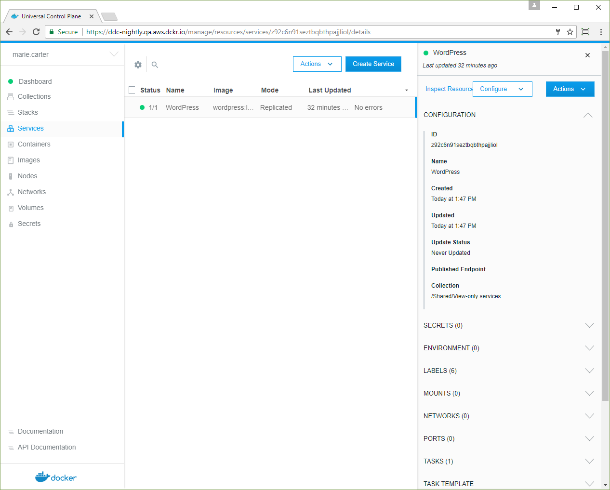

In this example, your organization is granted access to a new resource
collection that contains one service.

1. Create an organization and a team.
2. Create a collection for the view-only service.
3. Create a grant to manage user access to the collection.

## Create an organization

In this example, you create an organization and a team, and you add one user
who isn't an administrator to the team.
[Learn how to create and manage teams](create-and-manage-teams.md).

1.  Log in to UCP as an administrator.
2.  Navigate to the **Organizations & Teams** page and click
    **Create Organization**. Name the new organization "engineering" and
    click **Create**.
3.  Click **Create Team**, name the new team "Dev", and click **Create**.      
3.  Add a non-admin user to the Dev team.

## Create a collection for the service

1.  Navigate to the **Collections** page to view all of the resource
    collections in the swarm.
2.  Find the **Shared** collection and click **View children**.
3.  Click **Create collection** and name the collection "View-only services".
4.  Click **Create** to create the collection.

The `/Shared/View-only services` collection is ready to use for access
control.

## Deploy a service

Currently, the new collection has no resources assigned to it. To access
resources through this collection, deploy a new service and add it to the
collection.

1.  Navigate to the **Services** page and create a new service, named
    "WordPress".
2.  In the **Image** textbox, enter "wordpress:latest". This identifies the
    most recent WordPress image in the Docker Hub.
3.  In the left pane, click **Collection**. The **Swarm** collection appears.
4.  Click **View children** to list all of the collections. In **Shared**,
    Click **View children**, find the **View-only services** collection and
    select it.
5.  Click **Create** to add the "WordPress" service to the collection and
    deploy it.

You're ready to create a grant for controlling access to the "WordPress" service.

## Create a grant

Currently, users who aren't administrators can't access the
`/Shared/View-only services` collection. Create a grant to give the
`engineering` organization view-only access.

1.  Navigate to the **Grants** page and click **Create Grant**.
2.  In the left pane, click **Collections**, navigate to **/Shared/View-only services**,
    and click **Select Collection**.
3.  Click **Roles**, and in the dropdown, select **View Only**.
4.  Click **Subjects**, and under **Select subject type**, click **Organizations**.
    In the dropdown, select **engineering**.
5.  Click **Create** to grant permissions to the organization.

Everything is in place to show role-based access control in action.

## Verify the user's permissions

Users in the `engineering` organization have view-only access to the
`/Shared/View-only services` collection. You can confirm this by logging in
as a non-admin user in the organization and trying to delete the service.

1.  Log in as the user who you assigned to the Dev team.
2.  Navigate to the **Services** page and click **WordPress**.
3.  In the details pane, confirm that the service's collection is
    **/Shared/View-only services**.

    

4.  Click the checkbox next to the **WordPress** service, click **Actions**,
    and select **Remove**. You get an error message, because the user
    doesn't have `Service Delete` access to the collection.

## Where to go next

- [Isolate volumes between two different teams](isolate-volumes-between-teams.md)
