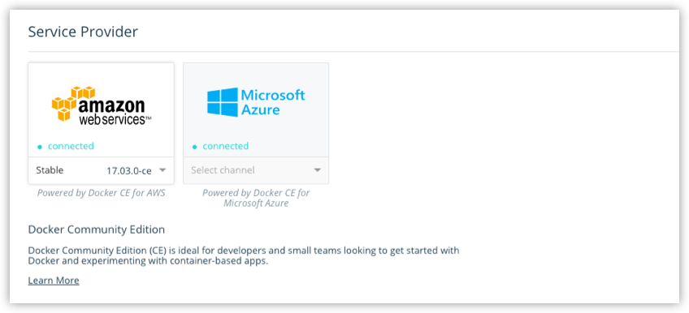
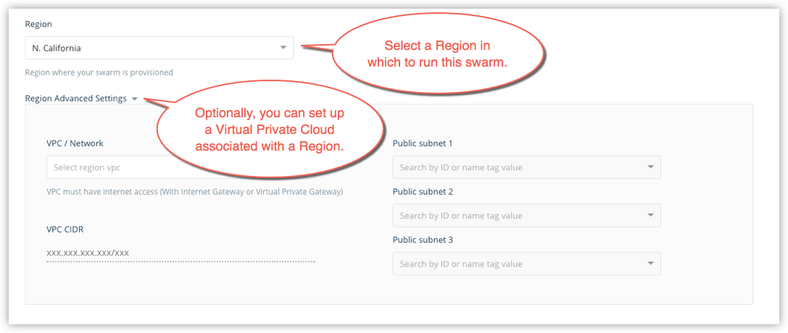
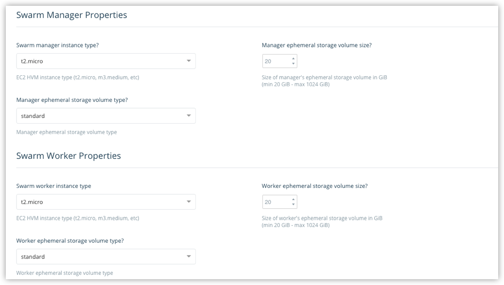
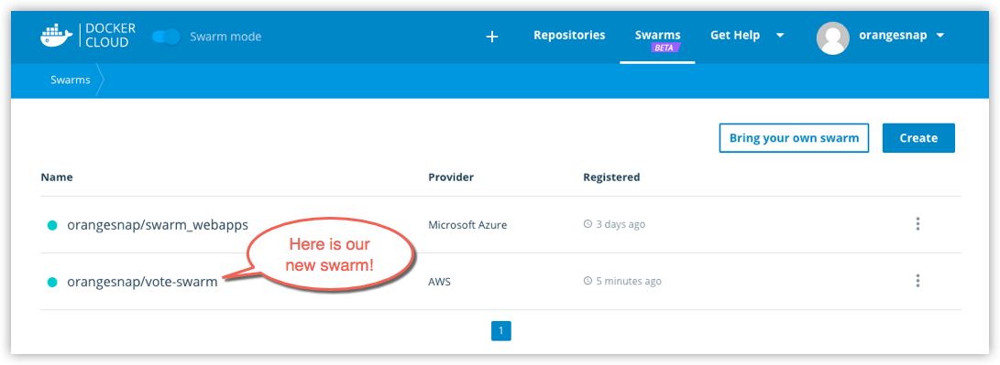



## Link your service provider to Docker Cloud

To create a swarm, you need to give Docker Cloud permission to deploy swarm
nodes on your behalf in your cloud services provider account.

If you haven't yet linked Docker Cloud to AWS, follow the steps in [Link Amazon Web Services to Docker Cloud](link-aws-swarm.md). Once it's
linked, it shows up on the **Swarms -> Create** page as a connected service
provider.

## Create a swarm

1. If necessary, log in to Docker Cloud and switch to Swarm Mode

2. Click **Swarms** in the top navigation, then click **Create**.

    Alternatively, you can select **+ -> Swarm** from the top navigation to get to the same page.

3.  Enter a name for the new swarm.

    Your Docker ID is pre-populated. In the example, our swarm name
    is "vote-swarm".

    

    >**Tip:** For Docker Cloud, use all lower case letters for swarm names. No spaces, capitalized letters, or special characters other than `.`, `_`, or `-` are allowed. AWS does not accept underscores in the name `_`.

4.  Select Amazon Web Services as the service provider and select a channel (`Stable` or `Edge`) from the drop-down menu.

    You can learn more about **stable** and **edge** channels in the [Install Docker overview](/install/) and the [Docker CE Edge](/edge/) topics.

    In this example, we use the `Stable` channel.

    

5.  Select a **Region** from the drop-down menu.

    > **Tip:** The SSH keys available to you in the next steps are
    filtered by the region you select here. Make sure that you have
    appropriate SSH keys available on the region you select.

    Optionally, click **Region Advanced Settings** to configure a
    [Virtual Private Cloud(VPC)](http://docs.aws.amazon.com/AmazonVPC/latest/UserGuide/VPC_Introduction.html) on which to run this swarm.

    

    For guidance on setting up a VPC, see [Recommended VPC and subnet setup](/docker-for-aws/faqs/#can-i-use-my-existing-vpc) in the Docker for AWS topics.

6.  Choose how many swarm managers and swarm worker nodes to deploy.

    Here, we create one manager and two worker nodes. (This maps nicely to the [Swarm tutorial setup](/engine/swarm/swarm-tutorial/index.md) and the [voting app sample in Docker Labs](https://github.com/docker/labs/blob/master/beginner/chapters/votingapp.md).)

    

7.  Configure swarm properties.

    

    * Select a public SSH key for Docker Cloud to use to connect to the
    nodes on AWS. Public keys from the [key pairs you configured on AWS](http://docs.aws.amazon.com/AWSEC2/latest/UserGuide/ec2-key-pairs.html) are provided in the drop-down menu. Only keys associated with the
    Region you selected (in step 5) are shown.

    * Choose whether to provide daily resource cleanup.

      Enabling this option helps to avoid charges for resources that you are no longer using. (See also, topics on [resource cleanup](http://docs.aws.amazon.com/AmazonECS/latest/developerguide/ECS_CleaningUp.html) in the AWS documentation.)

    * Enable or disable Cloudwatch for container logging.

      When enabled, Docker sends container logs to [Amazon Cloudwatch](https://aws.amazon.com/cloudwatch/), as described in the Docker for AWS topic on [Logging](/docker-for-aws/index.md#logging).

7. Select the instance sizes for the managers, and for the workers.

    

    In general, the larger your swarm, the larger the instance sizes you should use. See the Docker for AWS topics for more on [resource configuration](/docker-for-aws/index.md#configuration).

9. Click **Create**.

    Docker for AWS bootstraps all of the recommended infrastructure to
    start using Docker on AWS automatically. You don't need to worry
    about rolling your own instances, security groups, or load balancers
    when using Docker for AWS. (To learn more, see
    [Why Docker for AWS](/docker-for-aws/why.md).)

    This takes a few minutes. When the swarm is ready, its indicator on the Swarms page shows steady green.

    

    > **Note**: At this time, you cannot add nodes to a swarm from
    within Docker Cloud. To add new nodes to an existing swarm,
    log in to your AWS account, and add nodes manually. (You can
    unregister or dissolve swarms directly from Docker Cloud.)

## Where to go next

Learn how to [connect to a swarm through Docker Cloud](connect-to-swarm.md).

Learn how to [register existing swarms](register-swarms.md).

You can get an overview of topics on [swarms in Docker Cloud](index.md).

To find out more about Docker swarm in general, see the Docker engine
[Swarm Mode overview](/engine/swarm/).
