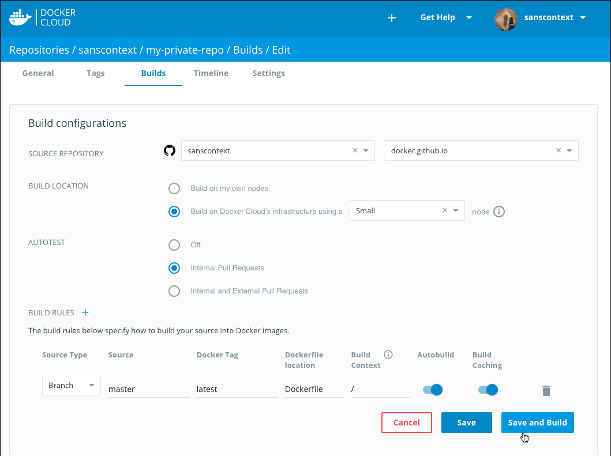

Docker Cloud provides a hosted [registry service](builds/repos.md) with
[build](builds/automated-build.md) and [testing](builds/automated-testing.md)
facilities for Dockerized application images; tools to help you set up and
[manage host infrastructure](infrastructure/); and [application lifecycle features](apps/) to automate deploying (and redeploying) services created from
images.

Log in to Docker Cloud using your free [Docker ID](../docker-id/).

<table class="tg">
  <tr>
    <td class="bluebar" width="50%"><a href="getting-started/index.md">Tutorial: Getting Started</a></td>
    <td class="bluebar" width="50%"><a href="getting-started/deploy-app/index.md">Tutorial: Deploy an App</a></td>
  </tr>
  <tr>
    <td class="plain" width="50%">
Start here! Deploy your first node and service in Docker Cloud.
</td>
    <td class="plain" width="50%">
For more advanced beginners: deploy a simple app in Docker Cloud.
</td>
  </tr>
  <tr>
    <td class="bluebar" width="50%"><a href="apps/index.md">Manage Applications</a></td>
    <td class="bluebar" width="50%"><a href="builds/index.md">Manage Builds and Images</a></td>
  </tr>
  <tr>
    <td class="plain" width="50%">
Deploy services, stacks, and apps in Docker Cloud.
</td>
    <td class="plain" width="50%">
Build and test your code, build Docker images.
</td>
  </tr>
  <tr>
    <td class="bluebar" colspan="2"><a href="infrastructure/index.md">Manage Infrastructure</a></td>
  </tr>
  <tr>
    <td class="plain" colspan="2">
Learn how to link to your hosts, upgrade the Docker Cloud agent, and manage container distribution. See the <a href="infrastructure/cloud-on-aws-faq.md">AWS FAQ</a> and <a href="infrastructure/cloud-on-packet.net-faq.md">Packet.net FAQ</a>
</td>
  </tr>
  <tr>
    <td class="bluebar" colspan="2"> <a href="/apidocs/docker-cloud/">API Docs</a> &nbsp;&nbsp; ● &nbsp;&nbsp; <a href="docker-errors-faq.md">Frequently Asked Questions</a> &nbsp;&nbsp; ● &nbsp;&nbsp; <a href="https://forums.docker.com/c/docker-cloud/release-notes">Release Notes</a></td>
  </tr>
</table>

## About Docker Cloud

### Images, Builds, and Testing

Docker Cloud uses the hosted Docker Cloud Registry, which allows you to publish
Dockerized images on the internet either publicly or privately. Docker Cloud can
also store pre-built images, or link to your source code so it can build the
code into Docker images, and optionally test the resulting images before pushing
them to a repository.

### Infrastructure management

Before you can do anything with your images, you need somewhere to run them.
Docker Cloud allows you to link to your infrastructure or cloud services
provider so you can provision new nodes automatically. Once you have nodes set
up, you can deploy images directly from Docker Cloud repositories.

### Services, Stacks, and Applications

Images are just one layer in containerized applications. Once you've built an
image, you can use it to deploy services (which are composed of one or more
containers created from an image), or use Docker Cloud's
[stackfiles](apps/stacks.md) to combine it with other services and
microservices, to form a full application.

