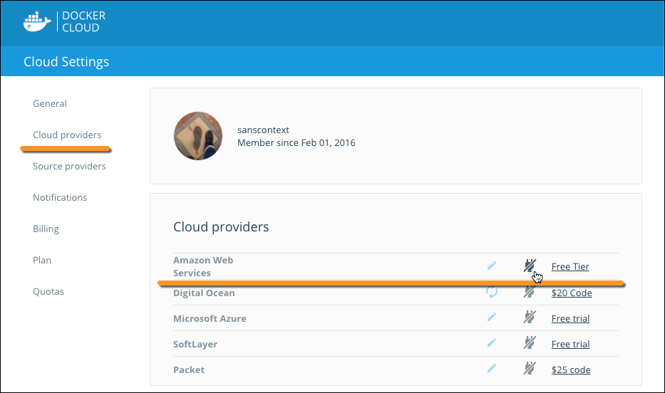
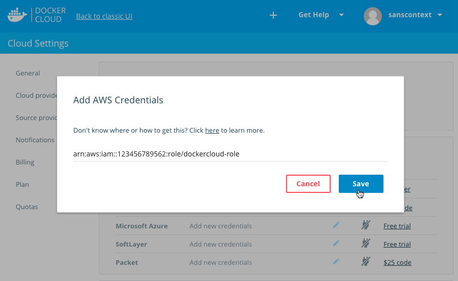

You can create a role with AWS IAM (Identity and Access Management) so that Docker Cloud can provision and manage **node clusters** and **nodes** on your behalf.

Previously, we recommended that you create a service user that Docker Cloud would use to access your AWS account. If you previously used this method, you can [create a new role](link-aws.md#acreate-a-dockercloud-role-role), attach the policy you created previously, unlink your AWS credentials and relink them using the new ARN method. You can then delete the `dockercloud-user`.

## Create a dockercloud-policy

Create an access control policy that will grant specific privileges to Docker Cloud so it can provision EC2 resources on your behalf. 

1.  Go to the AWS IAM panel at <a href="https://console.aws.amazon.com/iam/home#policies" target ="_blank">https://console.aws.amazon.com/iam/home#policies</a>
2.  Click **Create Policy**.
3.  On the next screen click **Create Your Own Policy**.
4.  Name the policy `dockercloud-policy` and paste the following text in the space provided for **Policy Document**.

    ```json
    {
      "Version": "2012-10-17",
      "Statement": [
        {
          "Action": [
            "ec2:*",
            "iam:ListInstanceProfiles"
          ],
          "Effect": "Allow",
          "Resource": "*"
        }
      ]
    }
    ```

    To limit the user to a specific region, use the [policy below](link-aws.md#limit-dockercloud-user-to-a-specific-ec2-region) instead.

    `ec2:*` allows the user to perform any operation in EC2.

    `iam:ListInstanceProfiles` allows the user to retrieve instance profiles to apply to your nodes.

    > **Note**: You cannot use an instance profile that has more permissions than the IAM user you are using with Docker Cloud. If you do that, you will get an "unauthorized operation" error. You can fix this issue by adding the `"Action":"iam:PassRole"` permission to the policy for the service user. You can read more about this <a href="http://blogs.aws.amazon.com/security/post/Tx3M0IFB5XBOCQX/Granting-Permission-to-Launch-EC2-Instances-with-IAM-Roles-PassRole-Permission" target="_blank">here</a>
6.  Click **Validate Policy**.
7.  If the validation is successful click **Create Policy**.

### Limit dockercloud-policy to a specific EC2 region

You can use the following `dockercloud-policy` to limit Docker Cloud to a specific EC2 region. Replace the example region `us-west-2` US West (Oregon) with the region you want.

```json
{
  "Version": "2012-10-17",
  "Statement": [
      {
        "Action": [
           "ec2:*"
        ],
        "Effect": "Allow",
        "Resource": "*",
        "Condition": {
            "StringEquals": {
                "ec2:Region": "us-west-2"
            }
        }
      },
      {
        "Action": [
            "iam:ListInstanceProfiles"
        ],
        "Effect": "Allow",
        "Resource": "*"
      }
  ]
}
```

## Create a dockercloud-role role
1. Go to the AWS IAM Role creation panel at  <a href="https://console.aws.amazon.com/iam/home#roles">https://console.aws.amazon.com/iam/home#roles</a>
2. Give the new role a name, such as `dockercloud-role`.

    > **Note**: You must use one role per Docker Cloud account namespace, so if you will be using nodes from a single AWS account for multiple Docker Cloud accounts, you should add an identifying the namespace to the end of the name. For example, you might have `dockercloud-role-moby` and `dockercloud-role-teamawesome`.

3.  Select **Role for Cross-Account Access**, and in the submenu that opens select **Allows IAM users from a 3rd party AWS account to access this account**.

    

4. In the **Account ID** field, enter the ID for the Docker Cloud service: `689684103426`.
5. In the **External ID** field, enter your Docker Cloud username.

    If you're linking to nodes for an organization, enter the organization name.

6. Leave **Require MFA** unchecked.
7. On the next screen, select the `dockercloud-policy` you created to attach to the role.
8. On next page review your entries and copy the full **Role ARN** string.

    The ARN string should look something like `arn:aws:iam::123456789123:role/dockercloud-role`. You'll use the ARN in the next step. If you forget to copy the ARN here, view the Role in IAM to see its related information including the ARN.

9. Click **Create Role**.

    


## Add AWS account credentials

Once you've created the a `dockercloud-policy`, attached it to a
`dockercloud-role`, and have the role's Role ARN, go back to Docker Cloud to connect the account.

1. In Docker Cloud, click **Cloud settings** at the lower left.
2. In the Cloud Providers section, click the plug icon next to Amazon Web Services.

    

3. Enter the full `Role ARN` for the role you just created.

    

4. Click **Save**.

## What's next?

You're ready to start using AWS as the infrastructure provider
for Docker Cloud! If you came here from the tutorial, click here to [continue the tutorial and deploy your first node](../getting-started/your_first_node.md).