Welcome to Docker for Mac! Docker is a full development platform for creating
containerized apps, and Docker for Mac is the best way to get started with
Docker _on a Mac_.

> See [Install Docker for Mac](install.md){: target="_blank" class="_"} for information on system requirements and stable & edge channels.

## Check versions

Ensure your versions of `docker`, `docker-compose`, and `docker-machine` are up-to-date and compatible with `Docker.app`. Your output may differ if you are running different versions.

```shell
$ docker --version
Docker version {{ site.docker_ce_stable_version }}, build c97c6d6

$ docker-compose --version
docker-compose version {{ site.compose_version }}, build 8dd22a9

$ docker-machine --version
docker-machine version {{ site.machine_version }}, build 9ba6da9
```

## Explore the application

1.  Open a command-line terminal and test that your installation works by
    running the simple Docker image, [hello-world](https://hub.docker.com/_/hello-world/){: target="_blank" class="_"}:

    ```shell
    $ docker run hello-world

    Unable to find image 'hello-world:latest' locally
    latest: Pulling from library/hello-world
    ca4f61b1923c: Pull complete
    Digest: sha256:ca0eeb6fb05351dfc8759c20733c91def84cb8007aa89a5bf606bc8b315b9fc7
    Status: Downloaded newer image for hello-world:latest

    Hello from Docker!
    This message shows that your installation appears to be working correctly.
    ...
    ```

2.  Start a Dockerized web server. Like the hello-world image above, if the
    image is not found locally, Docker pulls it from Docker Hub.

    ```bash
    $ docker run -d -p 80:80 --name webserver nginx
    ```

3.  In a web browser, go to `http://localhost/` to view the nginx homepage. Because we specified the default HTTP port, it isn't necessary to append `:80` at the end of the URL.

    {:width="500px"}

    > Early beta releases used `docker` as the hostname to build the
    > URL. Now, ports are exposed on the private IP addresses of the VM and
    > forwarded to `localhost` with no other host name set.

4.  View the details on the container while your web server is running (with `docker container ls` or `docker ps`):

    ```none
    $ docker container ls
    CONTAINER ID   IMAGE   COMMAND                  CREATED              STATUS              PORTS                         NAMES
    56f433965490   nginx   "nginx -g 'daemon off"   About a minute ago   Up About a minute   0.0.0.0:80->80/tcp, 443/tcp   webserver
    ```

5.  Stop and remove containers and images with the following commands. Use the "all" flag (`--all` or `-a`) to view stopped containers.

    ```shell
    $ docker container ls
    $ docker container stop webserver
    $ docker container ls -a
    $ docker container rm webserver
    $ docker image ls
    $ docker image rm nginx
    ```

## Preferences menu

Choose {: .inline} -> **Preferences** from the menu bar and configure the runtime options described below.

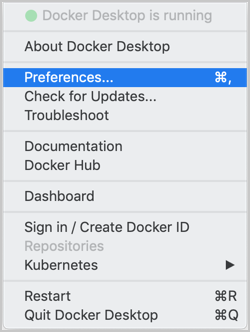{:width="250px"}

### General

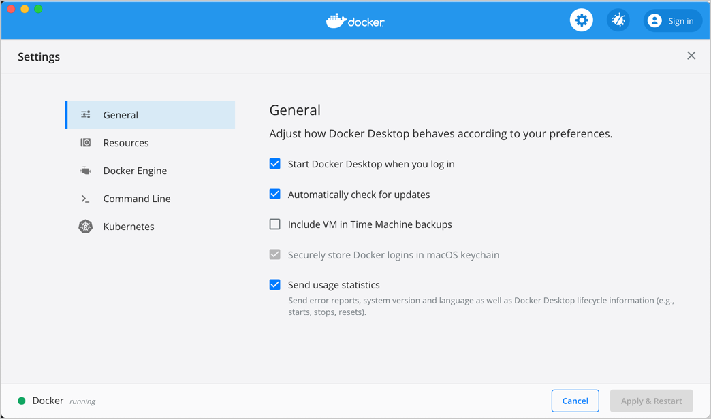{:width="400px"}

General settings are:

- **Start Docker when you log in**: Uncheck this option if you don't want Docker to start when you open your session.

- **Automatically check for updates** notifies you when an update is available.
  Click **OK** to accept and install updates (or cancel to keep the current
  version). If you disable this option, you can still find out about updates
  manually by choosing {: .inline} -> **Check for Updates**.

- **Include VM in Time Machine backups** backs up the Docker for Mac virtual machine. (Disabled by default.)

- **Securely store Docker logins in MacOS keychain** stores your Docker login credentials. (Enabled by default.)

- **Send usage statistics** &mdash; Send diagnostics, crash reports, and usage data to Docker. This information helps Docker improve the application and get more context for troubleshooting problems. (Enabled by default.)

### File sharing

Choose which local directories to share with your containers. File sharing is
required for volume mounting if the project lives outside of the `/Users`
directory. In that case, share the drive where the Dockerfile and volume are
located. Otherwise, you get `file not found` or `cannot start service errors at
runtime`.

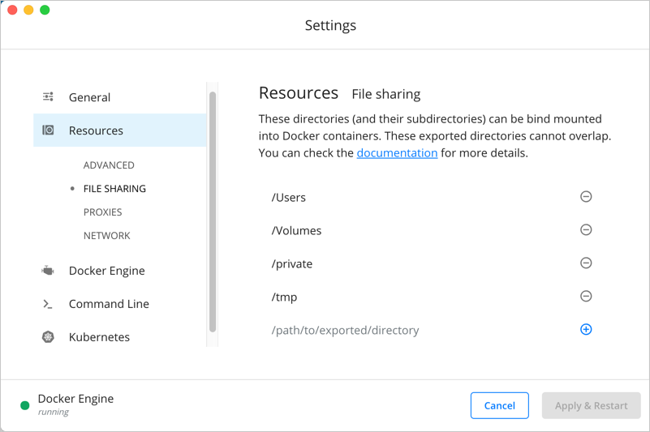{:width="400px"}

File share settings are:

- **Add a Directory**: Click `+` and navigate to the directory you want to add.

- **Apply & Restart** makes the directory available to containers using Docker's bind mount (`-v`) feature.

  There are some limitations on the directories that can be shared:

  - They cannot be a subdirectory of an already shared directory.
  - They cannot already exist inside of Docker.

For more information, see:

- [Namespaces](osxfs.md#namespaces){: target="_blank" class="_"} in the topic on [osxfs file system sharing](osxfs.md).
- [Volume mounting requires file sharing for any project directories outside of `/Users`](troubleshoot.md#volume-mounting-requires-file-sharing-for-any-project-directories-outside-of-users).)

### Advanced

On the Advanced tab, you can limit resources available to Docker.

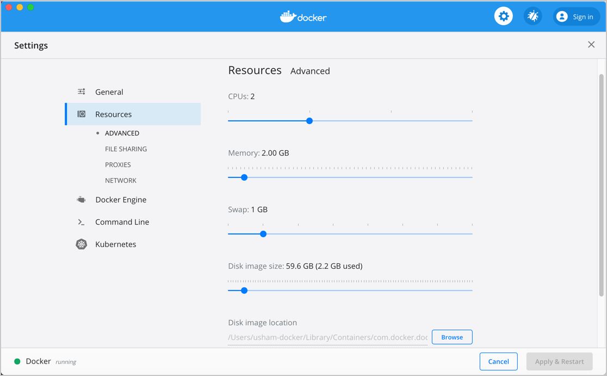{:width="400px"}

Advanced settings are:

**CPUs**: By default, Docker for Mac is set to use half the number of processors available
on the host machine. To increase processing power, set this to a higher number;
to decrease, lower the number.

**Memory**: By default, Docker for Mac is set to use `2` GB runtime memory, allocated from
the total available memory on your Mac. To increase RAM, set this to a higher number;
to decrease it, lower the number.

**Swap**: Configure swap file size as needed. The default is 1 GB.

### Disk

Specify the **Disk image location** of the Linux volume, where containers and images are stored.

You can also move the disk image location. If you attempt to move the disk image
to a location that already has one, you get a prompt asking if you want to use
the existing image or replace it.

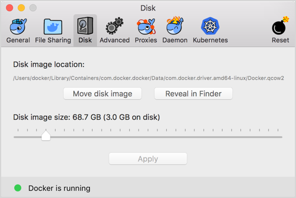{:width="400px"}

### Proxies

Docker for Mac detects HTTP/HTTPS Proxy Settings from macOS and automatically
propagates these to Docker and to your containers. For example, if you set your
proxy settings to `http://proxy.example.com`, Docker uses this proxy when
pulling containers.

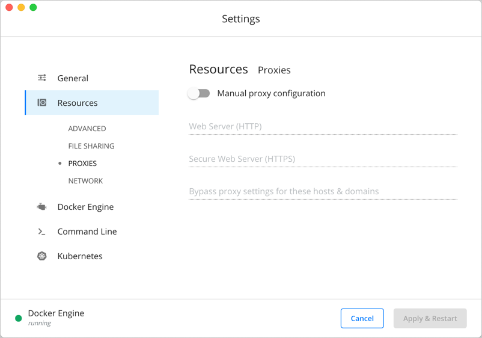{:width="400px"}

{:width="600px"}

When you start a container, your proxy settings propagate into
the containers. For example:

```
$ docker run -it alpine env
PATH=/usr/local/sbin:/usr/local/bin:/usr/sbin:/usr/bin:/sbin:/bin
HOSTNAME=b7edf988b2b5
TERM=xterm
HOME=/root
HTTP_PROXY=http://proxy.example.com:3128
http_proxy=http://proxy.example.com:3128
no_proxy=*.local, 169.254/16
```

You can see from the above output that the `HTTP_PROXY`, `http_proxy`, and
`no_proxy` environment variables are set. When your proxy configuration changes,
Docker restarts automatically to pick up the new settings. If you have
containers that you wish to keep running across restarts, you should consider
using [restart policies](/engine/reference/run/#restart-policies-restart).

<p id="daemon-experimental-mode" />

### Daemon

You can configure options on the Docker daemon that determine how your containers run.

Select **Basic** to configure the daemon with interactive settings, or select
**Advanced** to edit the JSON directly.

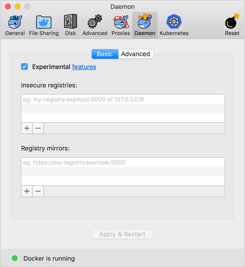{:width="400px"}


#### Experimental features

Both Docker for Mac Stable and Edge releases have experimental features enabled
on Docker Engine, as described [Docker Experimental Features README](https://github.com/docker/docker-ce/blob/master/components/cli/experimental/README.md){: target="_blank" class="_"}. If you uncheck **experimental mode**, Docker for Mac uses the current generally available
release of Docker Engine.

> Don't enable experimental features in production
>
> Experimental features are not appropriate for production environments or workloads. They are meant to be sandbox experiments for new ideas. Some experimental features may become incorporated into upcoming stable releases, but others may be modified or pulled from subsequent Edge releases, and never released on Stable.

You can see whether you are running experimental mode at the command line. If
`Experimental` is `true`, then Docker is running in experimental mode, as shown
here. (If `false`, Experimental mode is off.)

```bash
$ docker version -f {{.Server.Experimental}}
true
```

#### Insecure registries

You can set up a custom and insecure [registry](/registry/introduction.md){: target="_blank" class="_"}
to store your public or private images (instead of using [Docker Hub](https://hub.docker.com/){:target="_blank" class="_"}
or [Docker Trusted Registry](/datacenter/dtr/2.1/guides/index.md)).
Add URLs for your insecure registries and registry mirrors on which to host your images.

See also:
- [How do I add custom CA certificates?](faqs.md#how-do-i-add-custom-ca-certificates){:target="_blank" class="_"}
- [How do I add client certificates](faqs.md#how-do-i-client-certificates){:target="_blank" class="_"}

#### Daemon configuration file

Click the **Advanced** tab to configure the daemon from the JSON file. For a full
list of options, see the Docker Engine [dockerd commandline reference](/engine/reference/commandline/dockerd.md){:target="_blank" class="_"}.

Click **Apply & Restart** to save your settings and reboot Docker. Or, to cancel
changes, click another preference tab, then choose to discard or not apply changes when asked.

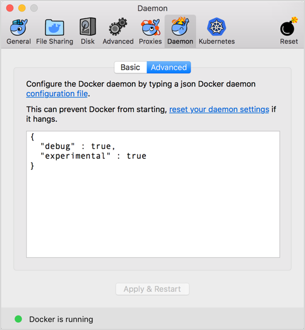{:width="400px"}

### Kubernetes

**Kubernetes is only available in Docker for Mac 17.12 CE and higher, on the Edge channel.**
Kubernetes support is not included in Docker for Mac Stable releases. To find
out more about Stable and Edge channels and how to switch between them, see
[General configuration](#general){:target="_blank" class="_"}.

Docker for Mac 17.12 CE (and higher) Edge includes a standalone Kubernetes server
that runs on your Mac, so that you can test deploying your Docker workloads on
Kubernetes.

The Kubernetes client command, `kubectl`, is included and configured to connect
to the local Kubernetes server. If you have `kubectl` already installed and
pointing to some other environment, such as `minikube` or a GKE cluster, be sure
to change context so that `kubectl` is pointing to `docker-for-desktop`:

```bash
$ kubectl config get-contexts
$ kubectl config use-context docker-for-desktop
```

If you installed `kubectl` with Homebrew, or by some other method, and
experience conflicts, remove `/usr/local/bin/kubectl`.

- To enable Kubernetes support and install a standalone instance of Kubernetes
  running as a Docker container, select **Enable Kubernetes** and click the
  **Apply** button.

  {: .with-border width="400px"}


  An Internet connection is required. Images required to run the Kubernetes
  server are downloaded and instantiated as containers, and the
  `/usr/local/bin/kubectl` command is installed on your Mac.

  When Kubernetes is enabled and running, an additional status bar item displays
  at the bottom right of the Docker for Mac Preferences dialog.

  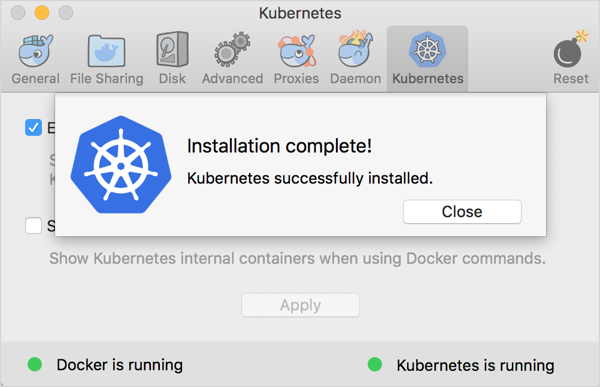{:width="400px"}

  The status of Kubernetes shows in the Docker menu and the context points to `docker-for-desktop`.

  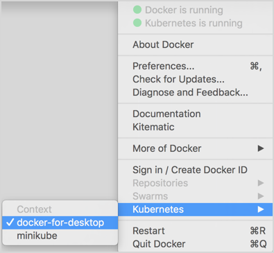{: .with-border width="400px"}

- By default, Kubernetes containers are hidden from commands like `docker
  service ls`, because managing them manually is not supported. To make them
  visible, select **Show system containers (advanced)** and click **Apply and restart**.
  Most users do not need this option.

- To disable Kubernetes support at any time, deselect **Enable Kubernetes**.
  The Kubernetes containers are stopped and removed, and the
  `/usr/local/bin/kubectl` command is removed.

  For more about using the Kubernetes integration with
  Docker for Mac, see [Deploy on Kubernetes](kubernetes.md){:target="_blank" class="_"}.

### Reset

Select {: .inline} ->
**Preferences** from the menu bar, then click **Reset** to reset factory
defaults, restart the Docker daemon, or uninstall.

{:width="400px"}

Reset settings are:

* **Restart** - Select to restart the Docker daemon.

* **Remove all data** - This option removes/resets all Docker data _without_
a reset to factory defaults (which would cause you to lose settings).

* **Reset to factory defaults** - Choose this option to reset all options on
  Docker for Mac to its initial state, the same as when it was first installed.

  * **Uninstall** - Choose this option to remove Docker for Mac from your system.

> Uninstall Docker for Mac from the commandline
>
> To uninstall Docker from Mac from a terminal, run: `<DockerforMacPath> --uninstall`.
> If your instance is installed in the default location, this command provides a
> clean uninstall:
>
> ```shell
> $ /Applications/Docker.app/Contents/MacOS/Docker --uninstall
> Docker is running, exiting...
> Docker uninstalled successfully. You can move the Docker application to the trash.
> ```
> You might want to use the command-line uninstall if, for example, you find that
> the app is non-functional, and you cannot uninstall it from the menu.

## Add TLS certificates

You can add trusted Certificate Authorities (CAs) (used to verify registry
server certificates) and client certificates (used to authenticate to
registries) to your Docker daemon.

### Add custom CA certificates (server side)

All trusted CAs (root or intermediate) are supported.
Docker for Mac creates a certificate bundle of all user-trusted CAs based on the
Mac Keychain, and appends it to Moby trusted certificates. So if an enterprise
SSL certificate is trusted by the user on the host, it is trusted by Docker
for Mac.

To manually add a custom, self-signed certificate, start by adding
the certificate to the macOS keychain, which is picked up by Docker for
Mac. Here is an example.

```bash
$ sudo security add-trusted-cert -d -r trustRoot -k /Library/Keychains/System.keychain ca.crt
```

Or, if you prefer to add the certificate to your own local keychain only (rather
than for all users), run this command instead:

```
$ security add-trusted-cert -d -r trustRoot -k ~/Library/Keychains/login.keychain ca.crt
```

See also, [Directory structures for certificates](#directory-structures-for-certificates).

> **Note:** You need to restart Docker for Mac after making any changes to
the keychain or to the `~/.docker/certs.d` directory in order for
the changes to take effect.

For a complete explanation of how to do this, see the blog post
[Adding Self-signed Registry Certs to Docker & Docker for Mac](http://container-solutions.com/adding-self-signed-registry-certs-docker-mac/){:target="_blank" class="_"}.

### Add client certificates

You can put your client certificates in
`~/.docker/certs.d/<MyRegistry>:<Port>/client.cert` and
`~/.docker/certs.d/<MyRegistry>:<Port>/client.key`.

When the Docker for Mac application starts up, it copies the `~/.docker/certs.d`
folder on your Mac to the `/etc/docker/certs.d` directory on Moby (the Docker
for Mac `xhyve` virtual machine).

> * You need to restart Docker for Mac after making any changes to the keychain
> or to the `~/.docker/certs.d` directory in order for the changes to take
> effect.
>
> * The registry cannot be listed as an _insecure registry_ (see [Docker
> Daemon](index.md#docker-daemon)). Docker for Mac ignores
> certificates listed under insecure registries, and does not send client
> certificates. Commands like `docker run` that attempt to pull from the
> registry produce error messages on the command line, as well as on the
> registry.

### Directory structures for certificates

If you have this directory structure, you do not need to manually add the CA
certificate to your Mac OS system login:

```
/Users/<user>/.docker/certs.d/
└── <MyRegistry>:<Port>
   ├── ca.crt
   ├── client.cert
   └── client.key
```

The following further illustrates and explains a configuration with custom
certificates:

```
/etc/docker/certs.d/        <-- Certificate directory
└── localhost:5000          <-- Hostname:port
   ├── client.cert          <-- Client certificate
   ├── client.key           <-- Client key
   └── ca.crt               <-- Certificate authority that signed
                                the registry certificate
```

You can also have this directory structure, as long as the CA certificate is
also in your keychain.

```
/Users/<user>/.docker/certs.d/
└── <MyRegistry>:<Port>
    ├── client.cert
    └── client.key
```

To learn more about how to install a CA root certificate for the registry and
how to set the client TLS certificate for verification, see [Verify repository
client with certificates](/engine/security/certificates.md) in the Docker Engine
topics.

## Install shell completion

Docker for Mac comes with scripts to enable completion for the `docker`,
`docker-machine`, and `docker-compose` commands. The completion scripts may be
found inside `Docker.app`, in the `Contents/Resources/etc/` directory and can be
installed both in Bash and Zsh.

### Bash

Bash has [built-in support for completion](https://www.debian-administration.org/article/316/An_introduction_to_bash_completion_part_1){:target="_blank" class="_"}
To activate completion for Docker commands, these files need to be copied or
symlinked to your `bash_completion.d/` directory. For example, if you installed
bash via [Homebrew](http://brew.sh/):

```bash
etc=/Applications/Docker.app/Contents/Resources/etc
ln -s $etc/docker.bash-completion $(brew --prefix)/etc/bash_completion.d/docker
ln -s $etc/docker-machine.bash-completion $(brew --prefix)/etc/bash_completion.d/docker-machine
ln -s $etc/docker-compose.bash-completion $(brew --prefix)/etc/bash_completion.d/docker-compose
```

### Zsh

In Zsh, the [completion system](http://zsh.sourceforge.net/Doc/Release/Completion-System.html){:target="_blank" class="_"}
takes care of things. To activate completion for Docker commands, these files
need to be copied or symlinked to your Zsh `site-functions/` directory. For
example, if you installed Zsh via [Homebrew](http://brew.sh/):

```bash
etc=/Applications/Docker.app/Contents/Resources/etc
ln -s $etc/docker.zsh-completion /usr/local/share/zsh/site-functions/_docker
ln -s $etc/docker-machine.zsh-completion /usr/local/share/zsh/site-functions/_docker-machine
ln -s $etc/docker-compose.zsh-completion /usr/local/share/zsh/site-functions/_docker-compose
```

## Give feedback and get help

To get help from the community, review current user topics, join or start a
discussion, log on to our [Docker for Mac
forum](https://forums.docker.com/c/docker-for-mac){:target="_blank" class="_"}.

To report bugs or problems, log on to [Docker for Mac issues on
GitHub](https://github.com/docker/for-mac/issues){:target="_blank" class="_"},
where you can review community reported issues, and file new ones.  See [Logs
and Troubleshooting](troubleshoot.md) for more details.

To give us feedback on the documentation or update it yourself, use the Feedback
options at the bottom of each docs page.

## Docker Store

Choose **Docker Store** from the Docker for Mac menu to get to the Docker app
downloads site. [Docker store](https://store.docker.com/){:target="_blank" class="_"} is a component of the
next-generation Docker Hub, and the best place to find compliant, trusted
commercial and free software distributed as Docker Images.

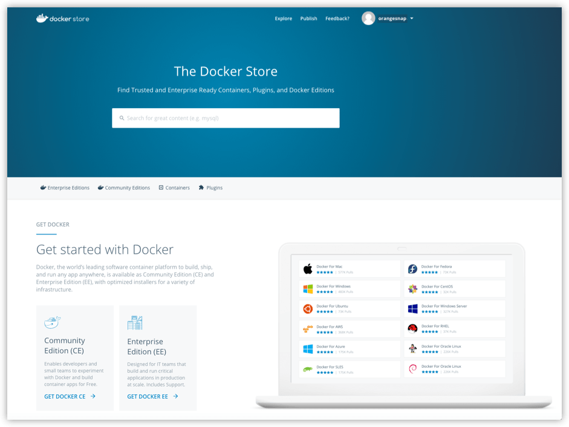{:width="550px"}

## Docker Cloud

You can access your [Docker Cloud](/docker-cloud/index.md){:target="_blank" class="_"}  account from within Docker for Mac.

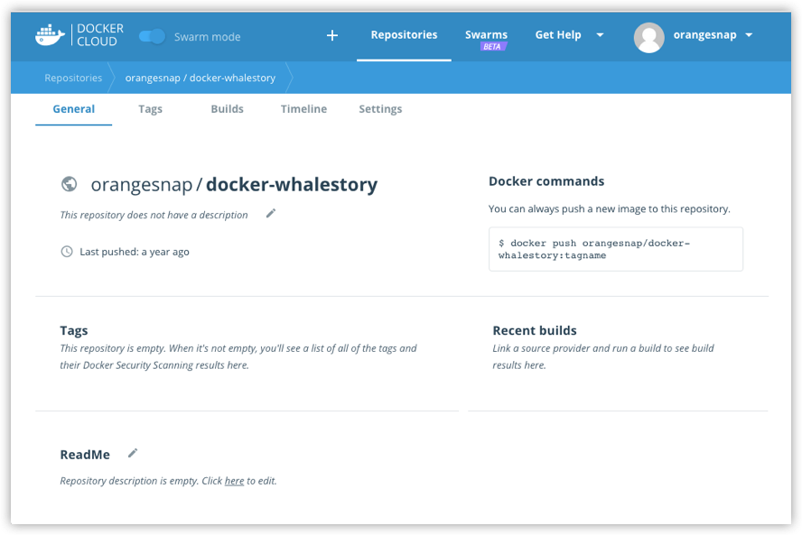{:width="550px"}

From the Docker for Mac menu, sign in to Docker Cloud with your Docker ID, or create one.

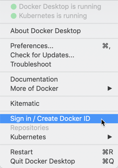{: .with-border width="250px"}

Then use the Docker for Mac menu to create, view, or navigate directly to your
Cloud resources, including **organizations**, **repositories**, and **swarms**.

Check out these [Docker Cloud topics](/docker-cloud/index.md){:target="_blank" class="_"}  to learn more:

* [Organizations and Teams in Docker Cloud](/docker-cloud/orgs/index.md){:target="_blank" class="_"}
* [Builds and Images](/docker-cloud/builds/index.md){:target="_blank" class="_"}
* [Swarms in Docker Cloud](/docker-cloud/cloud-swarm/index.md){:target="_blank" class="_"}

Need a direct link to Cloud? [Take me to Docker Cloud](https://cloud.docker.com/){: target="_blank" class="_" }.

## Where to go next

* Try out the walkthrough at [Get Started](/get-started/){: target="_blank" class="_"}.

* Dig in deeper with [Docker Labs](https://github.com/docker/labs/) example walkthroughs and source code.

* For a summary of Docker command line interface (CLI) commands, see [Docker CLI Reference Guide](/engine/api.md){: target="_blank" class="_"}.

* Check out the blog post, [What’s New in Docker 17.06 Community Edition (CE)](https://blog.docker.com/2017/07/whats-new-docker-17-06-community-edition-ce/){: target="_blank" class="_"}.
