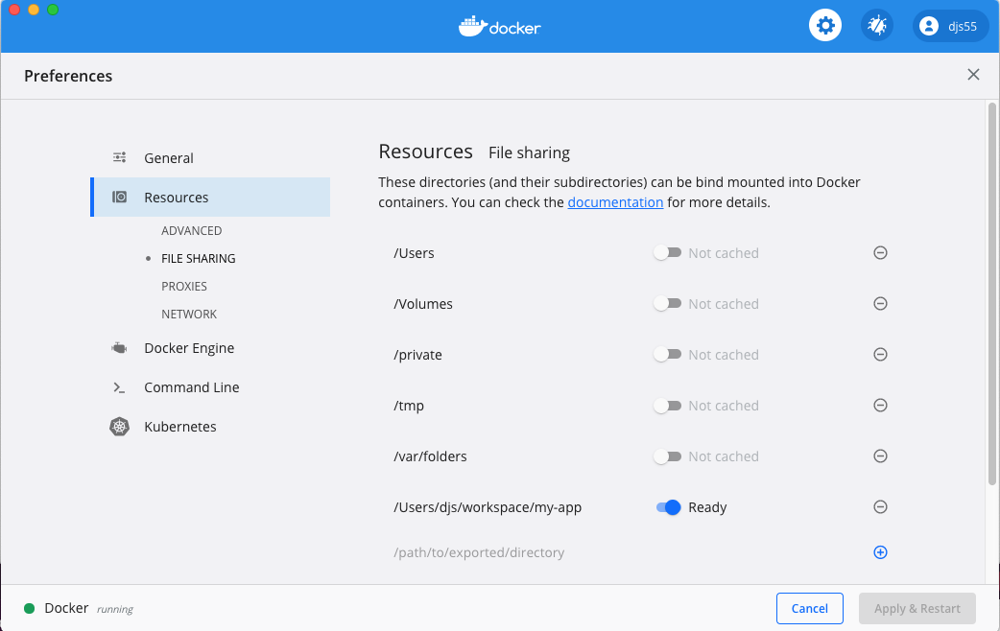

Docker Desktop for Mac on Edge has a new file sharing feature which performs
a continuous two-way sync of files between the host and containers using
[Mutagen](https://mutagen.io/). This feature is ideal for app development where:

- the source code tree is quite large
- the source is edited on Mac
- the source is compiled and run interactively inside Linux containers.

This page contains an example to show how the Mutagen feature should be used to sync files between the host and containers. It also gives some best practices to maximize performance.

> **Important**
>
> After completing the caching process, you must delete and re-create any containers which will make use of the cached directories.

## A simple React app

The following example bootstraps a simple React app with `npx` and configures
Docker Desktop to sync the source code between the host and a
development container.

First, create a directory which will contain the app:

```
$ mkdir ~/workspace/my-app
```
Next, enable the two-way file sync feature in Docker Desktop:

1. From the Docker Desktop menu, click **Preferences** > **Resources** > **File sharing**.

2. Type the new directory name in the bottom of the list and press the enter key.

3. Click on the toggle next to the directory name.

4.  Click **Apply & Restart** for the changes to take effect.

When Docker Desktop has restarted, the **File sharing** page looks like
this:



Run the following command to start a container and bootstrap the app with `npx`:

```
$ docker run -it -v ~/workspace/my-app:/my-app -w /my-app -p 3000:3000 node:lts bash
root@95441305251a:/my-app# npx create-react-app app
root@95441305251a:/my-app# cd app
root@95441305251a:/my-app# npm start
```

Once the development webserver has started, open [https://localhost:3000/](https://localhost:3000/) in
your browser and observe the app is running.

Return to the **File sharing** page in the UI and observe the status of the cache toggle located next to the directory name. The status will be
updated as file changes are detected and then synchronized between the host
and the containers.

Wait until the text says **Ready** and then open the source code in your IDE on
the host. Edit the file `src/App.js`, save the changes and observe the change
on the webserver.

As you edit code on the host, the changes are detected and transferred to the
container for testing. Changes inside the container (for example, the creation of build artifacts) are detected and transferred back to the host.

## Avoiding synchronizing a subdirectory

Although two-way file sync is suitable for many types of files, sometimes containers can generate lots of data which doesn't require copying to the host, for example, debug logs.

If your project has a subdirectory that doesn't need to be continuously copied back to the host, then use a named docker volume to bypass the sync.

First create a volume using:

```
$ docker volume create donotsyncme
donotsyncme
```

Use the volume for the subdirectory you want to avoid syncing:

```
$ docker run -it -v ~/workspace/my-app:/my-app -v donotsyncme:/my-app/dontsyncme -w /my-app -p 3000:3000 node:lts bash
```

Docker Desktop will sync all changes written by the app to `/my-app` to
the host, except changes written to `/my-app/dontsyncme` which will be written
to the named volume instead.

## Best practices

To achieve maximum performance when you enable two-way file sync:

- Avoid wasting disk space and CPU by minimising the size of the synchronized
  directories. For example, synchronize a project directory like `~/my-app`, but
  never sync a large directory like `/Users` or `/Volumes`.

  Remember that the files will be copied inside the container and therefore must fit within the
  `Docker.qcow2` or `Docker.raw` file.
- For every volume you want to sync in `docker run -v` or in
  `docker-compose.yml`, ensure either the directory itself or a
  parent/grandparent/... directory is listed in **Preferences** > **Resources** > **File sharing**.

   Note in particular that if only a *child* directory is listed
  on the **File sharing** page, then the whole `docker run -v` may bypass the two-way sync and be slower.

- Avoid changing the same files from both the host and containers. If changes
  are detected on both sides, the host takes precedence and the changes in the containers will be discarded.

- After completing the caching process, you must delete and re-create any containers which will make use of the cached directories.

## Feedback

Your feedback is very important to us. Let us know your feedback by creating an issue in the [Docker Desktop for Mac GitHub](https://github.com/docker/for-mac/issues) repository with the **Mutagen** label.
