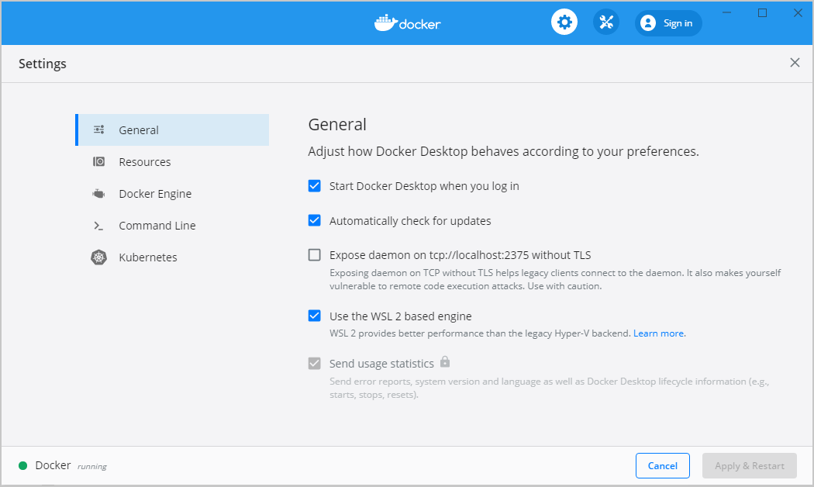
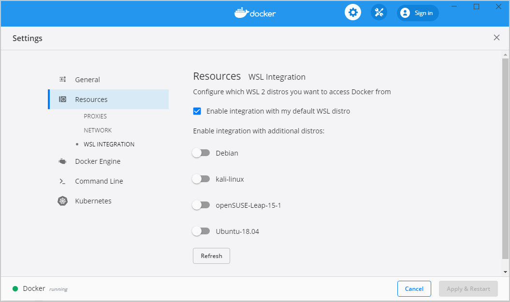

The new Docker Desktop WSL 2 backend replaces the Docker Desktop WSL 2 Tech Preview. The WSL 2 backend architecture introduces support for Kubernetes, provides an updated Docker daemon, offers VPN-friendly networking, and additional features.

WSL 2 introduces a significant architectural change as it is a full Linux kernel built by Microsoft, allowing Linux containers to run natively without emulation. With Docker Desktop running on WSL 2, users can leverage Linux workspaces and avoid having to maintain both Linux and Windows build scripts.

Docker Desktop also leverages the dynamic memory allocation feature in WSL 2 to greatly improve the resource consumption. This means, Docker Desktop only uses the required amount of CPU and memory resources it needs, while enabling CPU and memory-intensive tasks such as building a container to run much faster.

Additionally, with WSL 2, the time required to start a Docker daemon after a cold start is significantly faster. It takes less than 2 seconds to start the Docker daemon when compared to tens of seconds in the current version of Docker Desktop.

 Your feedback is very important to us. Please let us know your feedback by creating an issue in the [Docker Desktop for Windows GitHub](https://github.com/docker/for-win/issues) repository and adding the **WSL 2** label.

# Prerequisites

Before you install Docker Desktop WSL 2 backend, you must complete the following steps:

1. Install Windows 10 Insider Preview build 19018 or higher.
2. Enable WSL 2 feature on Windows. For detailed instructions, refer to the [Microsoft documentation](https://docs.microsoft.com/en-us/windows/wsl/wsl2-install).

# Download

Download [Docker Desktop Edge](https://hub.docker.com/editions/community/docker-ce-desktop-windows/) 2.1.6.0 or a later release.

# Install

Ensure you have completed the steps described in the Prerequisites section **before** installing the Docker Desktop Edge release.

1. Follow the usual Docker Desktop installation instructions to install Docker Desktop.
2. Start Docker Desktop from the Windows Start menu.
3. From the Docker menu, select **Settings** > **General**.

    

4. Select the **Enable the experimental WSL 2 based engine** check box.
5. Click **Apply & Restart**.
6. Ensure the distribution runs in WSL 2 mode. WSL can run distributions in both v1 or v2 mode.

    To check the WSL mode, run:

    `wsl -l -v`

    To upgrade to v2, run:

    `wsl --set-version <distro name> 2`
7. When Docker Desktop restarts, go to **Settings** > **Resources** > **WSL Integration** and then select from which WSL 2 distributions you would like to access Docker.

    

8. Click **Apply & Restart** for the changes to take effect.
