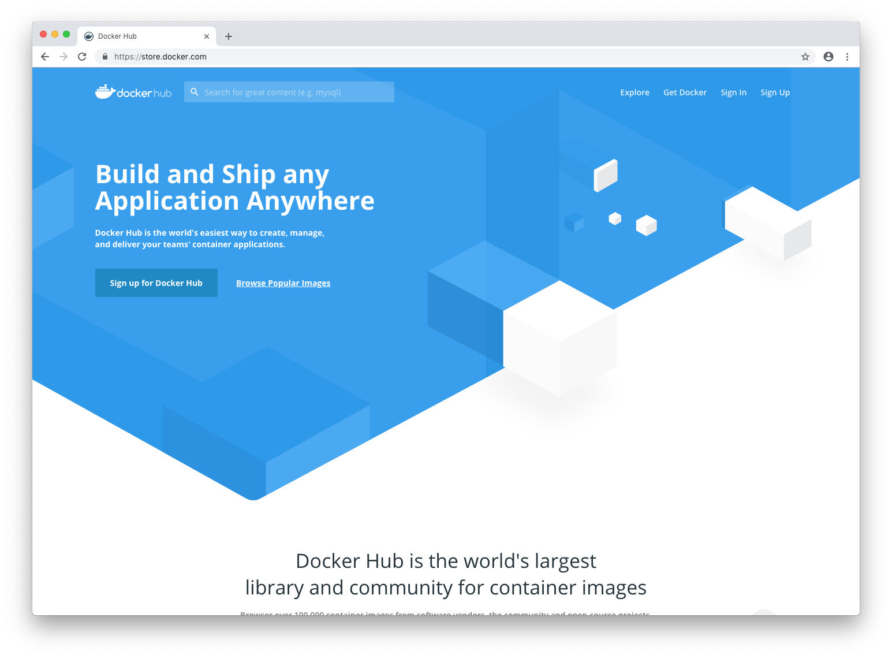

[Docker Hub](https://hub.docker.com) is a cloud-based registry service which
allows you to link to code repositories, build your images and test them, stores
manually pushed images, and links to [Docker Cloud](/docker-cloud/) so you can deploy images to your
hosts. It provides a centralized resource for container image discovery,
distribution and change management, [user and team collaboration](orgs.md), and
workflow automation throughout the development pipeline.

Log in to Docker Hub and Docker Cloud using [your free Docker ID](accounts.md).



Docker Hub provides the following major features:

* [Image Repositories](repos.md): Find and pull images from community and official libraries, and manage, push to, and pull from private image libraries to which you have access.
* [Automated Builds](builds.md): Automatically create new images when you make changes to a source code repository.
* [Webhooks](webhooks.md): A feature of Automated Builds, Webhooks let you trigger actions after a successful push to a repository.
* [Organizations](orgs.md): Create work groups to manage access to image repositories.
* GitHub and Bitbucket Integration: Add the Hub and your Docker Images to your current workflows.


## Create a Docker ID

To explore Docker Hub, you'll need to create an account by following the
directions in [Your Docker ID](accounts.md).

> **Note**: You can search for and pull Docker images from Hub without logging in, however to push images you must log in.

Your Docker ID gives you one private Docker Hub repository for free. If you need
more private repositories, you can upgrade from your free account to a paid
plan. To learn more, log in to Docker Hub and go to [Billing &
Plans](https://hub.docker.com/account/billing-plans/), in the Settings menu.

### Explore repositories

You can find public repositories and images from Docker Hub in two ways. You can
"Search" from the Docker Hub website, or you can use the Docker command line
tool to run the `docker search` command. For example if you were looking for an
ubuntu image, you might run the following command line search:

```
    $ docker search ubuntu
```

Both methods list the available public repositories on Docker Hub which match
the search term.

Private repositories do not appear in the repository search results. To see all
the repositories you can access and their status, view your "Dashboard" page on
[Docker Hub](https://hub.docker.com).

You can find more information on working with Docker images in the
[Docker userguide](/engine/tutorials/dockerimages/).

### Use Official Repositories

Docker Hub contains a number of [Official
Repositories](http://hub.docker.com/explore/). These are public, certified
repositories from vendors and contributors to Docker. They contain Docker images
from vendors like Canonical, Oracle, and Red Hat that you can use as the basis
to building your applications and services.

With Official Repositories you know you're using an optimized and
up-to-date image that was built by experts to power your applications.

> **Note:** If you would like to contribute an Official Repository for your organization or product, see the documentation on [Official Repositories on Docker Hub](official_repos.md) for more information.


##  Work with Docker Hub image repositories

Docker Hub provides a place for you and your team to build and ship Docker
images.

You can configure Docker Hub repositories in two ways:

* [Repositories](repos.md), which allow you to push images from a local Docker daemon to Docker Hub, and
* [Automated Builds](builds.md), which link to a source code repository and trigger an image rebuild process on Docker Hub when changes are detected in the source code.

You can create public repositories which can be accessed by any other Hub user,
or you can create private repositories with limited access you control.

### Docker commands and Docker Hub

Docker itself provides access to Docker Hub services via the [`docker search`](/engine/reference/commandline/search),
[`pull`](/engine/reference/commandline/pull), [`login`](/engine/reference/commandline/login), and [`push`](/engine/reference/commandline/push) commands.
