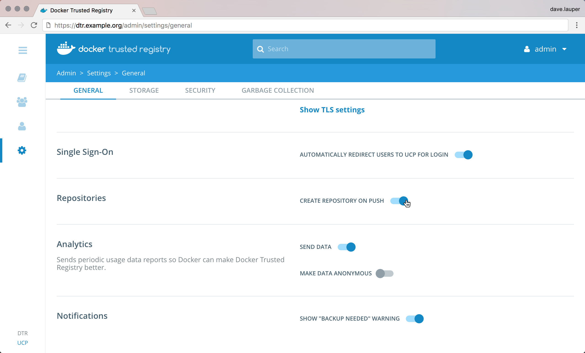

>

By default DTR only allows pushing images if the repository exists, and you
have write access to the repository.

As an example, if you try to push to `dtr.example.org/library/java:9`, and the
`library/java` repository doesn't exist yet, your push fails.

You can configure DTR to allow pushing to repositories that don't exist yet.
As an administrator, log into the **DTR web UI**, navigate to the **Settings**
page, and enable **Create repository on push**.

{: .with-border}

From now on, when a user pushes to their personal sandbox
(`<user-name>/<repository>`), or if the user is an administrator for the
organization (`<org>/<repository>`), DTR will create a repository if it doesn't
exist yet. In that case, the repository is created as private.

## Use the CLI to enable pushing to repositories that don't exist yet

```bash
curl --user <admin-user>:<password> \
--request POST "<dtr-url>/api/v0/meta/settings" \
--header "accept: application/json" \
--header "content-type: application/json" \
--data "{ \"createRepositoryOnPush\": true}"
```
