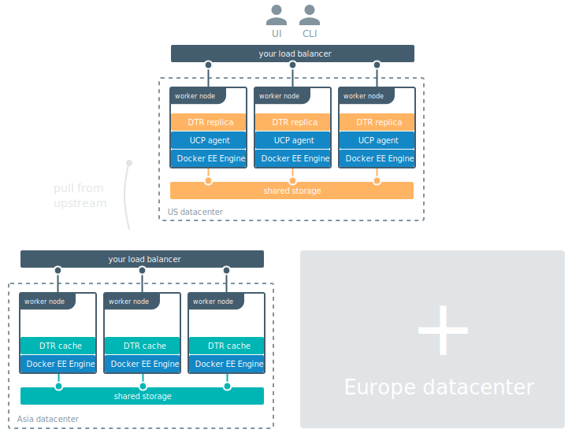

>

If you're deploying a DTR cache in a zone with few users and with no uptime
SLAs, a [single cache service is enough for you](simple.md).

But if you want to make sure your DTR cache is always available to users
and is highly performant, you should configure your cache deployment for
high availability.



## System requirements

* Multiple nodes, one for each cache replica.
* A load balancer.
* Shared storage system that has read-after-write consistency.

The way you deploy a DTR cache is the same, whether you're deploying a single
replica or multiple ones. The difference is that you should configure the
replicas to store data using a shared storage system.

When using a shared storage system, once an image layer is cached, any replica
is able to serve it to users without having to fetch a new copy from DTR.

DTR caches support the following storage systems:
* Alibaba Cloud Object Storage Service
* Amazon S3
* Azure Blob Storage
* Google Cloud Storage
* NFS
* Openstack Swift

If you're using NFS as a shared storage system, make sure the shared
directory is configured with:

```
/dtr-cache *(rw,root_squash,no_wdelay)
```

This ensures read-after-write consistency for NFS.

You should also mount the NFS directory on each node where you'll deploy a
DTR cache replica.

## Label the DTR cache nodes

Use SSH to log in to a manager node of the swarm where you want to deploy
the DTR cache.

If you're using UCP to manage that swarm you can also use a client bundle to
configure your Docker CLI client to connect to that swarm.

Label each node that is going to run the cache replica, by running:

```
docker node update --label-add dtr.cache=true <node-hostname>
```

## Configure and deploy the cache

Create the cache configuration files by following the
[instructions for deploying a single cache replica](simple.md#prepare-the-cache-deployment).

Make sure you adapt the `storage` object, using the
[configuration options for the shared storage](/registry/configuration/#storage)
of your choice.

## Configure your load balancer

The last step is to deploy a load balancer of your choice to load-balance
requests across the multiple replicas you deployed.
