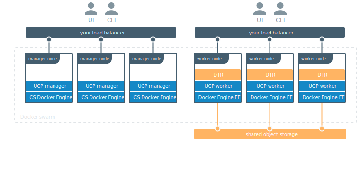

>

Docker Trusted Registry is designed to scale horizontally as your usage
increases. You can add more replicas to make DTR scale to your demand and for
high availability.

All DTR replicas run the same set of services and changes to their configuration
are automatically propagated to other replicas.



To make DTR tolerant to failures, add additional replicas to the DTR cluster.

| DTR replicas | Failures tolerated |
|:------------:|:------------------:|
|      1       |         0          |
|      3       |         1          |
|      5       |         2          |
|      7       |         3          |


When sizing your DTR installation for high-availability,
follow these rules of thumb:

* Don't create a DTR cluster with just two replicas. Your cluster
won't tolerate any failures, and it's possible that you experience performance
degradation.
* When a replica fails, the number of failures tolerated by your cluster
decreases. Don't leave that replica offline for long.
* Adding too many replicas to the cluster might also lead to performance
degradation, as data needs to be replicated across all replicas.

To have high-availability on UCP and DTR, you need a minimum of:

* 3 dedicated nodes to install UCP with high availability,
* 3 dedicated nodes to install DTR with high availability,
* As many nodes as you want for running your containers and applications.

You also need to configure the DTR replicas to share the
[same object storage](external-storage/index.md).

## Join more DTR replicas

To add replicas to an existing DTR deployment:

1. Use ssh to log into any node that is already part of UCP.

2.  Run the DTR join command:

    ```bash
    docker run -it --rm \
      {{ page.dtr_org }}/{{ page.dtr_repo }}:{{ page.dtr_version }} join \
      --ucp-node <ucp-node-name> \
      --ucp-insecure-tls
    ```

    Where the `--ucp-node` is the hostname of the UCP node where you want to
    deploy the DTR replica. `--ucp-insecure-tls` tells the command to trust the
    certificates used by UCP.

3. If you have a load balancer, add this DTR replica to the load balancing pool.

## Remove existing replicas

To remove a DTR replica from your deployment:

1. Use ssh to log into any node that is part of UCP.
2.  Run the DTR remove command:

```bash
docker run -it --rm \
  {{ page.dtr_org }}/{{ page.dtr_repo }}:{{ page.dtr_version }} remove \
  --ucp-insecure-tls
```

You will be prompted for:

* Existing replica id: the id of any healthy DTR replica of that cluster
* Replica id: the id of the DTR replica you want to remove. It can be the id of an
unhealthy replica
* UCP username and password: the administrator credentials for UCP

If you're load-balancing user requests across multiple DTR replicas, don't
forget to remove this replica from the load balancing pool.

## Where to go next

- [Set up vulnerability scans](set-up-vulnerability-scans.md)
