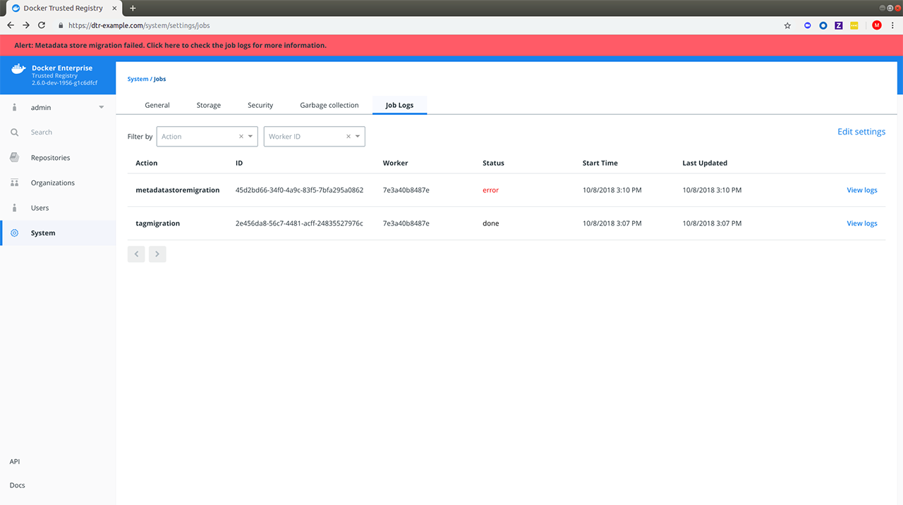



>

DTR uses [semantic versioning](http://semver.org/) and Docker aims to achieve specific guarantees while upgrading between versions. While downgrades are not supported, Docker supports upgrades according to the following rules:

* When upgrading from one patch version to another, you can skip patch versions because no data migration is performed for patch versions.
* When upgrading between minor versions, you ***cannot*** skip versions, however you can upgrade from any patch version of the previous minor version to any patch version of the current minor version.
* When upgrading between major versions, make sure to upgrade one major version at a time &ndash; and also to upgrade to the earliest available minor version. It is strongly recommended that you first upgrade to the latest minor/patch version for your major version.

| Description                          | From  | To        | Supported |
|:-------------------------------------|:------|:----------|:----------|
| patch upgrade                        | x.y.0 | x.y.1     | yes       |
| skip patch version                   | x.y.0 | x.y.2     | yes       |
| patch downgrade                      | x.y.2 | x.y.1     | no        |
| minor upgrade                        | x.y.* | x.y+1.*   | yes       |
| skip minor version                   | x.y.* | x.y+2.*   | no        |
| minor downgrade                      | x.y.* | x.y-1.*   | no        |
| skip major version                   | x.*.* | x+2.*.*   | no        |
| major downgrade                      | x.*.* | x-1.*.*   | no        |
| major upgrade                        | x.y.z | x+1.0.0   | yes       |
| major upgrade skipping minor version | x.y.z | x+1.y+1.z | no        |

A few seconds of interruption may occur during the upgrade of a
DTR cluster, so schedule the upgrade to take place outside of peak hours
to avoid any business impacts.

## 2.5 to 2.6 upgrade

> Upgrade Best Practices
>
> [Important changes have been made to the upgrade process](/ee/upgrade) that, if not correctly followed, can have impact on the availability of applications running on the Swarm during upgrades. These constraints impact any upgrades coming from any version before `18.09` to version `18.09` or greater. Refer to [Cluster Upgrade Best Practices](/ee/upgrade.md#cluster-upgrade-best-practices) for more details. 
>
> In addition, to ensure high availability during the DTR upgrade, drain the DTR replicas and move their workloads to updated workers. This can be done by joining new workers as DTR replicas to your existing cluster and then removing the old replicas. Refer to [docker/dtr join](/reference/dtr/2.7/cli/join/) and [docker/dtr remove](/reference/dtr/2.7/cli/remove/) for command options and details.

## Minor upgrade

Before starting the upgrade, confirm that:
* The version of UCP in use is supported by the upgrade version of DTR. [Check the compatibility matrix](https://success.docker.com/article/compatibility-matrix).
* The [DTR backup](disaster-recovery/create-a-backup) is recent.
* [Docker content trust in UCP is disabled](/ee/ucp/admin/configure/run-only-the-images-you-trust/).
* [All system requirements are met](install/system-requirements).

### Step 1. Upgrade DTR to {{ previous_version }} if necessary

Confirm that you are running DTR {{ previous_version }}. If this is not the case, [upgrade your installation to the {{ previous_version }} version](/datacenter/dtr/{{ previous_version }}/guides/admin/upgrade/).

### Step 2. Upgrade DTR

Pull the latest version of DTR:

```bash
docker pull {{ page.dtr_org }}/{{ page.dtr_repo }}:{{ page.dtr_version }}
```

Confirm that at least [16GB RAM is available](install/system-requirements) on the node on which you are running the upgrade. If the DTR node does not have access to the internet, follow the [offline installation documentation](install/install-offline) to get the images.

Once you have the latest image on your machine (and the images on the target
nodes, if upgrading offline), run the upgrade command.

> Note:
>
> The upgrade command can be run from any available node, as UCP is aware of which worker nodes have replicas.

```bash
docker run -it --rm \
  {{ page.dtr_org }}/{{ page.dtr_repo }}:{{ page.dtr_version }} upgrade
```

By default, the upgrade command runs in interactive mode and prompts for
any necessary information. You can also check the
[upgrade reference page](/reference/dtr/2.7/cli/upgrade/) for other existing flags.
If you are performing the upgrade on an existing replica, pass the `--existing-replica-id` flag.

The upgrade command will start replacing every container in your DTR cluster,
one replica at a time. It will also perform certain data migrations. If anything
fails or the upgrade is interrupted for any reason, rerun the upgrade
command (the upgrade will resume from the point of interruption).


#### Metadata Store Migration

When upgrading from `2.5` to `2.6`, the system will run a `metadatastoremigration` job following a successful upgrade. This involves migrating the blob links for your images, which is necessary for online garbage collection. With `2.6`, you can log into the DTR web interface and navigate to **System > Job Logs** to check the status of the `metadatastoremigration` job. Refer to [Audit Jobs via the Web Interface](/ee/dtr/admin/manage-jobs/audit-jobs-via-ui/) for more details.

{: .with-border}

Garbage collection is disabled while the migration is running. In the case of a failed `metadatastoremigration`, the system will retry twice.

{: .with-border}

If the three attempts fail, it will be necessary to manually retrigger the `metadatastoremigration` job. To do this, send a `POST` request to the `/api/v0/jobs` endpoint:

```bash
curl https://<dtr-external-url>/api/v0/jobs -X POST \
-u username:accesstoken -H 'Content-Type':'application/json' -d \
'{"action": "metadatastoremigration"}'
```
Alternatively, select **API** from the bottom left navigation pane of the DTR web interface and use the Swagger UI to send your API request.

## Patch upgrade

A patch upgrade changes only the DTR containers and is always safer than a minor version upgrade. The command is the same as for a minor upgrade.

## DTR cache upgrade

If you have previously [deployed a cache](/ee/dtr/admin/configure/deploy-caches/), be sure to [upgrade the node dedicated for your cache](/ee/upgrade) to keep it in sync with your upstream DTR replicas. This prevents authentication errors and other strange behaviors.

## Download the vulnerability database

After upgrading DTR, it is necessary to redownload the vulnerability database.
[Learn how to update your vulnerability database](configure/set-up-vulnerability-scans.md#update-the-cve-scanning-database).

## Where to go next

- [Release notes](../release-notes)
- [Garbage collection in v2.5](/datacenter/dtr/2.5/guides/admin/configure/garbage-collection/)
