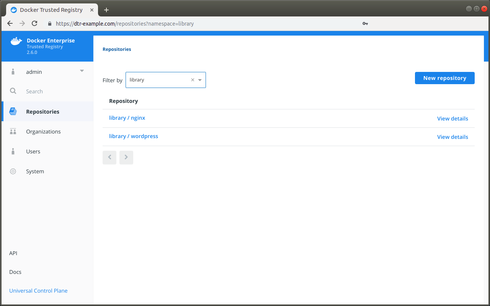
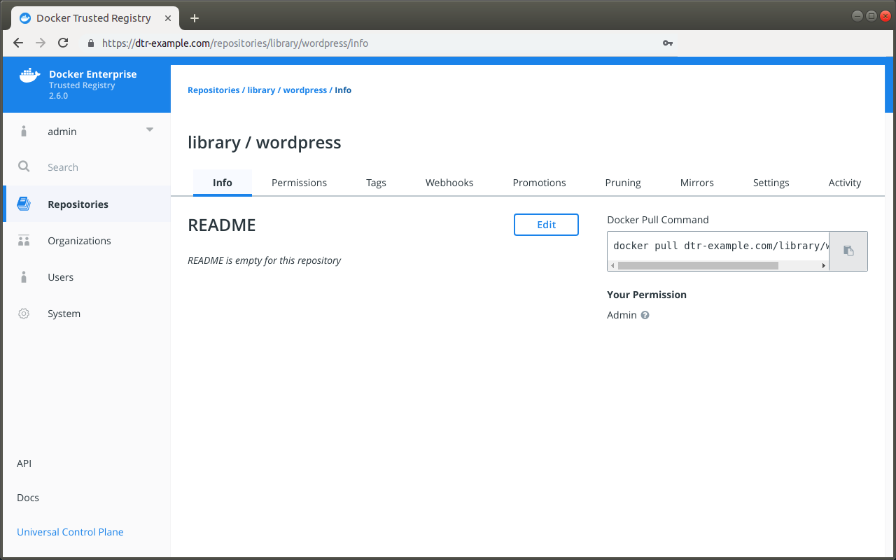
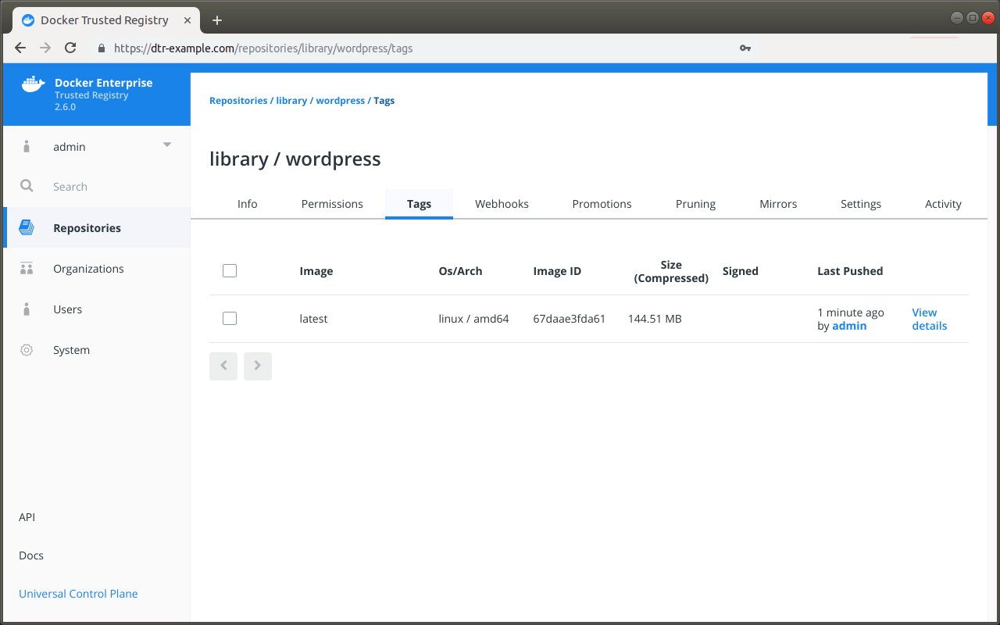






You interact with Docker Trusted registry in the same way you interact with
Docker Hub or any other registry:

* `docker login <dtr-url>`: authenticates you on DTR
* `docker pull <image>:<tag>`: pulls an image from DTR
* `docker push <image>:<tag>`: pushes an image to DTR

## Pull an image

Pulling an image from Docker Trusted Registry is the same as pulling an image
from Docker Hub or any other registry. Since DTR is secure by default, you
always need to authenticate before pulling images.

In this example, DTR can be accessed at {{ domain }}, and the user
was granted permissions to access the NGINX, and Wordpress repositories.

{: .with-border}

Click on the repository to see its details.

{: .with-border}

To pull the {{ tag }} tag of the {{ org }}/{{ repo }} image, run:

```bash
docker login {{ domain }}
docker pull {{ domain }}/{{ org }}/{{ repo }}:{{ tag }}
```

## Push an image

Before you can push an image to DTR, you need to [create a repository](index.md)
to store the image. In this example the full name of our repository is
`{{ domain }}/{{ org }}/{{ repo }}`.

### Tag the image

In this example we'll pull the {{ repo }} image from Docker Hub and tag with
the full DTR and repository name. A tag defines where the image was pulled
from, and where it will be pushed to.

```bash
# Pull from Docker Hub the {{ tag }} tag of the {{ repo }} image
docker pull {{ repo }}:{{ tag }}

# Tag the {{ repo }}:{{ tag }} image with the full repository name we've created in DTR
docker tag {{ repo }}:{{ tag }} {{ domain }}/{{ org }}/{{ repo }}:{{ tag }}
```

### Push the image

Now that you have tagged the image, you only need to authenticate and push the
image to DTR.

```bash
docker login {{ domain }}
docker push {{ domain }}/{{ org }}/{{ repo }}:{{ tag }}
```

Go back to the **DTR web UI** to validate that the tag was successfully pushed.

{: .with-border}

### Windows images

The base layers of the Microsoft Windows base images have restrictions on how
they can be redistributed. When you push a Windows image to DTR, Docker only
pushes the image manifest and all the layers on top of the Windows base layers.
The Windows base layers are not pushed to DTR. This means that:

* DTR won't be able to scan those images for vulnerabilities since DTR doesn't
have access to the layers (the Windows base layers are scanned by Docker Store,
however).
* When a user pulls a Windows image from DTR, the Windows base layers are
automatically fetched from Microsoft and the other layers are fetched from DTR.

This default behavior is recommended for standard Docker EE installations, but
for air-gapped or similarly limited setups Docker can optionally optionally also
push the Windows base layers to DTR.

To configure Docker to always push Windows layers to DTR, add the following
to your `C:\ProgramData\docker\config\daemon.json` configuration file:

```json
"allow-nondistributable-artifacts": ["<dtr-domain>:<dtr-port>"]
```

## Where to go next

- [Delete images](delete-images.md)
