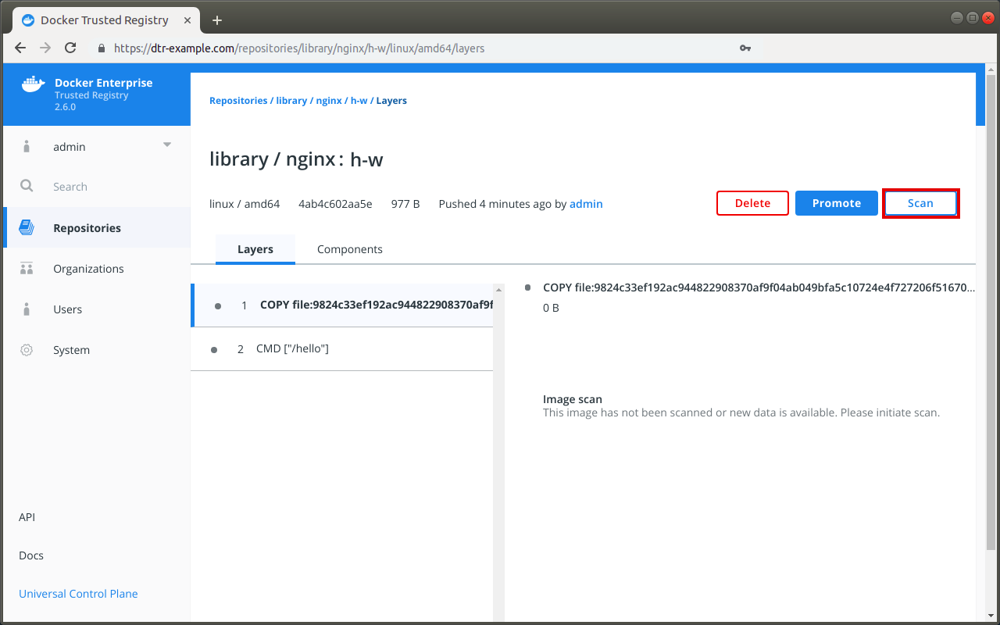
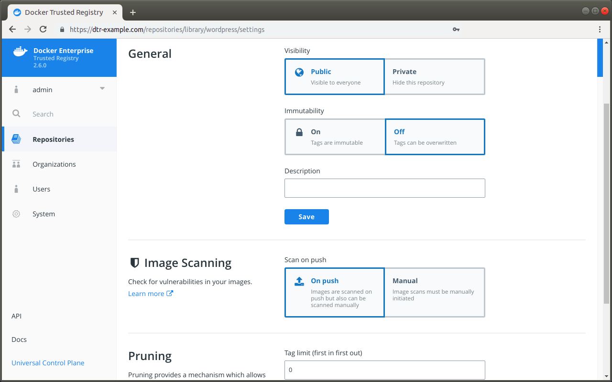
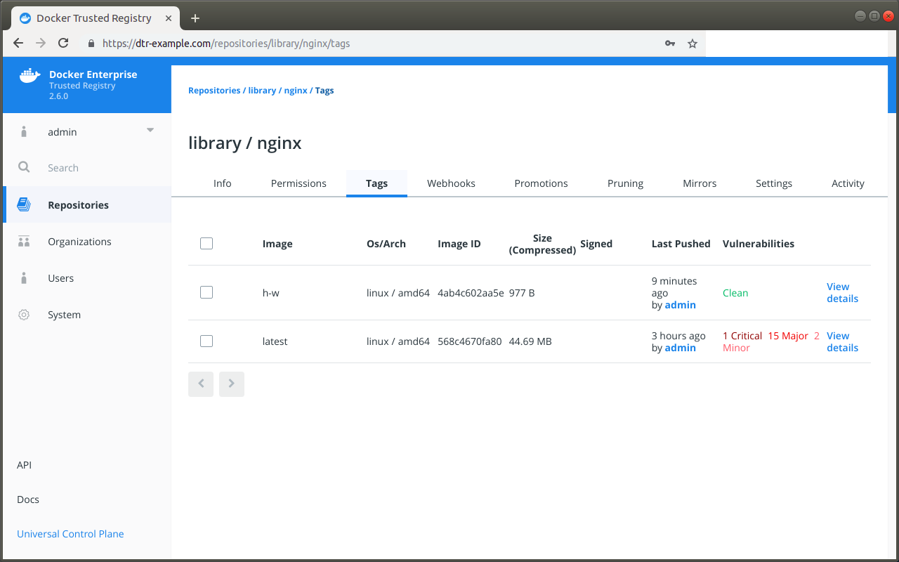
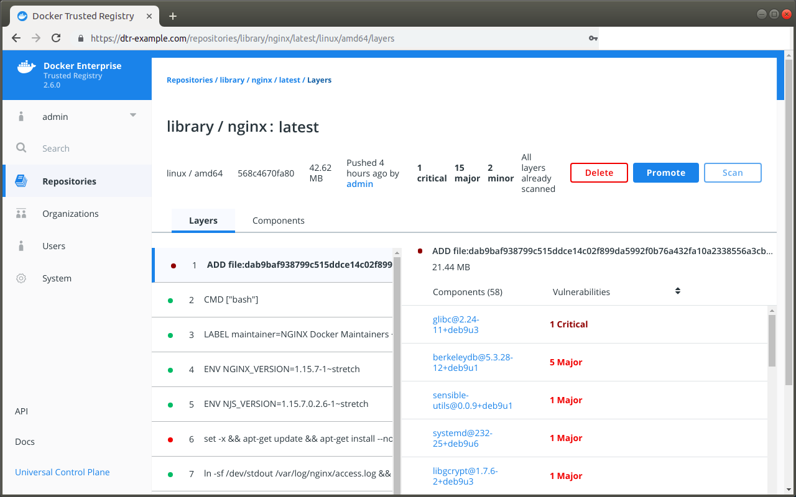
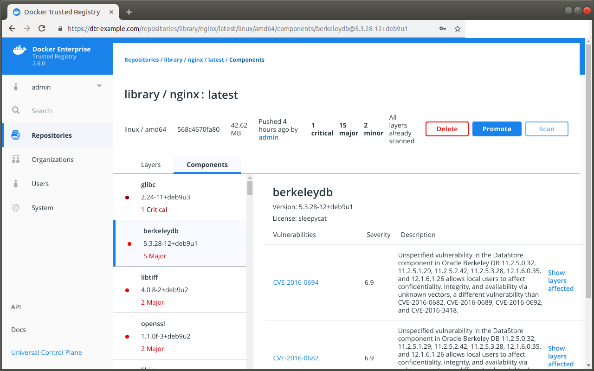

>

{: target="_blank" ._}

Docker Trusted Registry can scan images in your repositories to verify that they
are free from known security vulnerabilities or exposures, using Docker Security
Scanning. The results of these scans are reported for each image tag in a repository.

Docker Security Scanning is available as an add-on to Docker Trusted Registry,
and an administrator configures it for your DTR instance. If you do not see
security scan results available on your repositories, your organization may not
have purchased the Security Scanning feature or it may be disabled. See [Set up
Security Scanning in DTR](../../admin/configure/set-up-vulnerability-scans.md) for more details.

> **Tip**: Only users with write access to a repository can manually start a
scan. Users with read-only access can view the scan results, but cannot start
a new scan.

## The Docker Security Scan process

Scans run either on demand when you click the **Start a Scan** link or
**Scan** button (see [Manual scanning](#manual-scanning) below), or automatically
on any `docker push` to the repository.

First the scanner performs a binary scan on each layer of the image, identifies
the software components in each layer, and indexes the SHA of each component in
a bill-of-materials. A binary scan evaluates the components on a bit-by-bit
level, so vulnerable components are discovered even if they are
statically linked or under a different name.

The scan then compares the SHA of each component against the US National
Vulnerability Database that is installed on your DTR instance. When
this database is updated, DTR reviews the indexed components for newly
discovered vulnerabilities.

DTR scans both Linux and Windows images, but by default Docker doesn't push
foreign image layers for Windows images so DTR won't be able to scan them. If
you want DTR to scan your Windows images, [configure Docker to always push image
layers](pull-and-push-images.md), and it will scan the non-foreign layers.

## Security scan on push

By default, Docker Security Scanning runs automatically on `docker push` to an
image repository.

If your DTR instance is configured in this way, you do not need to do anything
once your `docker push` completes. The scan runs automatically, and the results
are reported in the repository's **Tags** tab after the scan finishes.

## Manual scanning

If your repository owner enabled Docker Security Scanning but disabled automatic
scanning, you can manually start a scan for images in repositories you
have `write` access to.

To start a security scan, navigate to the repository **Tags** tab on the web interface, click "View details" next to the relevant tag, and click **Scan**.

{: .with-border}

DTR begins the scanning process. You will need to refresh the page to see the
results once the scan is complete.

## Change the scanning mode

You can change the scanning mode for each individual repository at any time. You
might want to disable scanning if you are pushing an image repeatedly during
troubleshooting and don't want to waste resources scanning and re-scanning, or
if a repository contains legacy code that is not used or updated frequently.

> **Note**: To change an individual repository's scanning mode, you must have
`write` or `administrator` access to the repo.

To change the repository scanning mode:

1. Navigate to the repository, and click the **Settings** tab.
2. Scroll down to the **Image scanning** section.
3. Select the desired scanning mode.
{: .with-border}

## View security scan results

Once DTR has run a security scan for an image, you can view the results.

The **Tags** tab for each repository includes a summary of the most recent
scan results for each image.

{: .with-border}
- The text "Clean" in green indicates that the scan did not find
any vulnerabilities.
- A red or orange text indicates that vulnerabilities were found, and
the number of vulnerabilities is included on that same line according to severity: ***Critical***, ***Major***, ***Minor***.

If the vulnerability scan could not detect the version of a component, it reports
the vulnerabilities for all versions of that component.

From the repository **Tags** tab, you can click **View details** for a specific tag to see
the full scan results. The top of the page also includes metadata about the
image, including the SHA, image size, last push date, user who initiated the push,
the security scan summary, and the security scan progress.

The scan results for each image include two different modes so you can quickly
view details about the image, its components, and any vulnerabilities found.

- The **Layers** view lists the layers of the image in the order that they are built
by Dockerfile.

    This view can help you find exactly which command in the build introduced
    the vulnerabilities, and which components are associated with that single
    command. Click a layer to see a summary of its components. You can then
    click on a component to switch to the **Component** view and get more details
    about the specific item.

    > **Tip**: The layers view can be long, so be sure
    to scroll down if you don't immediately see the reported vulnerabilities.

   {: .with-border}

- The **Components** view lists the individual component libraries indexed by
the scanning system, in order of severity and number of vulnerabilities found, with the most vulnerable library listed first.

    Click on an individual component to view details about the vulnerability it
    introduces, including a short summary and a link to the official CVE
    database report. A single component can have multiple vulnerabilities, and
    the scan report provides details on each one. The component details also
    include the license type used by the component, and the filepath to the
    component in the image.
{: .with-border}

## What to do next

If you find that an image in your registry contains vulnerable components, you
can use the linked CVE scan information in each scan report to evaluate the
vulnerability and decide what to do.

If you discover vulnerable components, you should check if there is an updated
version available where the security vulnerability has been addressed. If
necessary, you can contact the component's maintainers to ensure that the
vulnerability is being addressed in a future version or a patch update.

If the vulnerability is in a `base layer` (such as an operating system) you
might not be able to correct the issue in the image. In this case, you can
switch to a different version of the base layer, or you can find an
equivalent, less vulnerable base layer.

Address vulnerabilities in your repositories by updating the images to use
updated and corrected versions of vulnerable components, or by using a different
component offering the same functionality. When you have updated the source
code, run a build to create a new image, tag the image, and push the updated
image to your DTR instance. You can then re-scan the image to confirm that you
have addressed the vulnerabilities.

## Where to go next

* [Override a reported vulnerability](override-a-vulnerability.md)
