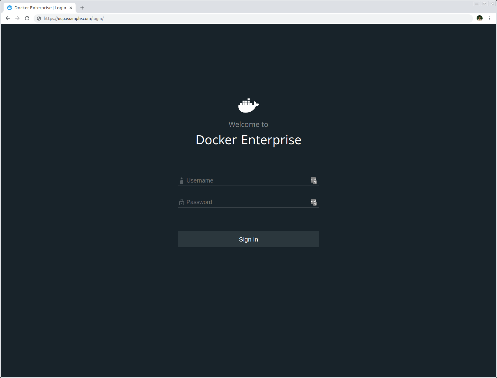
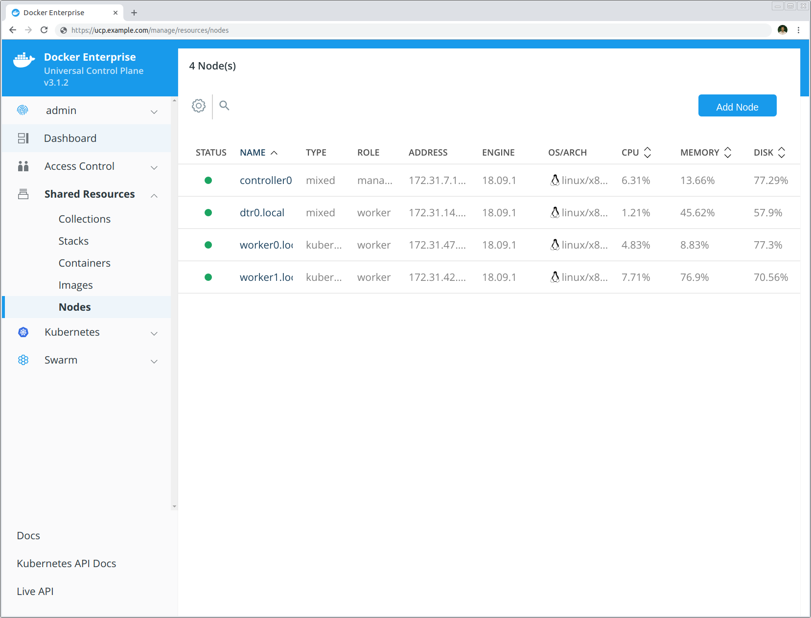
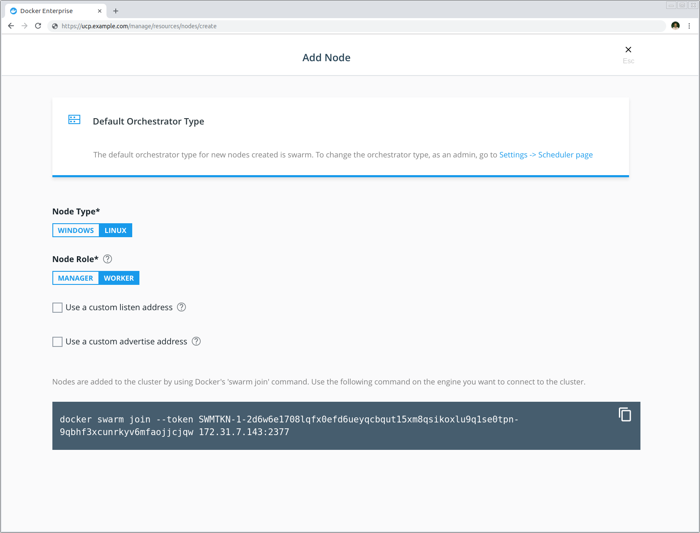

Get the [30-day
trial available at the Docker hub](https://hub.docker.com/editions/enterprise/docker-ee-trial/trial).

Once you get your trial license, you can install Docker Enterprise's Universal
Control Plane and Docker Trusted Registry on Linux Servers. Windows Servers
can only be used as Universal Control Plane Worker Nodes.

Learn more about the Universal Control Plane's system requirements 
[here](ucp/admin/install/system-requirements.md). Also, make sure the hosts are 
running one of the supported operating systems from Docker Enterprise's 
[Compatibility Matrix](https://success.docker.com/article/compatibility-matrix).

## Step 1: Install Docker Enterprise Container Engine

[Select a platform](/ee/supported-platforms) and click through to install the
Docker Enterprise container engine on all hosts you want to manage.

## Step 2: Install Universal Control Plane

Docker Universal Control Plane (UCP) allows managing from a centralized place
your images, applications, networks, and other computing resources.

Use ssh to log in to the host where you want to install UCP and run:

```bash
docker container run --rm -it --name ucp \
  -v /var/run/docker.sock:/var/run/docker.sock \
  {{ page.ucp_org }}/{{ page.ucp_repo }}:{{ page.ucp_version }} install \
  --host-address <node-ip-address> \
  --interactive
```

This runs the install command in interactive mode, so that you're prompted
for any necessary configuration values.

[Learn more about the UCP installation](ucp/admin/install/index.md).

>**What about Windows?** When you have UCP installed, you can
[join Windows worker nodes to a swarm](ucp/admin/configure/join-nodes/join-windows-nodes-to-cluster.md).

## Step 3: License your installation

Now that UCP is installed, you need to license it. In your browser, navigate
to the UCP web UI, log in with your administrator credentials and upload your
license.

{: .with-border}

[Get a free trial license if you don't have one](https://hub.docker.com/editions/enterprise/docker-ee-trial).

## Step 4: Join more nodes to UCP

Join more nodes so that you can manage them from UCP.
Go to the UCP web UI and navigate to the **Nodes** page.

{: .with-border}

Click the **Add Node button** to add a new node.

{: .with-border}

Check **Add node as a manager** to join the node as a manager
to provide replication and make UCP highly available. For a highly available
installation, make sure you have 3, 5, or 7 manager nodes.

Copy the command to your clipboard, and run it on every node that you want
to be managed by UCP. After you run the command in the node, the node
will show up in the UP web UI.

## Step 5: Install Docker Trusted Registry

Docker Trusted Registry (DTR) is a private image registry so that you can
manage who has access to your Docker images. DTR needs to be installed on
a node that is being managed by UCP.

Use ssh to log in to the host where you already installed UCP, and run:

```bash
docker container run -it --rm \
  {{ page.ucp_org }}/{{ page.dtr_repo }}:{{ page.dtr_version }} install \
  --ucp-node <node-hostname> \
  --ucp-insecure-tls
```

Where the `--ucp-node` is the hostname of the UCP node where you want to deploy
DTR. `--ucp-insecure-tls` tells the installer to trust the certificates used
by UCP.

## Where to go next

* [Scale your cluster](ucp/admin/configure/join-nodes/index.md)
* [Deploy an application](ucp/swarm/index.md)
