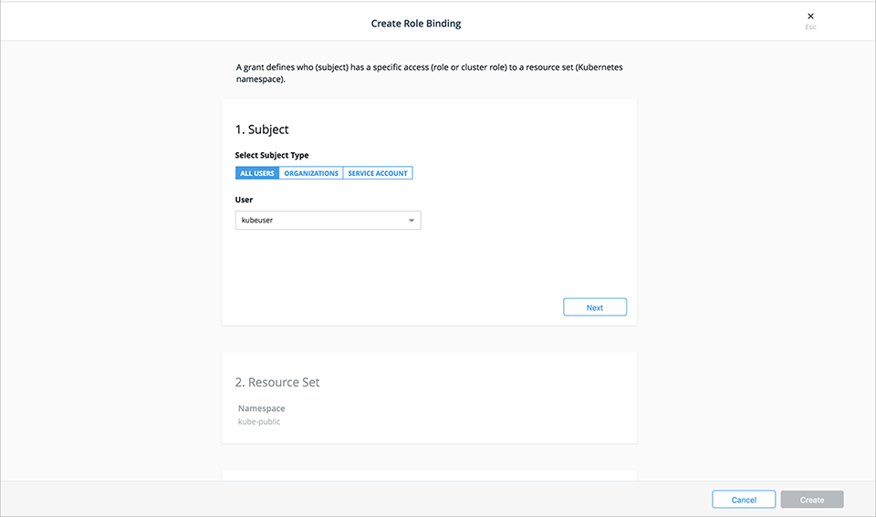

>

UCP 3.0 used its own role-based access control (RBAC) for Kubernetes clusters. New in UCP 3.1 is the ability to use native Kubernetes RBAC. The benefits of doing this are:

- Many ecosystem applications and integrations expect Kubernetes RBAC as a part of their YAML files to provide access to service accounts.
- Organizations planning to run UCP both on-premises as well as in hosted cloud services want to run Kubernetes applications on both sets of environments, without manually changing RBAC in their YAML file.

Kubernetes RBAC is turned on by default for Kubernetes clusters when customers upgrade to UCP 3.1. See [Using RBAC Authorization](https://kubernetes.io/docs/reference/access-authn-authz/rbac/) in the v1.11 documentation for more information about Kubernetes role-based access control.

Starting with UCP 3.1, Kubernetes and Swarm roles have separate views. You can view all of the roles for a particular cluster under **Access Control** > **Roles**. Select **Kubernetes** or **Swarm** to view the specific roles for each.

## Creating roles
You can create Kubernetes roles through either the CLI using [kubectl](https://kubernetes.io/docs/reference/kubectl/overview/) or the UCP user interface (the procedure that follows).

1. From the UCP UI, select **Access Control**.
2. From the left navigation menu, select **Roles**.
    
3. Select the **Kubernetes** tab at the top of the window.
4. Select **Create** to create a Kubernetes role object in the following dialog:
    
5. Select a namespace from the **Namespace** drop-down list. Selecting a specific namespace creates a role for use in that namespace, however selecting all namespaces creates a ClusterRole where you can create rules for cluster-scoped Kubernetes resources as well as namespaced resources.
6. Provide the YAML for the role, either by entering it in the **Object YAML** editor or select **Click to upload a .yml file** to choose and upload a .yml file instead.
7. Select **Create**.

## Creating role grants

Kubernetes provides two types of role grants, **ClusterRoleBinding** (which applies to all namespaces) and **RoleBinding** (which applies to a specific namespace).

To create a grant for a Kubernetes role in the UCP UI:

1. Select **Access Control**.
2. From the left navigation menu, select  **Grants**.
    
3. Select the **Kubernetes** tab at the top of the window to view all of the grants available to Kubernetes roles.
4. Select **Create New Grant** to start the Create Role Binding wizard and create a new grant for a given user, team, or service.
    
5. Select the subject type, **All Users**, **Organizations**, or **Service Account**.
6. To create a user role binding, select a username from the **Users** drop-down list then select **Next**.
7. Select a resource set for the subject. The **default** namespace is automatically selected. To use a different namespace, select the **Select Namespace** button next to the desired namespace. For `Cluster Role Binding`, slide the **Apply Role Binding to all namespaces** selector to the right.
    
8. Select **Next**.
9. Select the **Cluster Role** from the drop-down list. If you select **Apply Roles Binding to all namespaces** to create a ClusterRolebinding, only **ClusterRoles** can be selected. If, though, you select a specific namespace you can choose any role from that namespace or any ClusterRole.
    
10. Select **Create**.

## Where to go next
* [Using RBAC Authorization](https://kubernetes.io/docs/reference/access-authn-authz/rbac/)
* [Find Kubernetes Resources](https://docs.docker.com/ee/ucp/kubernetes/kube-resources/)
