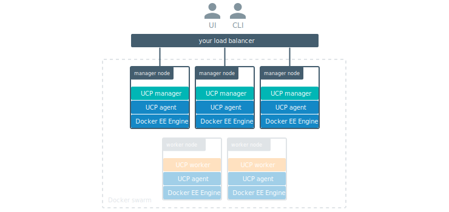

Once you've joined multiple manager nodes for high-availability, you can
configure your own load balancer to balance user requests across all
manager nodes.



This allows users to access UCP using a centralized domain name. If
a manager node goes down, the load balancer can detect that and stop forwarding
requests to that node, so that the failure goes unnoticed by users.

## Load-balancing on UCP

Since Docker UCP uses mutual TLS, make sure you configure your load balancer to:

* Load-balance TCP traffic on ports `443` and `6443`.
* Not terminate HTTPS connections.
* Use the `/_ping` endpoint on each manager node, to check if the node
is healthy and if it should remain on the load balancing pool or not.

## Load balancing UCP and DTR

By default, both UCP and DTR use port 443. If you plan on deploying UCP and DTR,
your load balancer needs to distinguish traffic between the two by IP address
or port number.

* If you want to configure your load balancer to listen on port 443:
    * Use one load balancer for UCP, and another for DTR,
    * Use the same load balancer with multiple virtual IPs.
* Configure your load balancer to expose UCP or DTR on a port other than 443.

## Configuration examples

Use the following examples to configure your load balancer for UCP.

<ul class="nav nav-tabs">
  <li class="active"><a data-toggle="tab" data-target="#nginx" data-group="nginx">NGINX</a></li>
  <li><a data-toggle="tab" data-target="#haproxy" data-group="haproxy">HAProxy</a></li>
  <li><a data-toggle="tab" data-target="#aws">AWS LB</a></li>
</ul>
<div class="tab-content">
  <div id="nginx" class="tab-pane fade in active" markdown="1">
```conf
user  nginx;
worker_processes  1;

error_log  /var/log/nginx/error.log warn;
pid        /var/run/nginx.pid;

events {
    worker_connections  1024;
}

stream {
    upstream ucp_443 {
        server <UCP_MANAGER_1_IP>:443 max_fails=2 fail_timeout=30s;
        server <UCP_MANAGER_2_IP>:443 max_fails=2 fail_timeout=30s;
        server <UCP_MANAGER_N_IP>:443  max_fails=2 fail_timeout=30s;
    }
    server {
        listen 443;
        proxy_pass ucp_443;
    }
}
```
  </div>
  <div id="haproxy" class="tab-pane fade" markdown="1">
```conf
global
    log /dev/log    local0
    log /dev/log    local1 notice

defaults
        mode    tcp
        option  dontlognull
        timeout connect     5s
        timeout client      50s
        timeout server      50s
        timeout tunnel      1h
        timeout client-fin  50s
### frontends
# Optional HAProxy Stats Page accessible at http://<host-ip>:8181/haproxy?stats
frontend ucp_stats
        mode http
        bind 0.0.0.0:8181
        default_backend ucp_stats
frontend ucp_443
        mode tcp
        bind 0.0.0.0:443
        default_backend ucp_upstream_servers_443
### backends
backend ucp_stats
        mode http
        option httplog
        stats enable
        stats admin if TRUE
        stats refresh 5m
backend ucp_upstream_servers_443
        mode tcp
        option httpchk GET /_ping HTTP/1.1\r\nHost:\ <UCP_FQDN>
        server node01 <UCP_MANAGER_1_IP>:443 weight 100 check check-ssl verify none
        server node02 <UCP_MANAGER_2_IP>:443 weight 100 check check-ssl verify none
        server node03 <UCP_MANAGER_N_IP>:443 weight 100 check check-ssl verify none
```
  </div>
  <div id="aws" class="tab-pane fade" markdown="1">
```json
{
    "Subnets": [
        "subnet-XXXXXXXX",
        "subnet-YYYYYYYY",
        "subnet-ZZZZZZZZ"
    ],
    "CanonicalHostedZoneNameID": "XXXXXXXXXXX",
    "CanonicalHostedZoneName": "XXXXXXXXX.us-west-XXX.elb.amazonaws.com",
    "ListenerDescriptions": [
        {
            "Listener": {
                "InstancePort": 443,
                "LoadBalancerPort": 443,
                "Protocol": "TCP",
                "InstanceProtocol": "TCP"
            },
            "PolicyNames": []
        }
    ],
    "HealthCheck": {
        "HealthyThreshold": 2,
        "Interval": 10,
        "Target": "HTTPS:443/_ping",
        "Timeout": 2,
        "UnhealthyThreshold": 4
    },
    "VPCId": "vpc-XXXXXX",
    "BackendServerDescriptions": [],
    "Instances": [
        {
            "InstanceId": "i-XXXXXXXXX"
        },
        {
            "InstanceId": "i-XXXXXXXXX"
        },
        {
            "InstanceId": "i-XXXXXXXXX"
        }
    ],
    "DNSName": "XXXXXXXXXXXX.us-west-2.elb.amazonaws.com",
    "SecurityGroups": [
        "sg-XXXXXXXXX"
    ],
    "Policies": {
        "LBCookieStickinessPolicies": [],
        "AppCookieStickinessPolicies": [],
        "OtherPolicies": []
    },
    "LoadBalancerName": "ELB-UCP",
    "CreatedTime": "2017-02-13T21:40:15.400Z",
    "AvailabilityZones": [
        "us-west-2c",
        "us-west-2a",
        "us-west-2b"
    ],
    "Scheme": "internet-facing",
    "SourceSecurityGroup": {
        "OwnerAlias": "XXXXXXXXXXXX",
        "GroupName":  "XXXXXXXXXXXX"
    }
}
```
  </div>
</div>


You can deploy your load balancer using:

<ul class="nav nav-tabs">
  <li class="active"><a data-toggle="tab" data-target="#nginx-2" data-group="nginx">NGINX</a></li>
  <li><a data-toggle="tab" data-target="#haproxy-2" data-group="haproxy">HAProxy</a></li>
</ul>
<div class="tab-content">
  <div id="nginx-2" class="tab-pane fade in active" markdown="1">
```conf
# Create the nginx.conf file, then
# deploy the load balancer

docker run --detach \
  --name ucp-lb \
  --restart=unless-stopped \
  --publish 443:443 \
  --volume ${PWD}/nginx.conf:/etc/nginx/nginx.conf:ro \
  nginx:stable-alpine
```
  </div>
  <div id="haproxy-2" class="tab-pane fade" markdown="1">
```conf
# Create the haproxy.cfg file, then
# deploy the load balancer

docker run --detach \
  --name ucp-lb \
  --publish 443:443 \
  --publish 8181:8181 \
  --restart=unless-stopped \
  --volume ${PWD}/haproxy.cfg:/usr/local/etc/haproxy/haproxy.cfg:ro \
  haproxy:1.7-alpine haproxy -d -f /usr/local/etc/haproxy/haproxy.cfg
```
  </div>
</div>

## Where to go next

- [Add labels to cluster nodes](../add-labels-to-cluster-nodes.md)
