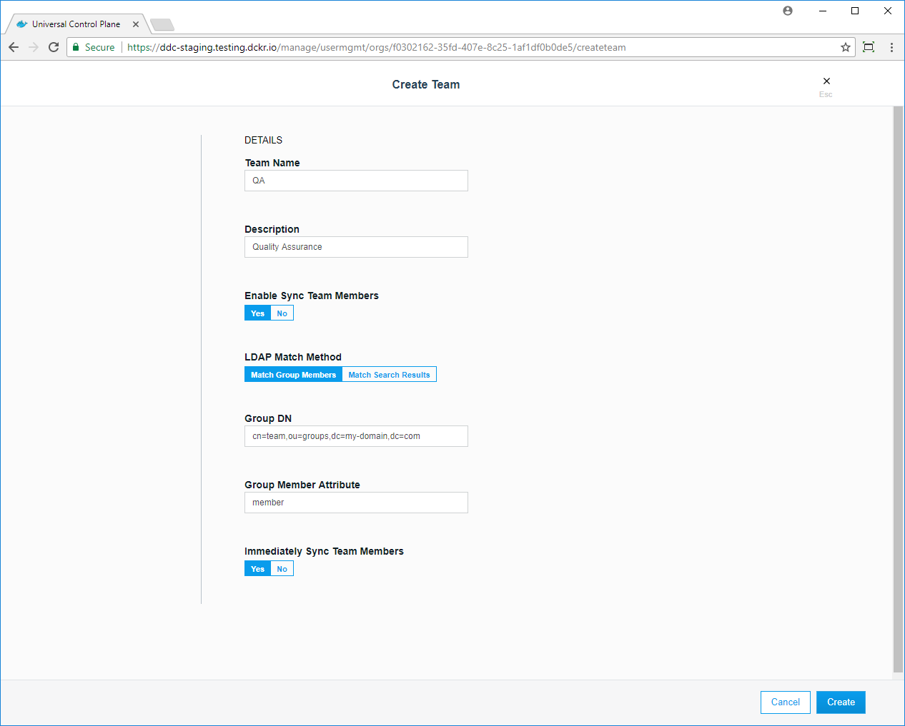

>

If Docker Enterprise is configured to sync users with a Lightweight Directory Access Protocol (LDAP) directory server, you can enable the syncing of new team members to occur either when creating a new team or when modifying settings of an existing team.

To enable LDAP in Docker Universal Control Place (UCP) and sync to your LDAP directory:

1. Click **Admin Settings** under your username drop-down list.
2. Click **Authentication & Authorization**.
3. Scroll down and click `Yes` next to **LDAP Enabled**. A list of LDAP settings displays.
4. Input values to match your LDAP server installation.
5. Test your configuration in UCP.
6. Manually create teams in UCP to mirror those in LDAP.
6. Click **Sync Now**.

For more information, see [Integrate with an LDAP Directory](../admin/configure/external-auth/index.md).

{: .with-border}

## Binding to the LDAP server

There are two methods for matching group members from an LDAP directory, **direct bind** and **search bind**.

Select **Immediately Sync Team Members** to run an LDAP sync operation
immediately after saving the configuration for the team. It may take a moment
before the members of the team are fully synced.

### Match Group Members (Direct Bind)

The Direct Bind option specifies that team members be synced directly with member of a group in the organization's LDAP directory. The team's membership will be synced to match the membership of the group.

| Option                 | Description                              |
|------------------------|------------------------------------------|
| Group DN               | The distinguished name (DN) of the group from which to select users. |
| Group Member Attribute | The value of this group attribute corresponds to the distinguished names of the members of the group. |

### Match Search Results (Search Bind)

The Search Bind option specifies that team members be synced using a search query against the organization's LDAP directory. The team's membership will be
synced to match the users in the search results.

| Option         | Description                              |
|----------------|------------------------------------------|
| Search Base DN | DN of the node in the directory tree where the search should start looking for users. |
| Search Filter  | Filter to find users. If null, existing users in the search scope are added as members of the team. |
| Search subtree | Defines search through the full LDAP tree, not just one level, starting at the Base DN. |

## Where to go next
* [Integrate with an LDAP directory](https://docs.docker.com/ee/ucp/admin/configure/external-auth/)
* [Create users and teams manually](https://docs.docker.com/ee/ucp/authorization/create-users-and-teams-manually/)
