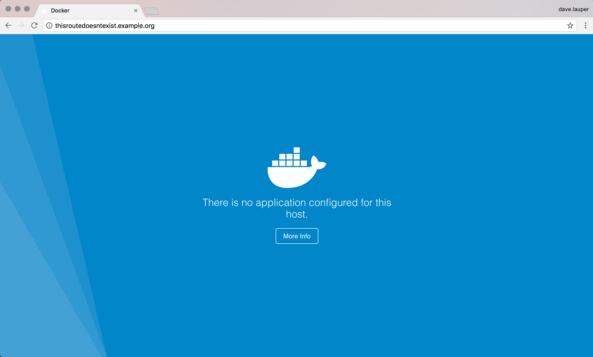

The default proxy service used by UCP to provide layer 7 routing is NGINX,
so when users try to access a route that hasn't been configured, they will
see the default NGINX 404 page.

{: .with-border}

You can customize this by labelling a service with
`com.docker.lb.defaul_backend=true`. When users try to access a route that's
not configured, they are redirected to this service.

As an example, create a `docker-compose.yml` file with:

```yaml
version: "3.2"

services:
  demo:
    image: ehazlett/interlock-default-app
    deploy:
      replicas: 1
      labels:
        com.docker.lb.default_backend: "true"
        com.docker.lb.port: 80
    networks:
      - demo-network

networks:
  demo-network:
    driver: overlay
```

Set up your CLI client with a [UCP client bundle](../../user-access/cli.md),
and deploy the service:

```bash
docker stack deploy --compose-file docker-compose.yml demo
```

Once users try to access a route that's not configured, they are directed
to this demo service.

{: .with-border}

