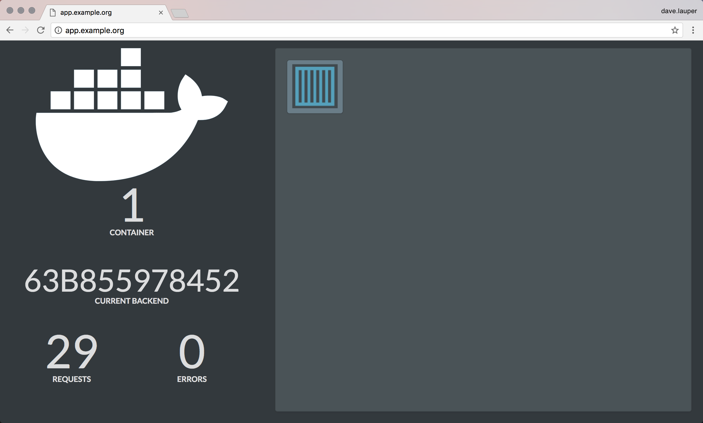

>

After Interlock is deployed, you can launch and publish services and applications.
Use [Service Labels](/engine/reference/commandline/service_create/#set-metadata-on-a-service--l-label)
to configure services to publish themselves to the load balancer.

The following examples assume a DNS entry (or local hosts entry if you are testing locally) exists
for each of the applications.

## Publish a service with four replicas
Create a Docker Service using two labels:

- `com.docker.lb.hosts`
- `com.docker.lb.port`

The `com.docker.lb.hosts` label instructs Interlock where the service should be available.
The `com.docker.lb.port` label instructs what port the proxy service should use to access
the upstreams.

Publish a demo service to the host `demo.local`:

First, create an overlay network so that service traffic is isolated and secure:

```bash
$> docker network create -d overlay demo
1se1glh749q1i4pw0kf26mfx5
```

Next, deploy the application:

```bash
$> docker service create \
    --name demo \
    --network demo \
    --label com.docker.lb.hosts=demo.local \
    --label com.docker.lb.port=8080 \
    ehazlett/docker-demo
6r0wiglf5f3bdpcy6zesh1pzx
```

Interlock detects when the service is available and publishes it. After tasks are running
and the proxy service is updated, the application is available via `http://demo.local`.

```bash
$> curl -s -H "Host: demo.local" http://127.0.0.1/ping
{"instance":"c2f1afe673d4","version":"0.1",request_id":"7bcec438af14f8875ffc3deab9215bc5"}
```

To increase service capacity, use the Docker Service [Scale](https://docs.docker.com/engine/swarm/swarm-tutorial/scale-service/) command:

```bash
$> docker service scale demo=4
demo scaled to 4
```

In this example, four service replicas are configured as upstreams.  The load balancer balances traffic
across all service replicas.

## Publish a service with a web interface
This example deploys a simple service that:

* Has a JSON endpoint that returns the ID of the task serving the request.
* Has a web interface that shows how many tasks the service is running.
* Can be reached at `http://app.example.org`.

Create a `docker-compose.yml` file with:

```yaml
version: "3.2"

services:
  demo:
    image: ehazlett/docker-demo
    deploy:
      replicas: 1
      labels:
        com.docker.lb.hosts: app.example.org
        com.docker.lb.network: demo_demo-network
        com.docker.lb.port: 8080
    networks:
      - demo-network

networks:
  demo-network:
    driver: overlay
```

Note that:

* Docker Compose files _must_ reference networks as external. Include `external:true` in the `docker-compose.yml` file.
* The `com.docker.lb.hosts` label defines the hostname for the service. When
the layer 7 routing solution gets a request containing `app.example.org` in
the host header, that request is forwarded to the demo service.
* The `com.docker.lb.network` defines which network the `ucp-interlock-proxy`
should attach to in order to be able to communicate with the demo service.
To use layer 7 routing, your services need to be attached to at least one network.
If your service is only attached to a single network, you don't need to add
a label to specify which network to use for routing. When using a common stack file for multiple deployments leveraging UCP Interlock / Layer 7 Routing, prefix `com.docker.lb.network` with the stack name to ensure traffic will be directed to the correct overlay network. When using in combination with `com.docker.lb.ssl_passthrough` the label in mandatory, even if your service is only attached to a single network.
* The `com.docker.lb.port` label specifies which port the `ucp-interlock-proxy`
service should use to communicate with this demo service.
* Your service doesn't need to expose a port in the swarm routing mesh. All
communications are done using the network you've specified.

Set up your CLI client with a [UCP client bundle](../../user-access/cli.md),
and deploy the service:

```bash
docker stack deploy --compose-file docker-compose.yml demo
```

The `ucp-interlock` service detects that your service is using these labels
and automatically reconfigures the `ucp-interlock-proxy` service.

### Test using the CLI

To test that requests are routed to the demo service, run:

```bash
curl --header "Host: app.example.org" \
  http://<ucp-address>:<routing-http-port>/ping
```

Where:

* `<ucp-address>` is the domain name or IP address of a UCP node.
* `<routing-http-port>` is the [port you're using to route HTTP traffic](../deploy/index.md).

If everything is working correctly, you should get a JSON result like:

```json
{"instance":"63b855978452", "version":"0.1", "request_id":"d641430be9496937f2669ce6963b67d6"}
```

### Test using a browser

Since the demo service exposes an HTTP endpoint, you can also use your browser
to validate that everything is working.

Make sure the `/etc/hosts` file in your system has an entry mapping
`app.example.org` to the IP address of a UCP node. Once you do that, you'll be
able to start using the service from your browser.

{: .with-border }

## Next steps

- [Publish a service as a canary instance](./canary.md)
- [Use context or path-based routing](./context.md)
- [Publish a default host service](./interlock-vip-mode.md)
- [Specify a routing mode](./interlock-vip-mode.md)
- [Use routing labels](./labels-reference.md)
- [Implement redirects](./redirects.md)
- [Implement a service cluster](./service-clusters.md)
- [Implement persistent (sticky) sessions](./sessions.md)
- [Secure services with TLS](./tls.md)
- [Configure websockets](./websockets.md)
