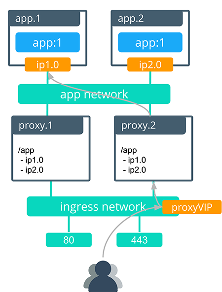
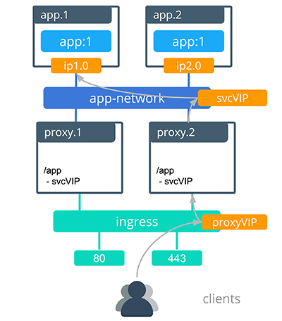

## VIP Mode

VIP mode is an alternative mode of routing in which Interlock uses the Swarm service VIP as the backend IP instead of container IPs.
Traffic to the frontend route is L7 load balanced to the Swarm service VIP which L4 load balances to backend tasks.
VIP mode can be useful to reduce the amount of churn in Interlock proxy service configuration, which may be an advantage in highly dynamic environments.
It optimizes for fewer proxy updates in a tradeoff for a reduced feature set.
Most kinds of application updates do not require a configuring backends in VIP mode.

#### Task Routing Mode

Task routing is the default Interlock behavior and the default backend mode if one is not specified.
In task routing mode, Interlock uses backend task IPs to route traffic from the proxy to each container.
Traffic to the frontend route is L7 load balanced directly to service tasks.
This allows for per-container routing functionality such as sticky sessions.
Task routing mode applies L7 routing and then sends packets directly to a container.




#### VIP Routing Mode

In VIP routing mode Interlock uses the service VIP (a persistent endpoint that exists from service creation to service deletion) as the proxy backend.
VIP routing mode was introduced in Universal Control Plane (UCP) 3.0 version 3.0.3 and 3.1 version 3.1.2.
VIP routing mode applies L7 routing and then sends packets to the Swarm L4 load balancer which routes traffic service containers.




While VIP mode provides endpoint stability in the face of application churn, it cannot support sticky sessions because sticky sessions depend on routing directly to container IPs.
Sticky sessions are therefore not supported in VIP mode.

Because VIP mode routes by service IP rather than by task IP it also affects the behavior of canary deployments.
In task mode a canary service with one task next to an existing service with four tasks represents one out of five total tasks, so the canary will receive 20% of incoming requests.
By contrast the same canary service in VIP mode will receive 50% of incoming requests, because it represents one out of two total services.

#### Usage

You can set the backend mode on a per-service basis, which means that some applications can be deployed in task mode, while others are deployed in VIP mode.
The following label must be applied to services to use Interlock VIP mode:

```
com.docker.lb.backend_mode=vip
```

The default backend mode is `task`.
If the label is set to `task` or the label does not exist then Interlock will use `task` routing mode.

In VIP mode the following non-exhaustive list of application events will not require proxy reconfiguration:

- Service replica increase/decrease
- New image deployment
- Config or secret updates
- Add/Remove labels
- Add/Remove environment variables
- Rescheduling a failed application task
- ...

The following two updates still require a proxy reconfiguration (because these actions will create or destroy a service VIP):

- Add/Remove a network on a service
- Deployment/Deletion of a service
