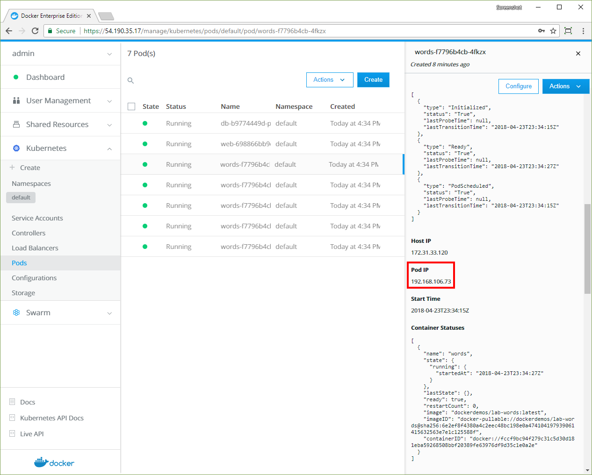
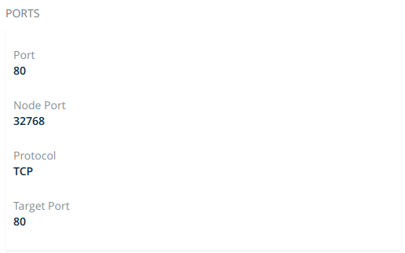
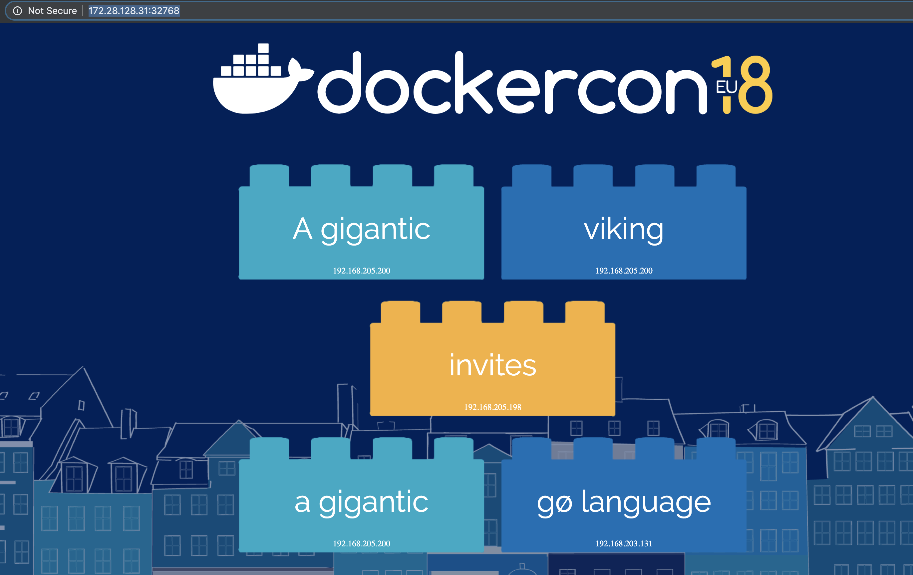

Docker Enterprise Edition enables deploying [Docker Compose](/compose/overview.md/)
files to Kubernetes clusters. Starting in Compile file version 3.3, you use the
same `docker-compose.yml` file that you use for Swarm deployments, but you
specify **Kubernetes workloads** when you deploy the stack. The result is a
true Kubernetes app.

## Get access to a Kubernetes namespace

To deploy a stack to Kubernetes, you need a namespace for the app's resources.
Contact your Docker EE administrator to get access to a namespace. In this
example, the namespace has the name `lab-words`.
[Learn to grant access to a Kubernetes namespace](../authorization/grant-permissions/#kubernetes-grants).

## Create a Kubernetes app from a Compose file

In this example, you create a simple app, named "lab-words", by using a Compose
file. The following yaml defines the stack:

```yaml
version: '3.3'

services:
  web:
    build: web
    image: dockerdemos/lab-web
    volumes:
     - "./web/static:/static"
    ports:
     - "80:80"

  words:
    build: words
    image: dockerdemos/lab-words
    deploy:
      replicas: 5
      endpoint_mode: dnsrr
      resources:
        limits:
          memory: 16M
        reservations:
          memory: 16M

  db:
    build: db
    image: dockerdemos/lab-db
```

1.  Open the UCP web UI, and in the left pane, click **Shared resources**.
2.  Click **Stacks**, and in the **Stacks** page, click **Create stack**.
3.  In the **Name** textbox, type "lab-words".
4.  In the **Mode** dropdown, select **Kubernetes workloads**.
5.  In the **Namespace** drowdown, select **lab-words**.
6.  In the **docker-compose.yml** editor, paste the previous YAML.
7.  Click **Create** to deploy the stack.

## Inspect the deployment

After a few minutes have passed, all of the pods in the `lab-words` deployment
are running.

1.  In the left pane, click **Pods**. Confirm that there are seven pods and
    that their status is **Running**. If any have a status of **Pending**,
    wait until they're all running.
2.  Click one of the pods that has a name starting with **words**, and in the
    details pane, scroll down to the **Pod IP** to view the pod's internal IP
    address.

    {: .with-border}

3.  In the left pane, click **Load balancers** and find the **web-published** service.
4.  Click the **web-published** service, and in the details pane, scroll down to the
    **Spec** section.
5.  Under **Ports**, click the URL to open the web UI for the `lab-words` app.

    {: .with-border}

6.  Look at the IP addresses that are displayed in each tile. The IP address
    of the pod you inspected previously may be listed. If it's not, refresh the
    page until you see it.

    {: .with-border}

7.  Refresh the page to see how the load is balanced across the pods.

