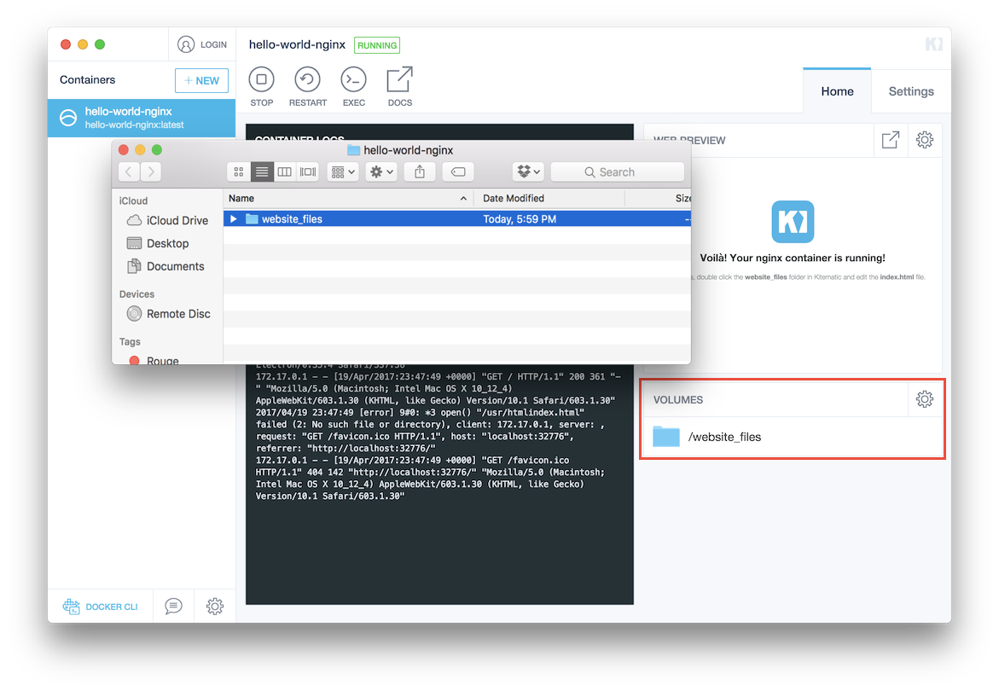
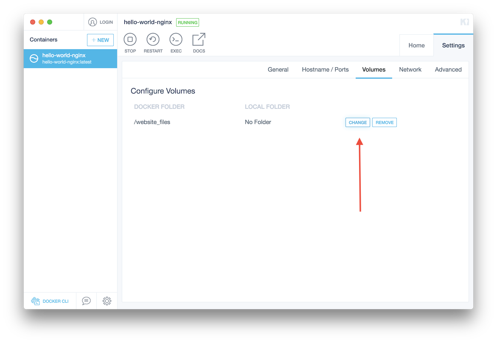
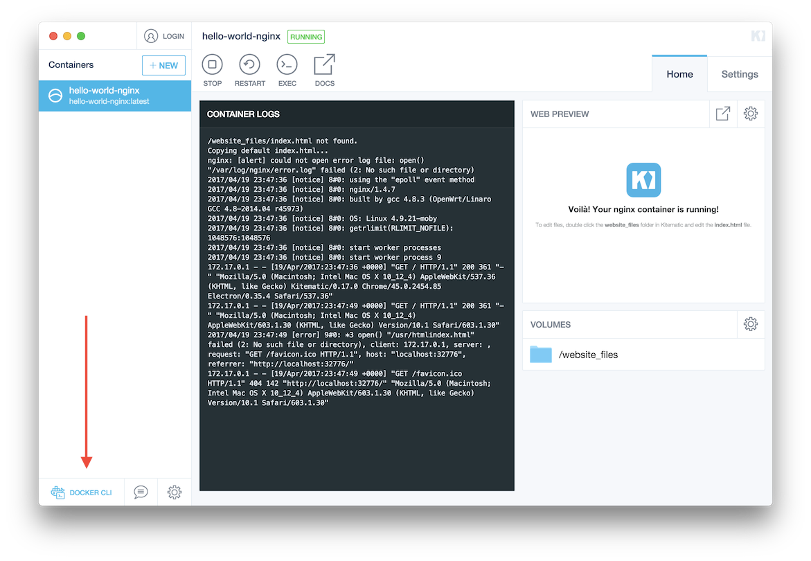
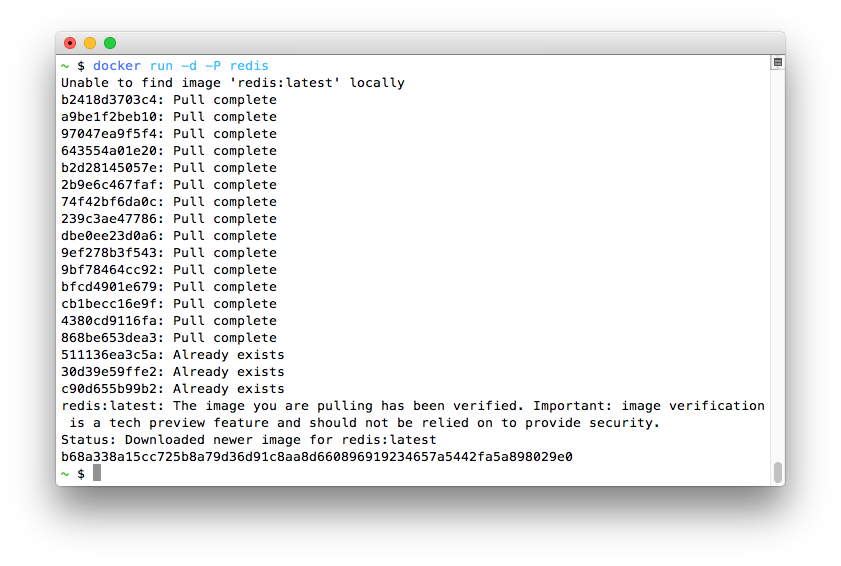

## Overview

Kitematic is an open source project built to simplify and streamline using
Docker on a Mac or Windows (coming soon) PC. Kitematic automates the Docker
installation and setup process and provides an intuitive graphical user
interface (GUI) for running Docker containers.  Kitematic integrates with
[Docker Machine](/machine/) to provision a VirtualBox VM
and install the Docker Engine locally on your machine.

Once installed, the Kitematic GUI launches and from the home screen you will be
presented with curated images that you can run instantly. You can search for any
public images on Docker Hub from Kitematic just by typing in the search bar.
You can use the GUI to create, run and manage your containers just by clicking
on buttons. Kitematic allows you to switch back and forth between the Docker CLI
and the GUI.  Kitematic also automates advanced features such as managing ports
and configuring volumes.  You can use Kitematic to change environment variables,
stream logs, and single click terminal into your Docker container all from the
GUI.

First, if you haven't yet done so, download and start Kitematic by installing [Docker Toolbox](/toolbox/overview.md#ready-to-get-started).

## Container list

Kitematic lists all running and stopped containers on the left side, underneath
the "New Container" link.

The container list includes all containers, even those not started by Kitematic,
giving you a quick over-view of the state of your Docker daemon.

You can click on any container to view its logs (the output of the main container
process), restart, stop or exec `sh` in that container. See [Working with a
container](userguide.md#working-with-a-container) for more details.

## Creating a new container

The "New Container" page lets you search for and select from images on the Docker Hub.
When you've found the image you want to run, you can click "Create" to pull, create,
and run the container.

## Working with a container

If you select a non-running container, either stopped, or paused, you will be able
to "Restart" or "Stop" the container using the icons. You can also view the entire
main container process' output logs, and in the Settings section you can make
changes which will be used if you "Restart" this container.

By selecting a running container from the left list, you can see some state information
for your container - either a preview of the HTML output for a container that has a web
server, the main container process' logs, and any container volumes that have been
configured.

The summary page will show different things depending on the image metadata. If
a known "web" port (see below) is `EXPOSED`, then Kitematic assumes its a web page,
and will show a preview of the site at `/`. If other ports are exposed, then it
will show a list of those ports, and the Docker daemon IP and port they are mapped
to. If there are any `VOLUMES`, then these will be shown. At minimum, the summary
screen will show the main container process' log output.

The currently detected "web" ports are, `80`, `8000`, `8080`, `3000`, `5000`,
`2368`, `9200`, and `8983`.

### Viewing container logs

You can view the entire main container process' log output either by clicking on the "Logs"
preview image, or by clicking on the "Logs" tab.

You can then scroll through the logs from the current running container. Note that
if you make changes to the container settings, then the container will be restarted,
so this will reset this log view.

### Starting a terminal in a container

The "Terminal" icon at the top of the container summary will `docker exec -i -t <your container> sh`.
This will allow you to make quick changes, or to debug a problem.

> **Note**: Your exec'ed `sh` process will not have the same environment settings
> as the main container process and its children. 
> Get the environment commands for your shell: `docker-machine env default`.

### Managing Volumes

You can choose to make all of a container's volumes mapped to directories on
on your Mac by clicking on the folders in the "Edit Files" section of the
container summary screen.

This allows you to manage files in volumes via the Finder.
Kitematic exposes a container's volume data under `~/Documents/Kitematic/<container's name>/`.
Quick access to this folder (or directory) is available via the app:

> **Note**: When you "Enable all volumes to edit files in Finder", the Docker
> container will be stopped, removed and re-created with the new `volumes`
> flag.

#### Changing Volume Directories

Let's say you have an Nginx webserver running via Kitematic (using the
`kitematic/hello-world-nginx` image on DockerHub). However, you don't want to
use the default directory created for the website_files volume. Instead, you
already have the HTML, Javascript, and CSS for your website under
`~/workspace/website`.

Navigate to the "Settings" tab of the container, and go to the "Volumes". This
screen allows you to set the mappings individually.

> **Note**: When you "Change Folders", the Docker
> container will be stopped, removed and re-created with the new `volumes`
> flag.

### Setting the container name

By default, Kitematic sets the container name to the same as the image name (or
with a `-<number>` if there are more than one.
To simplify administration, or when using container linking or volumes, you may
want to rename it.

> **Note**: When you rename the container it will be stopped, removed and
> re-created with the new name (due to the default volumes mapping).

### Adding Environment variables

Many images use environment variables to let you customise them. The "General"
"Settings" tab allows you to add and modify the environment variables used to
start a container.

The list of environment variables will show any that have been set on the image
metadata - for example, using the `ENV` instruction in the Dockerfile.

When you "Save" the changed environment variables, the container will be
stopped, removed and re-created.

### Delete container

On the "General" "Settings" tab, you can delete the container. Clicking "Delete
Container" will also stop the container if necessary.

You can also delete a container by clicking the `X` icon in the container list.

Kitematic will prompt you to confirm that you want to delete.

#### List the exposed Ports and how to access them

To see the complete list of exposed ports, go to "Settings" then "Ports". This
page lists all the container ports exposed, and the IP address and host-only
network port that you can access use to access that container from your macOS
system.

## Docker Command-line Access

You can interact with existing containers in Kitematic or create new containers
via the Docker Command Line Interface (CLI). Any changes you make on the CLI are
directly reflected in Kitematic.

To open a terminal via Kitematic, just press the whale button at the bottom left, as
shown below:

### Example: Creating a new Redis container

Start by opening a Docker-CLI ready terminal by clicking the whale button as
described above. Once the terminal opens, enter `docker run -d -P redis`. This
will pull and run a new Redis container via the Docker CLI.

> **Note**: If you're creating containers from the command line, use `docker run -d`
> so that Kitematic can re-create the container when settings are changed via the
> Kitematic user interface. Containers started without `-d` will fail to re-start.

Now, go back to Kitematic. The Redis container should now be visible.

## Next Steps

For an example using Kitematic to run a Minecraft server, take a look at
the [Minecraft server](./minecraft-server.md) page.
