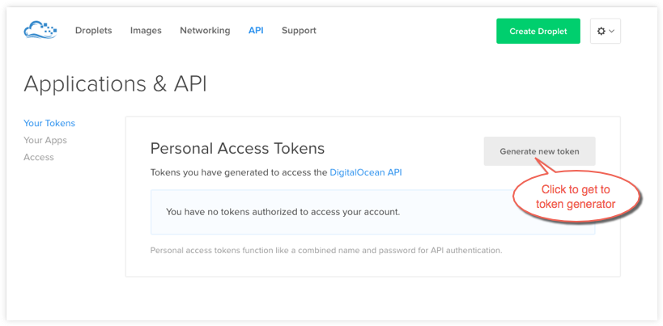
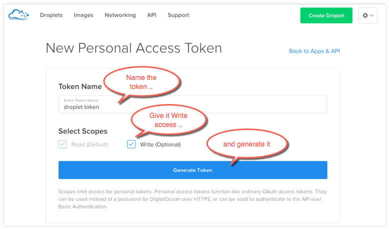

> Try out Docker Cloud!
>
> We suggest using [Docker Cloud](https://cloud.docker.com/) as the
most up-to-date way to run Docker on your cloud providers. To get started, see
[Docker Cloud docs home page](/docker-cloud/index.md), [Docker Cloud Settings
and Docker ID](/docker-cloud/dockerid.md), and [Link a DigitalOcean account to
Docker Cloud](/docker-cloud/infrastructure/link-do.md). If you are running Edge
channel Docker for Mac or Windows, you can access your Docker Cloud account from
those Docker desktop applications. See Docker Cloud (Edge feature) on
[Mac](/docker-for-mac/index.md#docker-cloud-edge-feature) or
[Windows](/docker-for-windows/index.md#docker-cloud-edge-feature).
>
> Docker Machine still works as described below, but Docker Cloud
supercedes Machine for this purpose.
{: .important}

Follow along with this example to create a Dockerized [Digital Ocean](https://digitalocean.com) Droplet (cloud host).

### Step 1. Create a Digital Ocean account

If you have not done so already, go to [Digital Ocean](https://digitalocean.com), create an account, and log in.

### Step 2. Generate a personal access token

To generate your access token:

1.  Go to the Digital Ocean administrator console and click **API** in the header.

    

2.  Click **Generate new token** to get to the token generator.

    

3.  Give the token a descriptive name, make sure the **Write (Optional)** checkbox is checked, and click **Generate Token**.

    

4.  Grab (copy to clipboard) the generated big long hex string and store it somewhere safe.

    

    This is the personal access token used in the next step to create your cloud server.

### Step 3. Use Machine to create the Droplet


1.  Run `docker-machine create` with the `digitalocean` driver and pass your key to the `--digitalocean-access-token` flag, along with a name for the new cloud server.

    For this example, the new Droplet is called `docker-sandbox`:

    ```none
    $ docker-machine create --driver digitalocean --digitalocean-access-token xxxxx docker-sandbox
    Running pre-create checks...
    Creating machine...
    (docker-sandbox) OUT | Creating SSH key...
    (docker-sandbox) OUT | Creating Digital Ocean droplet...
    (docker-sandbox) OUT | Waiting for IP address to be assigned to the Droplet...
    Waiting for machine to be running, this may take a few minutes...
    Machine is running, waiting for SSH to be available...
    Detecting operating system of created instance...
    Detecting the provisioner...
    Provisioning created instance...
    Copying certs to the local machine directory...
    Copying certs to the remote machine...
    Setting Docker configuration on the remote daemon...
    To see how to connect Docker to this machine, run: docker-machine env docker-sandbox
    ```

      When the Droplet is created, Docker generates a unique SSH key and stores it on your local system in `~/.docker/machines`. Initially, this is used to provision the host. Later, it's used under the hood to access the Droplet directly with the `docker-machine ssh` command. Docker Engine is installed on the cloud server and the daemon is configured to accept remote connections over TCP using TLS for authentication.

2. Go to the Digital Ocean console to view the new Droplet.

    

3. At the command terminal, run `docker-machine ls`.

        $ docker-machine ls
        NAME             ACTIVE   DRIVER         STATE     URL                         SWARM
        default          -        virtualbox     Running   tcp://192.168.99.100:2376
        docker-sandbox   *        digitalocean   Running   tcp://45.55.139.48:2376

    The new `docker-sandbox` machine is running, and it is the active host as
    indicated by the asterisk (\*). When you create a new machine, your command
    shell automatically connects to it. If for some reason your new machine is
    not the active host, run `docker-machine env docker-sandbox`, followed by
    `eval $(docker-machine env docker-sandbox)` to connect to it.

### Step 4. Run Docker commands on the Droplet

1. Run some `docker-machine` commands to inspect the remote host. For example, `docker-machine ip <machine>` gets the host IP address and `docker-machine inspect <machine>` lists all the details.

        $ docker-machine ip docker-sandbox
        104.131.43.236

        $ docker-machine inspect docker-sandbox
        {
            "ConfigVersion": 3,
            "Driver": {
            "IPAddress": "104.131.43.236",
            "MachineName": "docker-sandbox",
            "SSHUser": "root",
            "SSHPort": 22,
            "SSHKeyPath": "/Users/samanthastevens/.docker/machine/machines/docker-sandbox/id_rsa",
            "StorePath": "/Users/samanthastevens/.docker/machine",
            "SwarmMaster": false,
            "SwarmHost": "tcp://0.0.0.0:3376",
            "SwarmDiscovery": "",
            ...

2. Verify Docker Engine is installed correctly by running `docker` commands.

    Start with something basic like `docker run hello-world`, or for a more interesting test, run a Dockerized webserver on your new remote machine.

    In this example, the `-p` option is used to expose port 80 from the `nginx` container and make it accessible on port `8000` of the `docker-sandbox` host.

        $ docker run -d -p 8000:80 --name webserver kitematic/hello-world-nginx
        Unable to find image 'kitematic/hello-world-nginx:latest' locally
        latest: Pulling from kitematic/hello-world-nginx
        a285d7f063ea: Pull complete
        2d7baf27389b: Pull complete
        ...
        Digest: sha256:ec0ca6dcb034916784c988b4f2432716e2e92b995ac606e080c7a54b52b87066
        Status: Downloaded newer image for kitematic/hello-world-nginx:latest
        942dfb4a0eaae75bf26c9785ade4ff47ceb2ec2a152be82b9d7960e8b5777e65

    In a web browser, go to `http://<host_ip>:8000` to bring up the webserver home page. You got the `<host_ip>` from the output of the `docker-machine ip <machine>` command you ran in a previous step. Use the port you exposed in the `docker run` command.

    

### Step 5. Use Machine to remove the Droplet

To remove a host and all of its containers and images, first stop the machine, then use `docker-machine rm`:

    $ docker-machine stop docker-sandbox
    $ docker-machine rm docker-sandbox
    Do you really want to remove "docker-sandbox"? (y/n): y
    Successfully removed docker-sandbox

    $ docker-machine ls
    NAME      ACTIVE   DRIVER       STATE     URL                         SWARM
    default   *        virtualbox   Running   tcp:////xxx.xxx.xx.xxx:xxxx

If you monitor the Digital Ocean console while you run these commands, notice
that it updates first to reflect that the Droplet was stopped, and then removed.

If you create a host with Docker Machine, but remove it through the cloud
provider console, Machine loses track of the server status. Use the
`docker-machine rm` command for hosts you create with `docker-machine create`.

## Where to go next

-   [Understand Machine concepts](../concepts.md)
-   [Docker Machine driver reference](../drivers/index.md)
-   [Docker Machine subcommand reference](../reference/index.md)
-   [Provision a Docker Swarm cluster with Docker Machine](/swarm/provision-with-machine.md)
